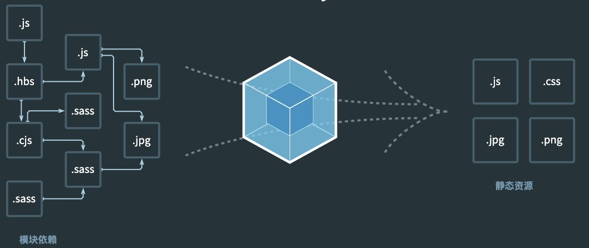

# 重新认识 Webpack

**我们需要一套足够开放，能融合诸多工程化工具，彻底抹平开发与生产环境差异的一体化工程方案**，这也正是 Webpack 需要解决的问题。

## 为什么是 Webpack

Webpack 是一种用于构建 JavaScript 应用程序的静态模块打包器。一致且开放的处理方式，加载应用中的所有资源文件（图片、CSS、视频、字体文件等），将其合并打包成浏览器兼容的 Web 资源文件。

其忽略具体资源类型之间的差异，将所有代码/非代码文件都统一看作 Module --- 模块对象，以相同的加载、解析、依赖管理、优化、合并流程实现打包，并借助 Loader、Plugin 两种开放接口将资源差异处理转交由社区实现，实现统一资源构建模型，这种设计有很多优点：

- 所有资源都是 Module，可以用同一套代码实现诸多特性，包括：代码压缩、Hot Module Rreplacement、缓存

- 打包时，资源与资源之间非常容易实现信息互换，例如可以轻易在 HTML 插入 Base64 格式图片

- 借助 Loader，Webpack 几乎可以用任意方式处理任意类型资源

版本成熟

- 基于 Module Federation 的微前端方案

- 基于 webpack-dev-server 的 Hot Module Rreplacement

- 基于 Terser、Tree-shaking、SplitChunks 等工具的 JavaScript 代码压缩、优化、混淆方案

- 基于 LazyCompilation 延迟编译功能

- 有利于提升应用性能的异步模块加载能力

- 有利于提升构建性能的持久化缓存能力

- 内置 JavaScript、JSON、二进制资源解析、生成能力

## 学习价值

深入学习 Webpack，不仅能帮助你更快解决具体的工程技术问题，还能形成属于你个人的，极具区分度的核心竞争力！

## 如何高效学习

由浅入深、循序渐进，有章法有体系地学

- 上手实践各种场景下的构建配置方法，捋清楚最基本的使用规则。

- 初步理解底层构建流程，学会分析性能卡点并据此做出正确性能优化。

- 深入 Webpack 扩展规则，理解 Loader 与 Plugin 能做什么，怎么做。

- 深挖源码，理解 Webpack 底层工作原理，加强应用与扩展能力。

