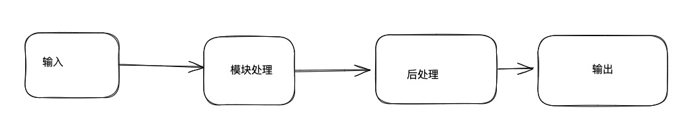
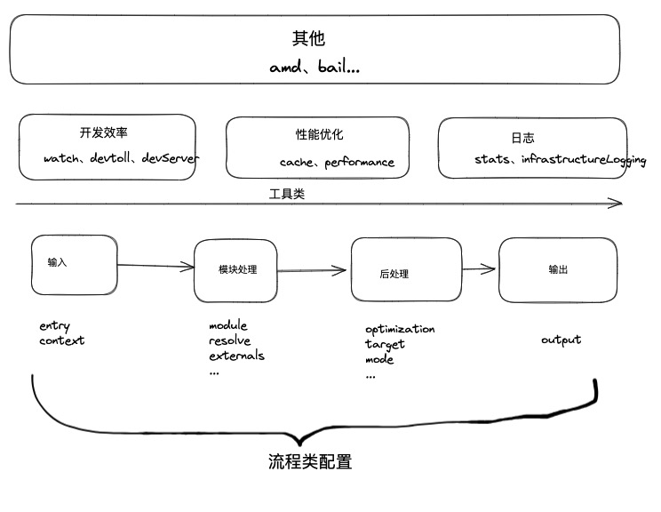

# 理解 Webpack 配置底层结构逻辑

## 结构化理解

打包过程大致简化



- 输入：从文件系统读入代码文件

- 模块递归处理：调用 Loader 转移 Module 内容，将结果转换成 AST，从中分析出模块依赖关系，进一步递归调用模块处理过程，直到所有依赖文件都处理完毕

- 后处理：所有模块递归处理完毕后开始执行后处理，包括模块合并、注入运行时、产物优化；最终输出 Chunk 集合

- 输出：将 Chunk 写出到外部文件系统

**从打包流程角度**，Webpack 配置项大体可分为两类：

- 流程类：作用于打包流程某个或若干个环节，直接影响编译打包效果的配置项

- 工具类：打包主流程外，提供更多工程化工具配置项

### 流程类

1. 输入输出

- entry：入口

- context：项目上下文

- output：出口

2. 模块处理

- resolve：解析规则

- module： 加载规则

- externals：声明外部资源，跳过这些资源的解析，打包

3. 后处理

- optimization：优化产物包体积，内置 Dead Code Elimination、Scope Hoisting、代码混淆、代码压缩

- target：配置编译产物目标运行环境，支持 web、node、electron 等

- mode：声明环境，development、production 等

大概流程：webpack 首先根据输入配置（entry/context）找到项目入口文件；之后根据模块配置（module/resolve/externals）规则处理模块文件，处理过程包括转译、依赖、分析等；模块处理完，根据后处理配置（optimization/target）合并模块资源，注入运行时依赖、优化产物结构。


### 工具类

1. 开发效率

- watch：监听文件变化

- devtool：配置 sourcemap 生成规则

- devServer：配置 HMR 强相关的开发服务器

2. 性能优化

- cache：控制缓存编译过程信息和编译结果

- performance：配置产物大小超过阀值时，如何通知开发者

3. 日志类

- stats：控制编译过程日志内容

- infrastructureLogging：控制日志输出方式



## 配置逻辑解析

基本示例：

```
|--src
|   |___ index.js
|__ webpack.config.js
```

声明入口，出口文件

```js
module.exports = {
    entry: './src/index.js',
    output: {
        filename: "[name].js",
        path: path.join(__dirname, "./dist")
    }
}
```

处理其他资源，配置对应的加载器

```js
const path = require('path')
module.exports = {
    entry: './src/index.js',
    output: {
        filename: "[name].js",
        path: path.join(__dirname, "./dist")
    },
    module: {
        rules: [
            {
                test: /\.less$/i,
                include: {
                    and: [path.join(__dirname, './src/')]
                },
                use: [
                    'style-loader',
                    'css-loader',
                    {
                        loader: 'less-loader'
                    }
                ]
            }
        ]
    }
}
```

## 脚手架工具

- Vue CLI

- create-react-app

- @angular/cli

- webpack-cli

- Neutrino

- react-starter-kit

### Vue CLI

```bash
npm install -g @vue/cli

vue -V

vue create [projectname]
```

### CRA

```bash
npx create-react-app my-app
```

默认工程能力：

- JSX、ES6、TypeScript、Flow 语法支持
- CSS 自动添加 --webkit-- 前缀
- 基于 Jest 的自动化测试能力
- 支持 HMR 的开发服务器
- 等等，具体可参考[官网](https://github.com/nitishdayal/cra_closer_look)


