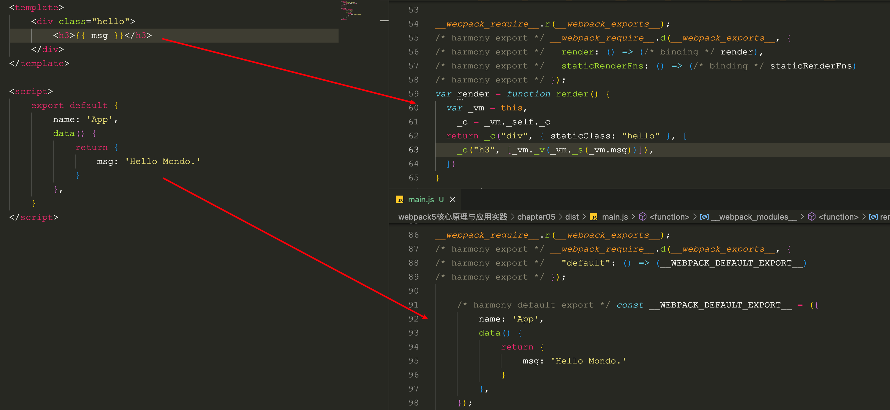
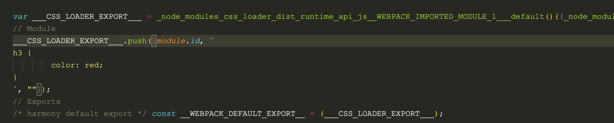

# 搭建 Vue 全栈开发环境

## 使用 Vue 处理 SFC

Single File Component 文件

- template：类 HTML

- script：定义组件对象

- style：定义组件样式

- Custom Block：用于满足领域特定需求而预留的 SFC 扩展模块，需要特定工具使用。参考详情可参考 [Custom Blocks | Vue Loader](https://vue-loader.vuejs.org/zh/guide/custom-blocks.html) 。

原生 Webpack 不能处理这种文件，需要安装 vue-loader

```bash
yarn add webpack webpack-cli vue-loader
```

修改配置

```js
const { VueLoaderPlugin } = require("vue-loader");

module.exports = {
  module: {
    rules: [
      {
        test: /\.vue$/,
        use: ["vue-loader"],
      },
    ],
  },
  plugins: [new VueLoaderPlugin()],
};

```

经过 vue-loader 处理转译成 JavaScript 模块



`<template>` 内容会被转译为用于构造 Virtual Dom 结构的 render 函数；`<script>` 标签导出的对象被转译为 JavaScript 对象字面量形式。

`<style>` 被转译为 JavaScript 内容



## 运行页面

- 使用 `html-webpack-plugin` 自动生成 HTML 页面；

- 使用 `webpack-dev-server` 让页面真正运行起来，并具备热更新能力。

安装并修改配置

```bash
yarn add html-webpack-plugin -D
```

```js
const { VueLoaderPlugin } = require('vue-loader')
const HtmlWebpackPlugin = require("html-webpack-plugin");
module.exports = {
    // ...
    module: {
        rules: [
          {
            test: /\.vue$/,
            use: ["vue-loader"],
          },
          {
            test: /\.css$/,
            use: ["css-loader"],
          },
        ],
      },
      plugins: [
        new VueLoaderPlugin(),
        new HtmlWebpackPlugin({
          templateContent: `
            <!DOCTYPE html>
            <html>
              <head>
                <meta charset="utf-8">
                <title>Webpack App</title>
              </head>
              <body>
                <div id="app" />
              </body>
            </html>
                `,
        }),
      ],
}
```

编译后，自动生成 HTML 文件。

`webpack-dev-server` 启动一套本地开发服务：

- 结合 webpack 工作流，提供基于 http(s) 协议的静态资源

- 提供资源热更新能力，在保持页面状态前提下自动更新页面代码，提升开发效率

接入和修改配置：

```bash
yarn add -D webpack-dev-server
```

添加 devServer 配置

```js
const path = require('path')
const { VueLoaderPlugin } = require('vue-loader')
const HtmlWebpackPlugin = require("html-webpack-plugin");
module.exports = {
    // ...
    devServer: {
      hot: true, // 用于申明是否使用热更新能力
      open: true // 用于声明是否自动打开页面
    },
    module: {
        rules: [
          {
            test: /\.vue$/,
            use: ["vue-loader"],
          },
          {
            test: /\.css$/,
            use: ["css-loader"],
          },
        ],
      },
      plugins: [
        new VueLoaderPlugin(),
        new HtmlWebpackPlugin({
          templateContent: `
            <!DOCTYPE html>
            <html>
              <head>
                <meta charset="utf-8">
                <title>Webpack App</title>
              </head>
              <body>
                <div id="app" />
              </body>
            </html>
                `,
        }),
      ],
}
```

## 使用 Server Side Render

SPA 应用的优缺点：

- 优点： 解决前后端协作的开发效率、性能、分工、工程化问题

- 缺点： SEO 不友好，无法向爬虫提供任何有用的信息；Time-To-Content 更长，由于客户端需要等待所有 JavaScript 资源都加载完成，才会开始渲染页面正真有意义的内容，所以 TTC 时间相对更长

SSR 正是为解决这些问题而出现的技术；本质上，SSR 是一种在服务器将组件渲染 HTML 字符传并发送到浏览器，最后在浏览器上将这些HTML 片段激活为客户端上可交互的应用技术。

方案实现：

- nuxt.js

- quasar

- @vue/server-renderer

实现步骤：

- 编译时，将同一组件构建成适合在客户端、服务端进行的两份副本

- 服务端接受请求，调用 render 工具将组件渲染为 HTML 字符串，返回给客户端

- 客户端运行 HTML，执行组件代码，激活组件（Hydrate）

使用 Webpack、Vue3、Express、@vue/server-renderer 搭建 Vue 

示例代码：[https://github.com/imondo/webpack-book-samples/tree/main/5-2_use-ssr](https://github.com/imondo/webpack-book-samples/tree/main/5-2_use-ssr)

```
│  ├─ package.json
│  ├─ server.js
│  ├─ src
│  │  ├─ App.vue
│  │  ├─ entry-client.js
│  │  ├─ entry-server.js
│  ├─ webpack.base.js
│  ├─ webpack.client.js
│  └─ webpack.server.js
```

1. 客户端，服务端环境分别准备项目 Entry 文件

2. 客户端与服务端分别编写 Webpack 配置文件

- base 定义基本规则

- webpack.client.js 定义构建客户端资源的配置

```js
// webpack.client.js
const Merge = require("webpack-merge");
const path = require("path");
const HtmlWebpackPlugin = require("html-webpack-plugin");
const { WebpackManifestPlugin } = require("webpack-manifest-plugin");
const base = require("./webpack.base");

// 继承自 `webpack.base.js`
module.exports = Merge.merge(base, {
  mode: "development",
  entry: {
    // 入口指向 `entry-client.js` 文件
    client: path.join(__dirname, "./src/entry-client.js"),
  },
  output: {
    publicPath: "/",
  },
  module: {
    rules: [{ test: /\.css$/, use: ["style-loader", "css-loader"] }],
  },
  plugins: [
    // 这里使用 webpack-manifest-plugin 记录产物分布情况
    // 方面后续在 `server.js` 中使用
    new WebpackManifestPlugin({ fileName: "manifest-client.json" }),
    // 自动生成 HTML 文件内容
    new HtmlWebpackPlugin({
      templateContent: `
<!DOCTYPE html>
<html>
<head>
  <meta charset="utf-8">
  <title>Webpack App</title>
</head>
<body>
  <div id="app" />
</body>
</html>
  `,
    }),
  ],
});

```

需要使用 webpack-manifest-plugin 插件记录产物分布，后面会在 server.js 用到。

3. webpack.server.js 定义构建服务端资源配置

```js
// webpack.server.js
const Merge = require("webpack-merge");
const path = require("path");
const { WebpackManifestPlugin } = require("webpack-manifest-plugin");
const base = require("./webpack.base");

module.exports = Merge.merge(base, {
  entry: {
    server: path.join(__dirname, "src/entry-server.js"),
  },
  target: "node",
  output: {
    // 打包后的结果会在 node 环境使用
    // 因此此处将模块化语句转译为 commonjs 形式
    libraryTarget: "commonjs2",
  },
  module: {
    rules: [
      {
        test: /\.css$/,
        use: [
          // 注意，这里用 `vue-style-loader` 而不是 `style-loader`
          // 因为 `vue-style-loader` 对 SSR 模式更友好
          "vue-style-loader",
          {
            loader: "css-loader",
            options: {
              esModule: false,
            },
          },
        ],
      },
    ],
  },
  plugins: [
    // 这里使用 webpack-manifest-plugin 记录产物分布情况
    // 方面后续在 `server.js` 中使用
    new WebpackManifestPlugin({ fileName: "manifest-server.json" }),
  ],
});
```

调用命令分别生成客户端，服务端代码

```bash
npx webpack --config ./webpack.client.js

npx webpack --config ./webpack.server.js
```

4. server.js 代码

```js
// server.js
const express = require("express");
const path = require("path");
const { renderToString } = require("@vue/server-renderer");

// 通过 manifest 文件，找到正确的产物路径
const clientManifest = require("./dist/manifest-client.json");
const serverManifest = require("./dist/manifest-server.json");
const serverBundle = path.join(
  __dirname,
  "./dist",
  serverManifest["server.js"]
);
// 这里就对标到 `entry-server.js` 导出的工厂函数
const createApp = require(serverBundle).default;

const server = express();

server.get("/", async (req, res) => {
  const app = createApp();

  const html = await renderToString(app);
  const clientBundle = clientManifest["client.js"];
  res.send(`
<!DOCTYPE html>
<html>
    <head>
      <title>Vue SSR Example</title>
    </head>
    <body>
      <!-- 注入组件运行结果 -->
      <div id="app">${html}</div>
      <!-- 注入客户端代码产物路径 -->
      <!-- 实现 Hydrate 效果 -->
      <script src="${clientBundle}"></script>
    </body>
</html>
    `);
});

server.use(express.static("./dist"));

server.listen(3000, () => {
  console.log("ready");
});

```

核心逻辑：

- 调用 entry-server.js 导出工厂函数渲染出 Vue 组件结构

- 调用 @vue/server-renderer 将组件渲染为 HTML 字符串

- 拼接 HTML 内容，将组件 HTML 字符串与 entry-client.js 产物路径注入到 HTML 中，返回给客户端。

## Static Site Generation

SSR 有不少新问题：

- 更高的架构复杂度，这意味着更高的维护、扩展、学习成本；
- Node 与浏览器环境不完全匹配，部分浏览器特定的代码，只能在某些生命周期钩子函数中使用；一些外部扩展库 (external library) 可能需要特殊处理，才能在 SSR 中运行；
- 组件要求更高，需要兼容 Node.js Server 运行环境；
- 服务端负载更高，毕竟相较于纯粹提供静态资源的 SPA 形式，SSR 需要在 Node 进程中执行大量 CPU 运算以渲染 HTML 片段。

因此，对于用户不敏感的应用，如公司官网、营销活动页等，还可以使用 [Static Site Generation](https://github.com/chrisvfritz/prerender-spa-plugin) (或叫 Pre-renderer) 方式，在编译构建阶段提前生成各页面的静态 HTML 代码，这样技能满足 SEO 需求，又尽可能降低架构、编码复杂度。

在 Webpack4 环境下，可选择 [prerender-spa-plugin](https://github.com/chrisvfritz/prerender-spa-plugin) 实现 SSG 功能，但实测发现该插件并不兼容 Webpack5，且社区目前没有成熟的替代方案，因此感兴趣的同学可自行查阅相关说明，此处不再赘述。

## Vue CLI

脚手架工具

- Vue CLI：基于 Webpack 搭建的 Vue 项目脚手架工具，提供多媒体资源处理、SFC 文件处理、dev-server、HMR、自动化测试、ESLint、Babel 等功能；

- create-vue： 基于 Vite 搭建的 Vue 项目脚手架工具，功能与 Vue-cli 基本对齐。