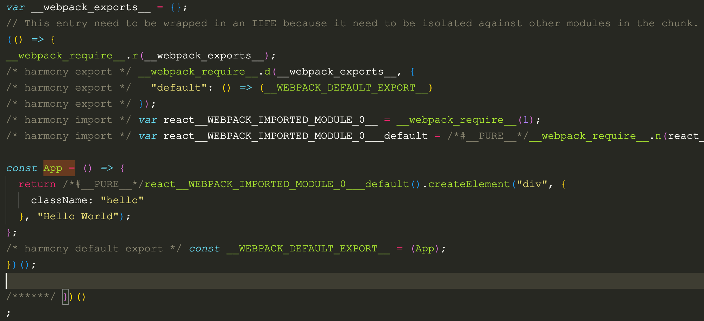
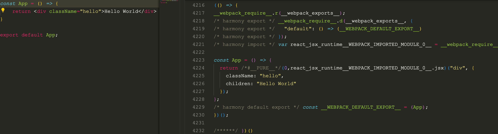

# 搭建 React 开发环境

React 认为渲染逻辑本质上与其他 UI 逻辑存在内在耦合关系，提倡将结构、逻辑、样式共同放在同一文件，以组件这种松散耦合结构实现关注点分离，即 JSX 技术。

## Babel 加载 JSX 文件

借助 babel-loader 完成 JavaScript 转换

1. 依赖安装

```bash
yarn add webpack webpack-cli babel-loader @babel/core @babel/preset-react -D
```

2. 修改配置

```js
module.exports = {
  mode: 'none',
  module: {
    rules: [
      {
        test: /\.jsx$/,
        loader: "babel-loader",
        options: {
          presets: ["@babel/preset-react"],
        }
      },
    ],
  },
};
```

执行 npx webpack，经过 babel-loader 处理，将被编译为 JavaScript 格式的 React.createElement 函数



JSX 支持新久两种模式

- React.createElement 函数，需要引入 React；`import React from 'react'`

- 自动注入代码，设置 `runtime: automatic`

```js
module.exports = {
  mode: 'none',
  module: {
    rules: [
      {
        test: /\.jsx$/,
        loader: "babel-loader",
        options: {
          presets: [["@babel/preset-react", {
            "runtime": "automatic"
          }]],
        }
      },
    ],
  },
};
```

自动导入 react/jsx-runtime，不必手动管理 React 依赖



CSS 处理

```js
module.exports = {
  mode: 'none',
  module: {
    rules: [
      {
        test: /\.jsx$/,
        loader: "babel-loader",
        options: {
          presets: [["@babel/preset-react", {
            "runtime": "automatic"
          }]],
        }
      },
      {
        test: /\.css$/,
        use: ["style-loader", "css-loader"],
      }
    ],
  },
};
```

## 运行页面

使用 `html-webpack-plugin` 和 `webpack-dev-server` 让页面运行起来。

```js
const HtmlWebpackPlugin = require('html-webpack-plugin');

module.exports = {
  module: {/*...*/},
  devServer: {
    hot: true,
    open: true
  },
  plugins: [
    new HtmlWebpackPlugin({
      templateContent: `
<!DOCTYPE html>
<html>
  <head>
    <meta charset="utf-8">
    <title>Webpack App</title>
  </head>
  <body>
    <div id="app" />
  </body>
</html>
    `
    })
  ]
};
```

安装其他编译工具

```bash
yarn add less-loader sass-loader typescript @babel/preset-typescript -D
```

修改配置文件

```js
module.exports = {
  module: {
    rules: [
      {
        test: /\.tsx$/,
        loader: 'babel-loader',
        options: {
          'presets': [["@babel/preset-react", {
            "runtime": "automatic"
          }],
          '@babel/preset-typescript']
        }
      },
    ],
  },
}

```

## 实现 Server Side Render

React 实现 SSR 方案

- next.js

- egg-react-ssr

- ssr

[示例](https://github.com/Tecvan-fe/webpack-book-samples/blob/main/react-ssr/package.json)

```md
├─ react-ssr-example
│  ├─ package.json
│  ├─ server.js
│  ├─ src
│  │  ├─ App.css
│  │  ├─ App.jsx
│  │  ├─ entry-client.jsx
│  │  ├─ entry-server.jsx
│  ├─ webpack.base.js
│  ├─ webpack.client.js
│  └─ webpack.server.js
```

1. 客户端入口文件

```js
// entry-client.js
import { createRoot } from 'react-dom/client';
import App from './App';

const container = document.getElementById('app');
const root = createRoot(container);
root.render(<App />);

```

2. 服务端入口文件

```js
// server-client.js
import React from 'react'
import express from 'express';
import App from './App'
import { renderToString } from 'react-dom/server';

// 通过 manifest 文件，找到正确的产物路径
const clientManifest = require("../dist/manifest-client.json");

const server = express();

server.get("/", (req, res) => {

  const html = renderToString(<App/>);

  const clientCss = clientManifest["client.css"];
  const clientBundle = clientManifest["client.js"];

  res.send(`
<!DOCTYPE html>
<html>
    <head>
      <title>React SSR Example</title>
      <link rel="stylesheet" href="${clientCss}"></link>
    </head>
    <body>
      <!-- 注入组件运行结果 -->
      <div id="app">${html}</div>
      <!-- 注入客户端代码产物路径 -->
      <!-- 实现 Hydrate 效果 -->
      <script src="${clientBundle}"></script>
    </body>
</html>
    `);
});

server.use(express.static("./dist"));

server.listen(3000, () => {
  console.log("ready");
});

```

核心逻辑

- 引入客户端 React 根组件，调用 renderToString 方法，渲染为 HTML 字符串
- 获取客户端产物映射文件 manifest 文件，将组件 HTML 字符串与 entry-client.js 产物路径注入到 HTML 中，返回给客户端
- 客户端，服务端编写配置文件

  - base 基本规则

  - webpack.client.js 定义构建客户端资源配置

```js
const Merge = require("webpack-merge");
const path = require("path");
const HtmlWebpackPlugin = require("html-webpack-plugin");
const MiniCssExtractPlugin = require("mini-css-extract-plugin");
const { WebpackManifestPlugin } = require("webpack-manifest-plugin");
const base = require("./webpack.base");

// 继承自 `webpack.base.js`
module.exports = Merge.merge(base, {
  entry: {
    // 入口指向 `entry-client.js` 文件
    client: path.join(__dirname, "./src/entry-client.jsx"),
  },
  output: {
    filename: 'index.js',
    publicPath: "/",
  },
  module: {
    rules: [{ test: /\.css$/, use: [MiniCssExtractPlugin.loader, "css-loader"] }],
  },
  plugins: [
    // 这里使用 webpack-manifest-plugin 记录产物分布情况
    // 方面后续在 `server.js` 中使用
    new WebpackManifestPlugin({ fileName: "manifest-client.json" }),
    // 生成CSS文件
    new MiniCssExtractPlugin({
      filename: 'index.[contenthash].css'
    }),
    // 自动生成 HTML 文件内容
    new HtmlWebpackPlugin({
      templateContent: `
    <!DOCTYPE html>
    <html>
    <head>
  <meta charset="utf-8">
  <title>Webpack App</title>
    </head>
    <body>
  <div id="app" />
    </body>
    </html>
  `,
    }),
  ],
});
```

webpack.server.js 定义构建服务端资源配置

```js
const Merge = require("webpack-merge");
const path = require("path");
const { WebpackManifestPlugin } = require("webpack-manifest-plugin");
const base = require("./webpack.base");

module.exports = Merge.merge(base, {
  entry: {
    server: path.join(__dirname, "./src/entry-server.jsx"),
  },
  target: "node",
  output: {
    // 打包后的结果会在 node 环境使用
    // 因此此处将模块化语句转译为 commonjs 形式
    libraryTarget: "commonjs2",
    filename: 'server.js'
  },
  module: {
    rules: [{
      test: /.css$/,
      loader: './loader/removeCssLoader'
    }]
  },
});

```

大部分配置与普通 Node 应用相似，唯一需要注意的是：在 SSR 中，通常由客户端代码提前做好 CSS 资源编译，对服务端而言只需要支持输出构建后的 CSS 文件路径即可，不需要关注 CSS 具体内容，因此通常会用一个简单的自定义 Loader 跳过 CSS 资源，如：

```js

module.exports = () => {
  return 'module.exports = null';
};

```

只需要调用适当命令即可分别生成客户端、服务端版本代码

```js
# 客户端版本：
npx webpack --config ./webpack.client.js
# 服务端版本：
npx webpack --config ./webpack.server.js 

```

编译并执行 node ./dist/server.js 启动 Node 应用。

React 的 SSR 实现逻辑与 Vue 极为相似，都需要搭建对应的 Client、Server 端构建环境，之后在 Server 端引入组件代码并将其渲染为 HTML 字符串，配合 manifest 记录的产物信息组装出完整的 Web 页面代码，从而实现服务端渲染能力。


## 脚手架工具

- [Next.js](https://nextjs.org/docs)

- [Umi](https://umijs.org/docs/guides/getting-started)

- [Modern.js](https://modernjs.dev/guides/get-started/introduction)