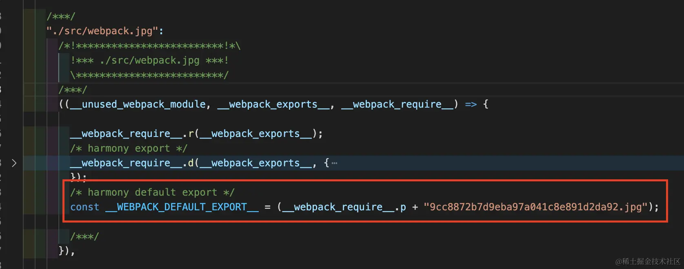
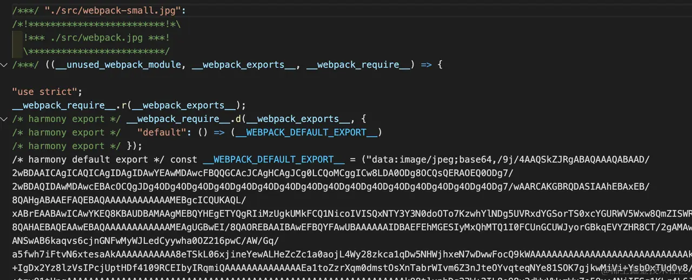
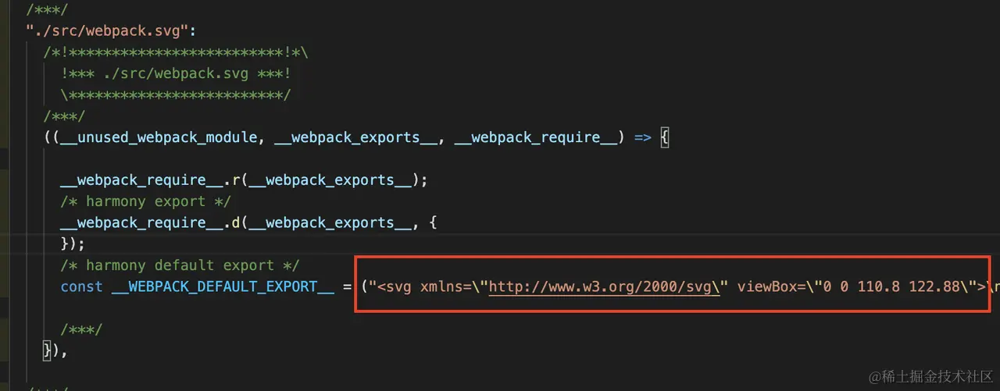

# 深入理解图像加载原理与最佳实践

- 如何使用适当的 Loader 处理图像资源

- 如何借助 Loader 或插件实现图像优化，包括压缩、雪碧图、响应式图片

## webpack4 中导入图像

- file-loader：将图像引用转换为 url 语句并生成相应图片文件

```js
// webpack.config.js
module.exports = {
  // ...
  module: {
    rules: [{
      test: /\.(png|jpg)$/,
      use: ['file-loader']
    }],
  },
};
```

经过 file-loader 处理后，原始图片会被重命名并复制到产物文件夹，同时在代码中插入图片 URL 地址，形如：



- url-loader：有两种表现，对于小于阈值 `limit` 的图像直接转化为 `base64` 编码；大于阈值的图像则调用 `file-loader` 进行加载

```js
module.exports = {
  // ...
  module: {
    rules: [{
      test: /\.(png|jpg)$/,
      use: [{
        loader: 'url-loader',
        options: {
          limit: 1024
        }
      }]
    }],
  },
};
```

经过 `url-loader` 处理后，小于 `limit` 参数即 `1024B` 的图片会被转译为 `Base64` 编码



对于超过 `limit` 值的图片则直接调用 `file-loader` 完成加载。`url-loader` 同样适用于大多数图片格式，且能将许多细小的图片直接内嵌进产物中，减少页面运行时需要发出的网络请求数，在 HTTP 1.1 及之前版本中能带来正向的性能收益。

- raw-loader：不做任何转译，只是简单将文件内容复制到产物中，适用于 SVG 场景

```js
// webpack.config.js
module.exports = {
  // ...
  module: {
    rules: [
      {
        test: /\.svg$/i,
        use: ['raw-loader'],
      },
    ],
  },
};
```

经过 raw-loader 处理后，SVG 资源会被直接复制成字符串形式



其他 `Loader` 加载 `SVG` 资源：

- svg-inline-loader：能够自动删除 `SVG` 图片中与显式无关的各种原信息，达到压缩效果；
- svg-url-loader：以 `DataURL` 方式导入 `SVG` 图片，相比于 `Base64` 更节省空间；
- react-svg-loader：导入 `SVG` 图片并自动转化为 `React` 组件形态，效果类似 `@svgr/webpack`；
- vue-svg-loader：导入 `SVG` 图片并自动转化为 `Vue` 组件形态。

## webpack5 中导入图像

webpack5 已经内置 `file-loader`、`url-loader`、`raw-loader` 相关 `loader`。

通过 `module.rules.type` 属性指定[资源类型](https://webpack.js.org/guides/asset-modules/)即可

- `file-loader` 对标到 `type = "asset/resource"'`

```js
// webpack.config.js
module.exports = {
  // ...
  module: {
    rules: [{
      test: /\.(png|jpg)$/,
-     use: ['file-loader']
+     type: 'asset/resource'
    }],
  },
};
```

默认情况下，`asset/resource` 生成的文件会以 `[hash][ext][query]` 方式重命名，可以通过 [output.assetModuleFilename](https://webpack.js.org/configuration/output/#outputassetmodulefilename) 属性控制。

- `url-loader` 对标到 `type = "asset"` 或 `type = "asset/inline"`

```js
module.exports = {
  // ...
  module: {
    rules: [{
      test: /\.(png|jpg)$/,
      type: "asset",
      parser: {
        dataUrlCondition: {
         maxSize: 1024 // 1kb
        }
      }
    }],
  },
};
```

- `raw-loader` 对标到 `type = "asset/source"`

```js
module.exports = {
  // ...
  module: {
    rules: [
      {
        test: /\.svg$/i,
        type: "asset/source"
      },
    ],
  },
};

```

`module.rules.type` 并不只是为了取代 `Loader` 那么简单，更重要的目的是在 `JavaScript Module` 之外增加对其它资源 —— [Asset Module](https://webpack.js.org/guides/asset-modules/) 的原生支持

支持 JSON、WebAssemsbly、二进制、文本等资源类型

## 图片优化

常见优化方法：

- 压缩：减少网络传输流量
- 雪碧图：减少 HTTP 请求数
- 响应式图片：根据不同设备动态调整图片大小，有助于减少网络流量
- CDN：减少客户端到服务器之间的物理链路长度，提升传输效率

### 图像压缩

优秀的图像压缩组件：

- image-webpack-loader
- imagemin-webpack-plugin
- image-minimizer-webpack-plugin

`image-webpack-loader` 组件功能齐全且用法简单，更推荐使用

```js
module.exports = {
  // ...
  module: {
    rules: [{
      test: /\.(gif|png|jpe?g|svg)$/i,
      // type 属性适用于 Webpack5，旧版本可使用 file-loader
      type: "asset/resource",
      use: [{
        loader: 'image-webpack-loader',
        options: {
          // jpeg 压缩配置
          mozjpeg: {
            quality: 80
          },
        }
      }]
    }],
  },
};
```

`image-webpack-loader` 底层依赖于 [imagemin](https://github.com/imagemin/imagemin) 及一系列的图像优化工具

- [mozjpeg](https://github.com/imagemin/imagemin-mozjpeg)：用于压缩 JPG(JPEG) 图片；
- [optipng](https://github.com/imagemin/imagemin-optipng)：用于压缩 PNG 图片；
- [pngquant](https://github.com/imagemin/imagemin-pngquant)：同样用于压缩 PNG 图片；
- [svgo](https://github.com/imagemin/imagemin-svgo)：用于压缩 SVG 图片；
- [gifsicle](https://github.com/imagemin/imagemin-gifsicle)：用于压缩 Gif 图；
- [webp](https://github.com/imagemin/imagemin-webp)：用于将 JPG/PNG 图压缩并转化为 WebP 图片格式。

图像压缩是一种非常耗时的操作，建议只在生产环境下开启

```js
module.exports = {
  // ...
  module: {
    rules: [{
      // ...
      use: [{
        loader: 'image-webpack-loader',
        options: {
          disable: process.env.NODE_ENV === 'development'
          // ...
        }
      }]
    }],
  },
};
```

### 雪碧图

HTTP 请求-响应是一种性能低下的通讯模型，即使是为了请求一个非常少的数据，也可能需要完整经历：建立 TCP 连接 => 发送 HTTP 请求 => 服务端处理 => 返回响应数据整个过程，加之 HTTP 协议的队首阻塞、浏览器并发请求数限制等原因，迫使我们必须尽量减少 HTTP 请求数以提升网络通讯效率。

雪碧图：将许多细小的图片合并成一张大图 —— 从而将复数次请求合并为一次请求，配合 CSS 的 `background-position` 控制图片的可视区域。

使用 `webpack-spritesmith` 插件自动实现雪碧图效果

```js
module.exports = {
  // ...
  resolve: {
    modules: ["node_modules", "assets"]
  },
  plugins: [
    new SpritesmithPlugin({
      // 需要
      src: {
        cwd: path.resolve(__dirname, 'src/icons'),
        glob: '*.png'
      },
      target: {
        image: path.resolve(__dirname, 'src/assets/sprite.png'),
        css: path.resolve(__dirname, 'src/assets/sprite.less')
      }
    })
  ]
};

```

将 `src.cwd` 目录内所有匹配 `src.glob` 规则的图片合并成一张大图并保存到 `target.imag`e 指定的文件路径，同时生成兼容 `SASS/LESS/Stylus` 预处理器的 `mixins` 代码，例如对于下面文件结构：

```md
load-img
├─ src
│  ├─ icons
│  │  ├─ grunt.png
│  │  ├─ gulp-js.png
│  │  └─ webpack.png
│  └─ index.js
├─ webpack.config.js
└─ package.json

```

> 示例[代码](https://github1s.com/Tecvan-fe/webpack-book-samples/blob/HEAD/load-img/webpack.config.js)

可以使用 `sprite.less` 提供的 `.sprite mixin` 添加背景图

```less
@import (less) "./assets/sprite.less";

#main {
    // 参数为原始图片文件名
    .sprite(@webpack);
}
```

> 雪碧图曾经是一种使用广泛的性能优化技术，但 HTTP2 实现 TCP 多路复用之后，雪碧图的优化效果已经微乎其微 —— 甚至是反优化，可以预见随 HTTP2 普及率的提升，未来雪碧图的必要性会越来越低，因此建议读者们了解作用与基本原理即可，不必深究。

### 响应式图片

为不同设备提供不同的分辨率、不同尺寸的图片

自动生成响应式图片的组件

- resize-image-loader
- html-loader-srcset
- responsive-loader

以 `responsive-loader` 为例

```js
module.exports = {
  // ...
  module: {
    rules: [{
      test: /\.(png|jpg)$/,
      // 对同一匹配规则下的，匹配模块，在做过滤应用规则
      oneOf: [{
        type: "javascript/auto",
        resourceQuery: /sizes?/,
        use: [{
          loader: "responsive-loader",
          options: {
            adapter: require("responsive-loader/sharp"),
          },
        }],
      }, {
        type: "asset/resource",
      }],
    }],
  }
};
```

通常没必要对项目里所有图片都施加响应式特性，因此这里使用 `resourceQuery` 过滤出带 `size/sizes` 参数的图片引用

```js
// 引用图片，并设置响应式参数
import responsiveImage from './webpack.jpg?sizes[]=300,sizes[]=600,sizes[]=1024';

const Picture = function () {
  return (
    
  );
};
```

引用参数 `'./webpack.jpg?sizes[]=300,sizes[]=600,sizes[]=1024'`; 最终将生成宽度分别为 300、600、1024 三张图片，之后设置 `img` 标签的 [srcset](https://www.w3schools.com/tags/att_source_srcset.asp) 属性即可实现图片响应式功能。

还能简单地通过 size 参数精确控制不同条件下的图像尺寸：

```css
.foo {
    background: url("./webpack.jpg?size=1024");
}

@media (max-width: 480px) {
    .foo {
        background: url("./webpack.jpg?size=300");
    }
}
```

> [responsive-loader](https://www.npmjs.com/package/responsive-loader) 还提供了许多用于控制产物、压缩比等特性的配置项