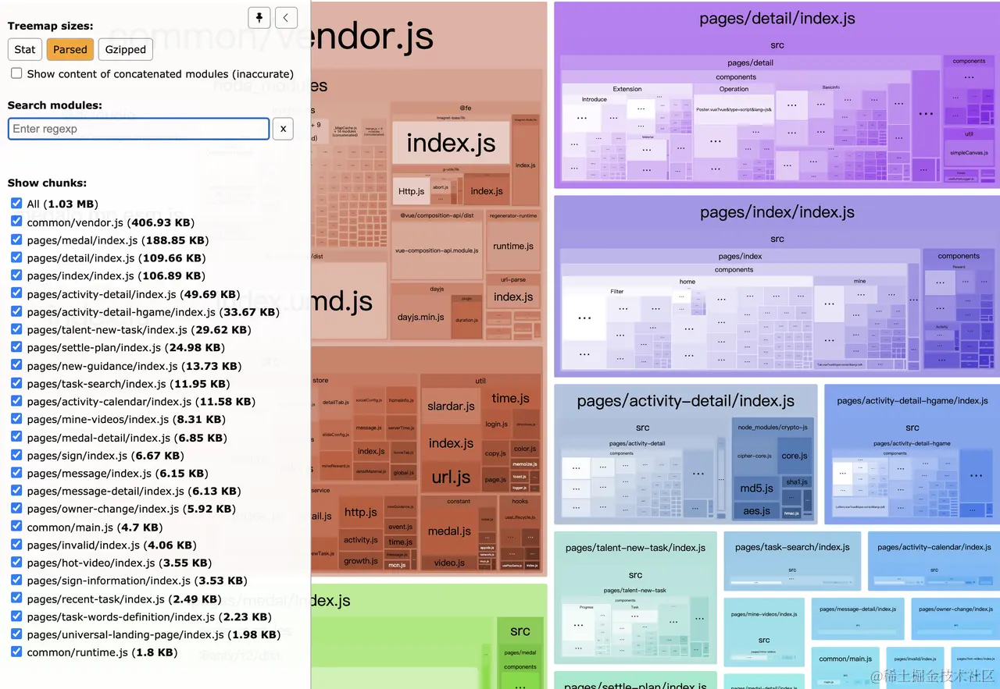
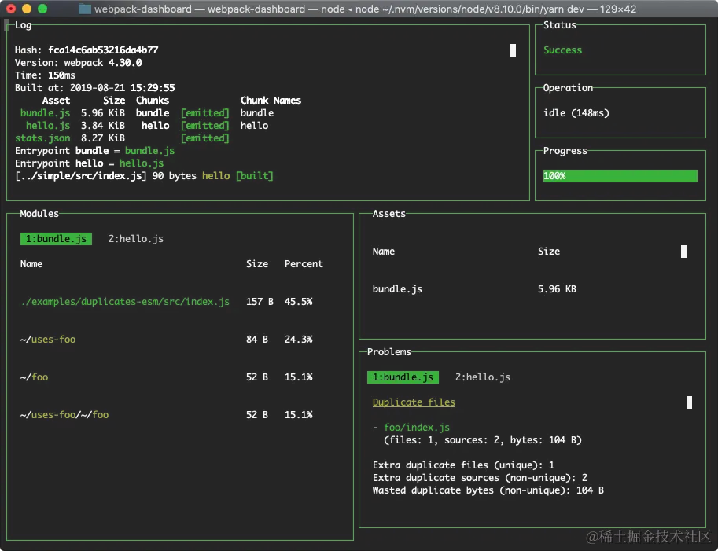
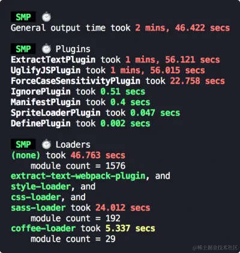

# 性能分析工具

webpack 在大型项目中性能表现不佳

- JavaScript 语言的单线程架构决定 webpack 运算效率不可能提高
- webpack 需要借助许多插件、Loader 来处理各种类型的文件读写，代码编译操作

性能优化方法：缓存，并发，优化文件

## 核心流程

最核心的流程是：

- 使用 Loader 处理各种类型的文件，转化为 JavaScript 代码
- 经过 Loader 处理的文件资源合并、打包成向下兼容的产物文件

底层工作流程：

1. 初始化阶段

- 初始化参数：从配置文件、配置对象、Shell 参数中读取，与默认配置结合得出最终参数
- 创建编译器对象：得到的参数创建 `Compiler` 对象，`Compiler` 对象负责文件监听和启动编译
- 初始化编译环境：注入内置插件、注册各种模块工厂、初始化 `RuleSet` 集合、加载配置插件
- 开始编译：执行 `Compiler` 对象的 `run` 方法开始执行编译，创建 `Compilation` 对象
- 确定入口：根据配置中的 `entry` 找出所有的入口文件，调用 `comopilation.addEntry()` 将入口文件转换为 `dependence` 对象

2. 构建阶段

- 编译模块（make）：从 `entry` 文件开始，调用 `loader` 将模块转译为 JavaScript 代码，调用 JS 解析器将内容转换为 AST 对象，找出该模块依赖的模块，**递归**处理依赖模块，直到所有入口依赖的文件都经过了本步骤的处理
- 完成模块编译：经过 `make` 阶段的处理，所有入口依赖的文件都经过了编译，得到每个文件最终编译的 js 代码和 AST 对象和它们之间的**依赖关系图**

3. 封装阶段

- 合并（seal）：根据入口和模块之间的依赖关系，组装成一个个包含多个模块的 `Chunk`
- 优化（optimize）：对 `Chunk` 中的 `Module` 进行优化处理，包括 `scope hoisting` 和 `tree-shaking`、压缩、`code split` 等
- 写入文件系统（emit）：根据 `Chunk` 生成文件，写入到文件系统中

过程中的性能问题

- 构建阶段
    - 需要将文件的相对引用路径转换为绝对路径，过程涉及多次 IO 操作，执行效率取决于**文件层次深度**
    - 找到具体文件后，需要读入文件内容并调用 `loader-runner` 遍历 `loader` 数组完成内容转译，执行 `loader` 处理文件内容，执行效率取决于**Loader 的数量与复杂度**
    - 需要将模块内容解析为 `AST` 对象，执行效率取决于**模块内容与复杂度**
    - 递归处理依赖资源，执行效率取决于**模块之间的依赖关系复杂度**

- 封装阶段
    - 根据 `splitChunks` 配置，`entry` 配置、动态模块引用语句等，确定模块与 `Chunk` 的映射关系，其中 `splitChunks` 相关的分包算法非常复杂，涉及大量 CPU 计算
    - 根据 `optimization` 配置，`Terser` 插件执行大量 AST 相关运算，执行效率取决于**产物代码量**

Webpack 需要执行非常密集的 IO 与 CPU 操作，计算成本高，再加上 `Webpack` 以及大多数组件都使用 `JavaScript` 编写，无法充分利用多核 CPU 能力，所以在中大型项性能通常表现较差

## 性能分析

Webpack 内置了 [stats](https://webpack.js.org/api/stats/) 接口，专门用于统计模块构建耗时、模块依赖关系等信息，推荐用法：

1. 添加 `profile = true` 配置

```js
// webpack.config.js
module.exports = {
  // ...
  profile: true
}
```

2. 运行编译命令，并添加 `--json` 参数，参数值为最终生成的统计文件名

```bash
npx webpack --json=stats.json
```

在文件夹下生成 `stats.json` 文件

```json
{
  "hash": "2c0b66247db00e494ab8",
  "version": "5.36.1",
  "time": 81,
  "builtAt": 1620401092814,
  "publicPath": "",
  "outputPath": "/Users/tecvan/learn-webpack/hello-world/dist",
  "assetsByChunkName": { "main": ["index.js"] },
  "assets": [
    // ...
  ],
  "chunks": [
    // ...
  ],
  "modules": [
    // ...
  ],
  "entrypoints": {
    // ...
  },
  "namedChunkGroups": {
    // ...
  },
  "errors": [
    // ...
  ],
  "errorsCount": 0,
  "warnings": [
    // ...
  ],
  "warningsCount": 0,
  "children": [
    // ...
  ]
}

```

`stats` 对象收集了 Webpack 运行过程中许多值得关注的信息，包括：

- `modules`：本次打包处理的所有模块列表，内容包含模块的大小、所属 `chunk`、构建原因、依赖模块等，特别是 `modules.profile` 属性，包含了构建该模块时，解析路径、编译、打包、子模块打包等各个环节所花费的时间，非常有用；
- `chunks`：构建过程生成的 `chunks` 列表，数组内容包含 `chunk` 名称、大小、包含了哪些模块等；
- `assets`：编译后最终输出的产物列表、文件路径、文件大小等；
- `entrypoints`：`entry` 列表，包括动态引入所生产的 `entry` 项也会包含在这里面；
- `children`：子 `Compiler` 对象的性能数据，例如 `extract-css-chunk-plugin` 插件内部就会调用 `compilation.createChildCompiler` 函数创建出子 `Compiler` 来做 `CSS` 抽取的工作。

分析工具

- [Webpack Analysis](https://webpack.github.io/analyse/) ：Webpack 官方提供的，功能比较全面的 stats 可视化工具；
- [Statoscope](https://github.com/statoscope/statoscope)：主要侧重于模块与模块、模块与 chunk、chunk 与 chunk 等，实体之间的关系分析；
- [Webpack Bundle Analyzer](https://www.npmjs.com/package/webpack-bundle-analyzer)：应该是使用率最高的性能分析工具之一，主要实现以 Tree Map 方式展示各个模块的体积占比；
- [Webpack Dashboard](https://www.npmjs.com/package/webpack-dashboard)：能够在编译过程实时展示编译进度、模块分布、产物信息等；
- [Unused Webpack Plugin](https://www.npmjs.com/package/unused-webpack-plugin)：能够根据 stats 数据反向查找项目中未被使用的文件。

## Webpack Bundle Analyzer

Webpack 构建结束后生成 `Tree Map` 形态的模块分布统计图，用户可以通过对比 `Tree Map` 内容推断各模块的体积占比，是否包含重复模块、不必要的模块等

```bash
yarn add -D webpack-bundle-analyzer
```

添加插件

```js
const BundleAnalyzerPlugin = require("webpack-bundle-analyzer")
  .BundleAnalyzerPlugin;

module.exports = {
  ...
  plugins: [new BundleAnalyzerPlugin()],
};
```

编译结束后默认打开本地视图



也可以直接用 `Webpack-bundle-analyzer` 命令直接打开 `stats` 文件

```bash
npx webpack-bundle-analyzer ./stats.json
```

分析

- Bundle 包所包含的模块内容 —— 从而推断出产物中是否包含预期之外的模块；
- 确定模块体积大小与占比 —— 从而确定是否存在优化空间；
- 了解 Bundle 产物体积，以及经过压缩后的体积。

## Webpack Dashboard

```bash
yarn add -D webpack-dashboard
```

添加插件

```js
const DashboardPlugin = require("webpack-dashboard/plugin");

module.exports = {
  // ...
  plugins: [new DashboardPlugin()],
};

```

启动编译

```bash
# 打包
npx webpack-dashboard -- webpack
# Dev Server
npx webpack-dashboard -- webpack-dev-server
# 运行 Node 程序
npx webpack-dashboard -- node index.js
```



## Speed Measure Plugin

该插件能够统计出各个 Loader、插件的处理耗时，开发者可以根据这些数据分析出哪些类型的文件处理更耗时间

```bash
yarn add -D speed-measure-webpack-plugin
```

添加插件

```js
const SpeedMeasurePlugin = require("speed-measure-webpack-plugin");

const smp = new SpeedMeasurePlugin();

const config = {
  entry: "./src/index.ts",
  // ...
};

// 注意，这里是用 `smp.wrap` 函数包裹住 Webpack 配置
module.exports = smp.wrap(config);

```



## UnusedWebpackPlugin

能够根据 webpack 统计信息，反向查找出工程项目里哪些文件没有被用到

```js
const UnusedWebpackPlugin = require("unused-webpack-plugin");

module.exports = {
  // ...
  plugins: [
    new UnusedWebpackPlugin({
      directories: [path.join(__dirname, "src")],
      root: path.join(__dirname, "../"),
    }),
  ],
};
```

`directories` 用于指定需要分析的文件目录；`root` 用于指定根路径，与输出有关。配置插件后，webpack 每次运行完毕都会输出 `directories` 目录中，有哪些文件没有被用到。