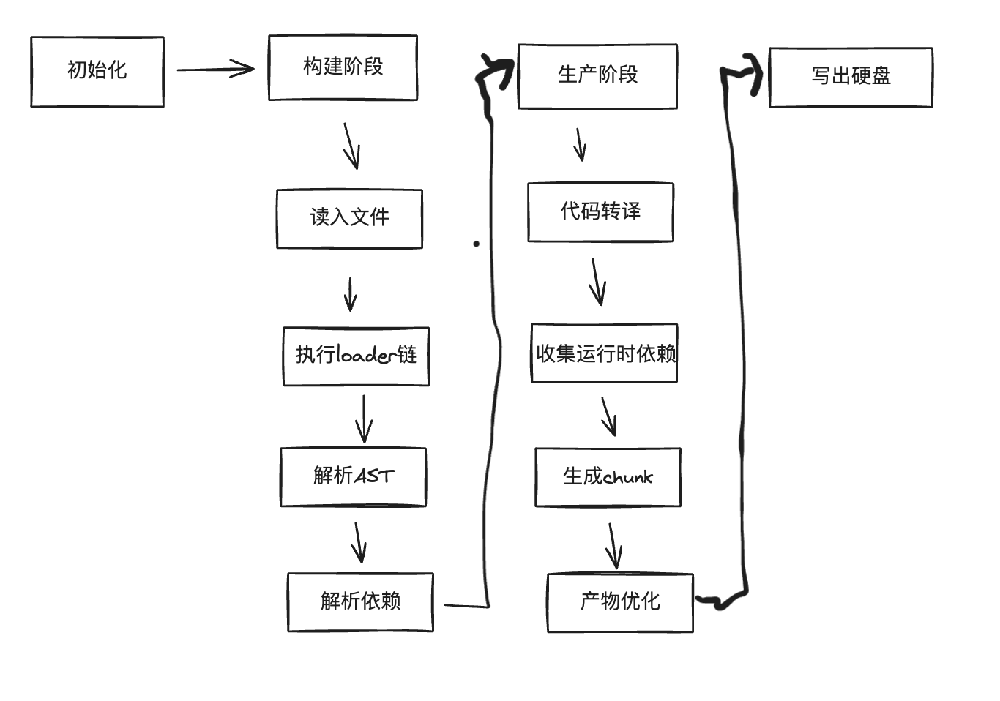

# 持久缓存提升构建性能

## Webpack5 中的持久缓存

将首次构建的过程和结果数据持久化保存到本地文件系统，以便后续构建时复用。

直接开启

```js
module.exports = {
    //...
    cache: {
        type: 'filesystem'
    },
    //...
};
```

- `cache.type`: 缓存类型，支持 'memory' 和 'filesystem'。 
- `cache.cacheDirectory`: 缓存文件的存放路径。
- `cache.buildDependencies`: 额外的依赖文件，这些文件内容发生变化时，缓存会失效而执行完整编译构建。

```js
module.exports = {
  cache: {
    type: 'filesystem',
    buildDependencies: {
      config: [
        path.join(__dirname, 'webpack.dll_config.js'),
        path.join(__dirname, '.babelrc')
      ],
    },
  },
};
```

- `cache.managedPaths`: 受控目录，webpack 构建时会跳过新旧代码 hash 值与时间戳的比较，直接使用缓存。默认值 `['./node_modules']`
- `cache.profile`：是否输出缓存处理过程的日志信息。默认 `false`
- `cache.maxAge`: 缓存失效时间，默认 `5184000000`

## 缓存原理

构建过程



- 初始化，根据配置信息设置内置的各类插件。
- Make - 构建阶段，从 entry 执行：
  - 读入文件内容；
  - 调用 Loader 转译文件内容；
  - 调用 acorn 生成 AST 结构；
  - 分析 AST，确定模块依赖列表；
  - 遍历模块依赖列表，对每一个依赖模块重新执行上述流程，直到生成完整的模块依赖图 —— ModuleGraph 对象。
- Seal - 生成阶段，过程：
  - 遍历模块依赖图，对每一个模块执行：
  - 代码转译，如 import 转换为 require 调用；
  - 分析运行时依赖。
  - 合并模块代码与运行时代码，生成 chunk；
  - 执行产物优化操作，如 Tree-shaking；
  - 将最终结果写出到产物文件。
  
Webpack 5 持久化缓存功能则将构建结果保存在文件系统中，在下次编译时对比每一个文件的内容哈希或时间戳，未发生变化的文件则跳过编译操作，直接使用缓存副本，减少重复计算，发生变化的则重新执行编译流程。

## Webpack4 使用 cache-loader

借助第三方实现缓存功能

- [cache-loader](https://www.npmjs.com/package/cache-loader)
- hard-source-webpack-plugin
- babel-loader、eslint-loader 自带缓存功能

```bash
npm install --save-dev cache-loader
```

修改配置，必须将 cache-loader 放在 loader 数组首位

```js
module.exports = {
    // ...
    module: {
        rules: [{
            test: /\.js$/,
            use: ['cache-loader', 'babel-loader', 'eslint-loader']
        }]
    },
    // ...
};
```

`cache-loader` 提供控制缓存逻辑的配置属性，特别是 `read/write` 可以用于改变缓存数据的持久化逻辑，借助这两个属性我们甚至能够实现多台机器间的缓存共享

```js
const redis = require("redis");
const client = redis.createClient();

// 读数据
async function read(key, callback) {
  // ...
  const result = await client.get(key);
  const data = JSON.parse(result);
  callback(null, data);
}

// 写数据
async function write(key, data, callback) {
  // ...
  await client.set(key, JSON.stringify(data));
  callback();
}

module.exports = {
  // ...
  module: {
    rules: [
      {
        test: /\.js$/,
        use: [
          {
            loader: "cache-loader",
            // 传入 read、write 函数
            options: { read, write },
          },
          "babel-loader",
        ],
      },
    ],
  },
};
```

## Webpack4 使用 hard-source-webpack-plugin

[hard-source-webpack-plugin](https://github.com/mzgoddard/hard-source-webpack-plugin)不仅仅缓存了 Loader 运行结果，还保存了 Webpack 构建过程中许多中间数据，包括：模块、模块关系、模块 Resolve 结果、Chunks、Assets 等，效果几乎与 Webpack5 自带的 Cache 对齐。

```bash
yarn add -D hard-source-webpack-plugin
```

配置

```js
const HardSourceWebpackPlugin = require("hard-source-webpack-plugin");

module.exports = {
  // ...
  plugins: [
    new HardSourceWebpackPlugin(),
  ],
};
```

首次运行会在缓存文件夹 `node_module/.cache` 写入一系列日志文件

## 使用组件自带的缓存功能

babel-loader 缓存

```js
module.exports = {
    // ...
    module: {
        rules: [{
            test: /\.m?js$/,
            loader: 'babel-loader',
            options: {
                cacheDirectory: true,
            },
        }]
    },
    // ...
};
```

默认情况下，缓存内容会被保存到 `node_modules/.cache/babel-loader` 目录，你也可以通过 `cacheDirectory = 'dir'` 属性设置缓存路径

`ESLint` 与 `Stylelint` 这一类耗时较长的 `Lint` 工具也贴心地提供了相应的缓存能力，只需设置 `cache = true` 即可开启

```js
// webpack.config.js
module.exports = {
  plugins: [
    new ESLintPlugin({ cache: true }),
    new StylelintPlugin({ files: '**/*.css', cache: true }),
  ],
};
```