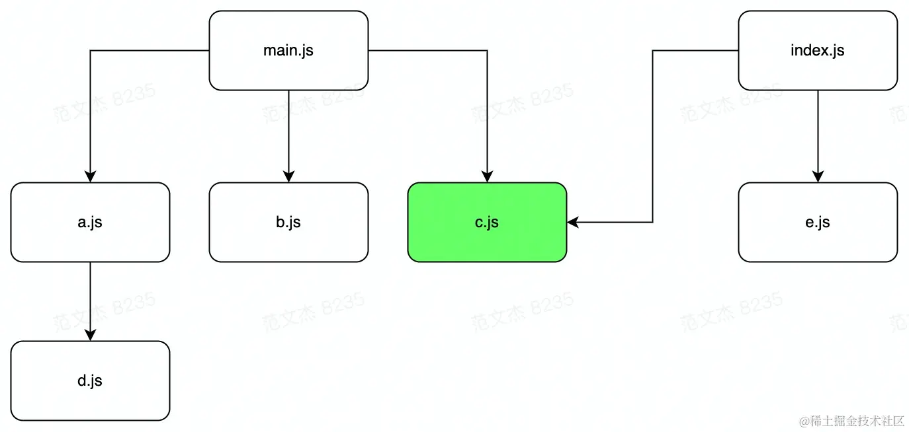
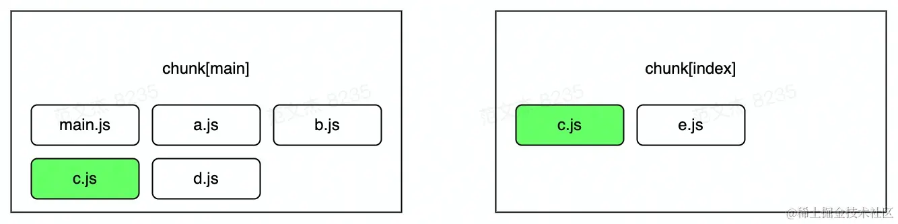
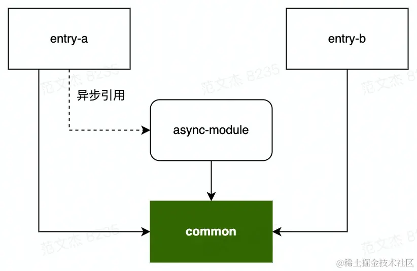
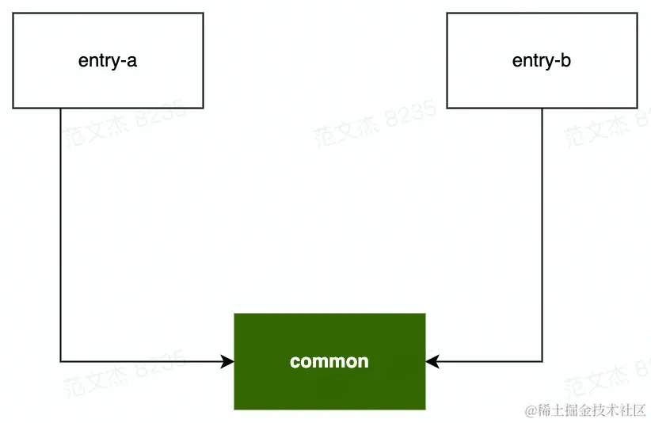
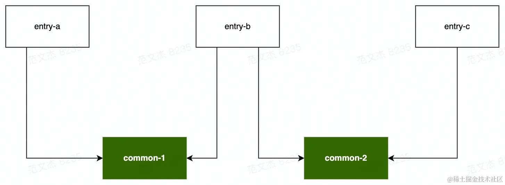

# 使用 SpiltChunks 提升应用性能

Webpack 默认会将尽可能的模块代码打包在一起，优点是减少最终页面的 HTTP 请求数，缺点是：

- 代码体积过大，影响加载速度
- 无法有效应用浏览器缓存，特别对于 NPM 包之类变动较少的代码，业务代码哪怕改了一行都会导致 NPM 包缓存失效

## 深入理解 Chunk

在构建流程进入生成阶段（Seal）后

- Webpack 首先根据 entry 配置创建若干 Chunk 对象
- 遍历构建阶段（Make）找到所有 Module 对象，同一 Entry 下模块分配到 Entry 对应的 Chunk 中
- 遇到异步模块则创建新的 Chunk 对象，并将异步模块放入该 Chunk
- 分配完毕后，根据 SplitChunksPlugin 的启发式算法进一步对这些 Chunk 执行裁剪、拆分、合并、代码调优，最终调整成运行性能更优的形态
- 最后，将这些 Chunk 一个个输出成最终的产物文件，编译工作到此结束

Chunk 在构建流程中起着承上启下的关键作用 —— 一方面作为 Module 容器，根据一系列默认 分包策略 决定哪些模块应该合并在一起打包；另一方面根据 splitChunks 设定的 策略 优化分包，决定最终输出多少产物文件。

Chunk 分包结果的好坏直接影响了最终应用性能

- Initial Chunk：entry 模块及相应子模块打包成 Initial Chunk；
- Async Chunk：通过 import('./xx') 等语句导入的异步模块及相应子模块组成的 Async Chunk；
- Runtime Chunk：运行时代码抽离成 Runtime Chunk，可通过 entry.runtime 配置项实现。

但 Initial Chunk 与 Async Chunk 这种略显粗暴的规则会带来两个明显问题：

1. 模块重复打包

假如多个 Chunk 同时依赖同一个 Module，那么这个 Module 会被不受限制地重复打包进这些 Chunk，例如对于下面的模块关系：



示例中 main/index 入口(entry)同时依赖于 c 模块，默认情况下 Webpack 不会对此做任何优化处理，只是单纯地将 c 模块同时打包进 main/index 两个 Chunk



2. 资源冗余 & 低效缓存

Webpack 会将 `Entry` 模块、异步模块所有代码都打进同一个单独的包，这在小型项目通常不会有明显的性能问题，但伴随着项目的推进，包体积逐步增长可能会导致应用的响应耗时越来越长。归根结底这种将所有资源打包成一个文件的方式存在两个弊端：

- 资源冗余：客户端必须等待整个应用的代码包都加载完毕才能启动运行，但可能用户当下访问的内容只需要使用其中一部分代码
- 缓存失效：将所有资源达成一个包后，所有改动 —— 即使只是修改了一个字符，客户端都需要重新下载整个代码包，缓存命中率极低

更科学的分包策略解决

- 将被多个 `Chunk` 依赖的包分离成独立 `Chunk`，防止资源重复

- `node_modules` 中的资源通常变动较少，可以抽成一个独立的包，业务代码的频繁变动不会导致这部分第三方库资源缓存失效，被无意义地重复加载

## SplitChunksPlugin

基于一些更灵活、合理的启发式规则将 `Module` 编排进不同的 `Chunk`，最终构建出性能更佳，缓存更友好的应用产物

- `SplitChunksPlugin` 支持根据 `Module` 路径、`Module` 被引用次数、`Chunk` 大小、`Chunk` 请求数等决定是否对 `Chunk` 进行拆分，这些决策都可以通过 `optimization.splitChunks` 进行配置
    - 单独打包某些特定路径的内容，例如 `node_modules` 打包为 `vendors`
    - 单独打包使用频率较高的文件
- `SplitChunksPlugin` 提供了 `optimization.splitChunks.cacheGroup`，用于对不同特点的资源做分组处理
- 内置 `default` 与 `defautlVendors` 两个默认分组
    - `node_modules` 资源会命中 `defaultVendors` 规则，并被单独打包；
    - 只有包体超过 20kb 的 `Chunk` 才会被单独打包；
    - 加载 Async Chunk 所需请求数不得超过 30
    - 加载 Initial Chunk 所需请求数不得超过 30

修改 optimization.splitChunks 配置项即可实现自定义的分包策略

```js
module.exports = {
  //...
  optimization: {
    splitChunks: {
      // ...
    },
  },
}
```

`splitChunks` 主要有两种类型的配置

- `minChunks/minSize/maxInitialRequest` 等分包条件，满足这些条件的模块都会被执行分包；

- `cacheGroup` ：用于为特定资源声明特定分包条件，例如可以为 `node_modules` 包设定更宽松的分包条件

## 设置分包范围

`SplitChunksPlugin` 默认情况下只对 `Async Chunk` 生效，我们可以通过 `splitChunks.chunks` 调整作用范围，该配置项支持如下值

- 字符串 `'all'` ：对 Initial Chunk 与 Async Chunk 都生效，建议优先使用该值；
- 字符串 `'initial'` ：只对 Initial Chunk 生效；
- 字符串 `'async'` ：只对 Async Chunk 生效；
- 函数 `(chunk) => boolean` ：该函数返回 `true` 时生效

```js
module.exports = {
  //...
  optimization: {
    splitChunks: {
      chunks: 'all',
    },
  },
}
```

## 根据 Module 使用频率分包

支持按 `Module` 被 `Chunk` 引用的次数决定是否分包，借助这种能力我们可以轻易将那些被频繁使用的模块打包成独立文件，减少代码重复

```js
module.exports = {
  //...
  optimization: {
    splitChunks: {
      // 设定引用次数超过 2 的模块才进行分包
      minChunks: 2
    },
  },
}
```

被 `Chunk` 引用次数”并不直接等价于被 `import` 的次数，而是取决于上游调用者是否被视作 Initial Chunk 或 Async Chunk 处理

```js
// common.js
export default "common chunk";

// async-module.js
import common from './common'

// entry-a.js
import common from './common'
import('./async-module')

// entry-b.js
import common from './common'

```

模块关系



其中，`entry-a`、`entry-b` 分别被视作 Initial Chunk 处理；async-module 被 `entry-a` 以异步方式引入，因此被视作 Async Chunk 处理。那么对于 `common` 模块来说，分别被三个不同的 `Chunk` 引入，此时引用次数为 3，配合下面的配置

```js
// webpack.config.js
module.exports = {
  entry: {
    entry1: './src/entry-a.js',
    entry2: './src/entry-b.js'
  },
  // ...
  optimization: {
    splitChunks: {      
      minChunks: 2,
      //...
    }
  }
};
```

`common` 模块命中 `optimization.splitChunks.minChunks = 2` 规则，因此该模块可能会被单独分包，最终产物

- entry1.js
- entry1.js
- async-module.js
- common.js

## 限制分包数量

提供了 `maxInitialRequest/maxAsyncRequest` 配置项，用于限制分包数量

- `maxInitialRequest`：用于设置 Initial Chunk 最大并行请求数

- `maxAsyncRequests`：用于设置 Async Chunk 最大并行请求数

这里所说的“请求数”，是指加载一个 Chunk 时所需要加载的所有分包数。例如对于一个 Chunk A，如果根据分包规则(如模块引用次数、第三方包)分离出了若干子 Chunk A[¡]，那么加载 A 时，浏览器需要同时加载所有的 A[¡]，此时并行请求数等于 ¡ 个分包加 A 主包，即 ¡+1。



若 minChunks = 2 ，则 common 模块命中 minChunks 规则被独立分包，浏览器请求 entry-a 时，则需要同时请求 common 包，并行请求数为 1 + 1=2。



若 minChunks = 2 ，则 common-1 、common-2 同时命中 minChunks 规则被分别打包，浏览器请求 entry-b 时需要同时请求 common-1 、common-2 两个分包，并行数为 2 + 1 = 3，此时若 maxInitialRequest = 2，则分包数超过阈值，SplitChunksPlugin 会 放弃 common-1、common-2 中体积较小的分包。maxAsyncRequest 逻辑与此类似，不在赘述。

## 限制分包体积

防止产物过碎，避免单个 `Chunk` 过大。

- `minSize`： 超过这个尺寸的 `Chunk` 才会正式被分包；
- `maxSize`： 超过这个尺寸的 `Chunk` 会尝试进一步拆分出更小的 `Chunk`；
- `maxAsyncSize`： 与 `maxSize` 功能类似，但只对异步引入的模块生效；
- `maxInitialSize`： 与 `maxSize` 类似，但只对 `entry` 配置的入口模块生效；
- `enforceSizeThreshold`： 超过这个尺寸的 `Chunk` 会被强制分包，忽略上述其它 `Size` 限制

结合前面介绍的两种规则，`SplitChunksPlugin` 的主体流程如下

- `SplitChunksPlugin` 尝试将命中 `minChunks` 规则的 `Module` 统一抽到一个额外的 `Chunk` 对象
- 判断该 `Chunk` 是否满足 `maxInitialRequests` 阈值，若满足则进行下一步
- 判断该 `Chunk` 资源的体积是否大于上述配置项 `minSize` 声明的下限阈值

  - 如果体积小于 `minSize` 则取消这次分包，对应的 `Module` 依然会被合并入原来的 `Chunk`
  - 如果 `Chunk` 体积大于 `minSize` 则判断是否超过 `maxSize`、`maxAsyncSize`、`maxInitialSize` 声明的上限阈值，如果超过则尝试将该 `Chunk` 继续分割成更小的部分


## 缓存组 cacheGroups

用于为不同文件组设置不同的规则

```js
module.exports = {
  //...
  optimization: {
    splitChunks: {
      cacheGroups: {
        vendors: {
            test: /[\\/]node_modules[\\/]/,
            minChunks: 1,
            minSize: 0
        }
      },
    },
  },
};
```

`cacheGroups` 支持上述 `minSice/minChunks/maxInitialRequest` 等条件配置，此外还支持一些与分组逻辑强相关的属性

- `test`：接受正则表达式、函数及字符串，所有符合 `test` 判断的 Module 或 Chunk 都会被分到该组
- `type`：接受正则表达式、函数及字符串，与 `test` 类似均用于筛选分组命中的模块，区别是它判断的依据是文件类型而不是文件名，例如 `type = 'json'` 会命中所有 JSON 文件
- `idHint`：字符串型，用于设置 `Chunk ID`，它还会被追加到最终产物文件名中，例如 `idHint = 'vendors`' 时，输出产物文件名形如 `vendors-xxx-xxx.js` 
- `priority`：数字型，用于设置该分组的优先级，若模块命中多个缓存组，则优先被分到 `priority` 更大的组

缓存组的作用在于能为不同类型的资源设置更具适用性的分包规则

提供了两个开箱即用的 cacheGroups，分别命名为 default 与 defaultVendors，默认配置：

```js
module.exports = {
  //...
  optimization: {
    splitChunks: {
      cacheGroups: {
        default: {
          idHint: "",
          reuseExistingChunk: true,
          minChunks: 2,
          priority: -20
        },
        defaultVendors: {
          idHint: "vendors",
          reuseExistingChunk: true,
          test: /[\\/]node_modules[\\/]/i,
          priority: -10
        }
      },
    },
  },
};
```

- 将所有 `node_modules` 中的资源单独打包到 `vendors-xxx-xx.js` 命名的产物
- 对引用次数大于等于 2 的模块 —— 也就是被多个 `Chunk` 引用的模块，单独打包

将默认分组设置为 `false`，关闭分组配置

```js
module.exports = {
  //...
  optimization: {
    splitChunks: {
      cacheGroups: {
        default: false
      },
    },
  },
};
```

## 配置项与最佳实践

`SplitChunksPlugin` 支持的配置项：

- `minChunks`：用于设置引用阈值，被引用次数超过该阈值的 `Module` 才会进行分包处理；
- `maxInitialRequest/maxAsyncRequests`：用于限制 `Initial Chunk`(或 Async Chunk) 最大并行请求数，本质上是在限制最终产生的分包数量；
- `minSize`： 超过这个尺寸的 `Chunk` 才会正式被分包；
- `maxSize`： 超过这个尺寸的 `Chunk` 会尝试继续做分包；
- `maxAsyncSize`： 与 `maxSize` 功能类似，但只对异步引入的模块生效；
- `maxInitialSize`： 与 `maxSize` 类似，但只对 `entry` 配置的入口模块生效；
- `enforceSizeThreshold`： 超过这个尺寸的 `Chunk` 会被强制分包，忽略上述其它 `size` 限制；
- `cacheGroups`：用于设置缓存组规则，为不同类型的资源设置更有针对性的分包策略。

惯用的最佳分包策略

- 针对 `node_modules` 资源

  - 可以将 `node_modules` 模块打包成单独文件(通过 `cacheGroups` 实现)，防止业务代码的变更影响 NPM 包缓存，同时建议通过 `maxSize` 设定阈值，防止 `vendor` 包体过大

- 针对业务代码

  - 设置 `common` 分组，通过 `minChunks` 配置项将使用率较高的资源合并为 `Common` 资源
  - 首屏用不上的代码，尽量以异步方式引入
  - 设置 `optimization.runtimeChunk` 为 `true`，将运行时代码拆分为独立资源

```js
const path = require("path");
const webpack = require("webpack");

module.exports = {
  mode: "development",
  devtool: false,
  entry: path.resolve(__dirname, "src/index.js"),
  output: {
    path: path.resolve(__dirname, "dist"),
    filename: "[name].[contenthash].js",
    clean: true,
  },
  optimization: {
    runtimeChunk: "single",
    splitChunks: {
      chunks: "all",
      maxInitialRequests: Infinity,
      minSize: 0,
      cacheGroups: {
        vendor: {
          test: /[\\/]node_modules[\\/]/,
          name(module) {
            const packageName = module.context.match(
              /[\\/]node_modules[\\/](.*?)([\\/]|$)/
            )[1];

            return `npm.${packageName.replace("@", "")}`;
          },
        },
      },
    },
  },
};
```
