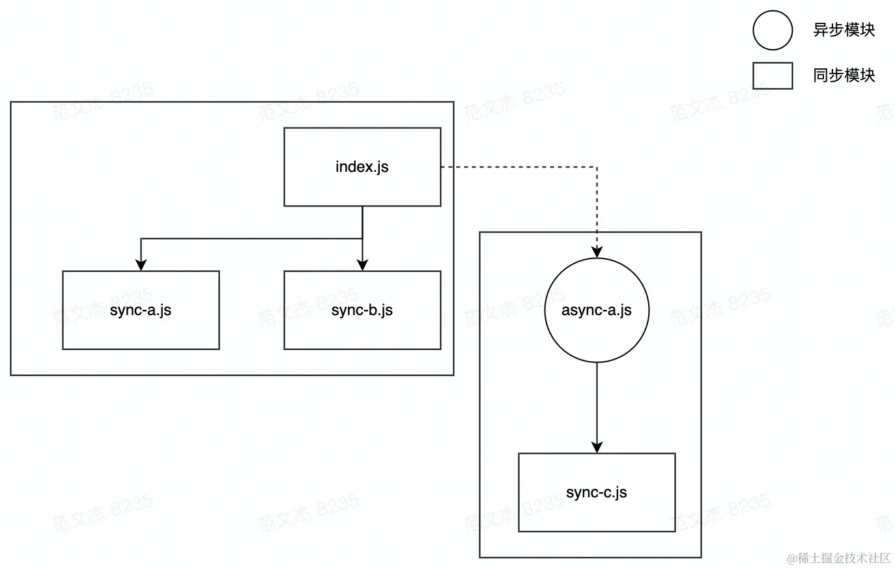
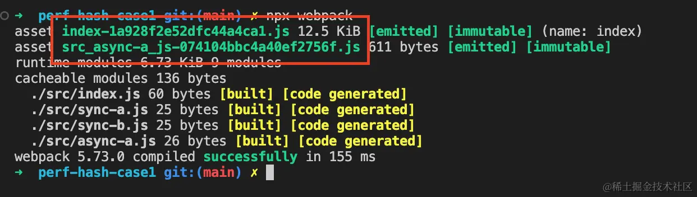
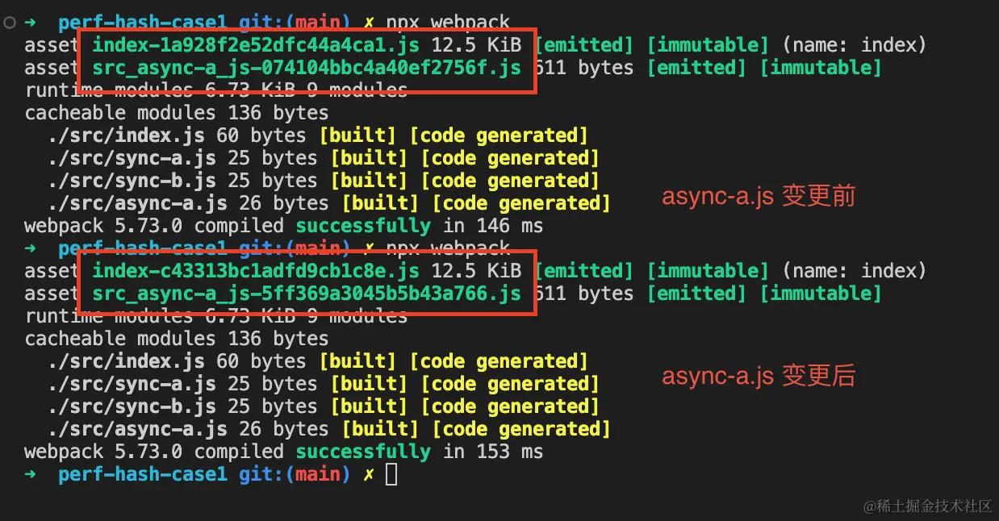
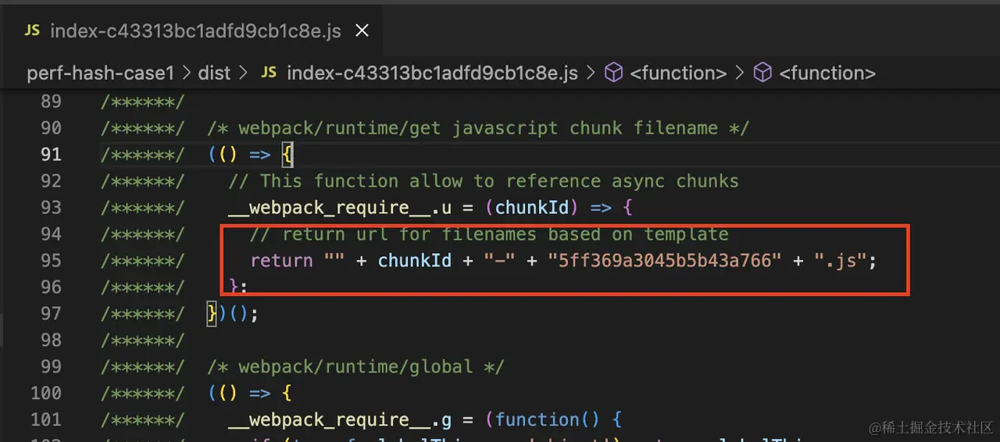
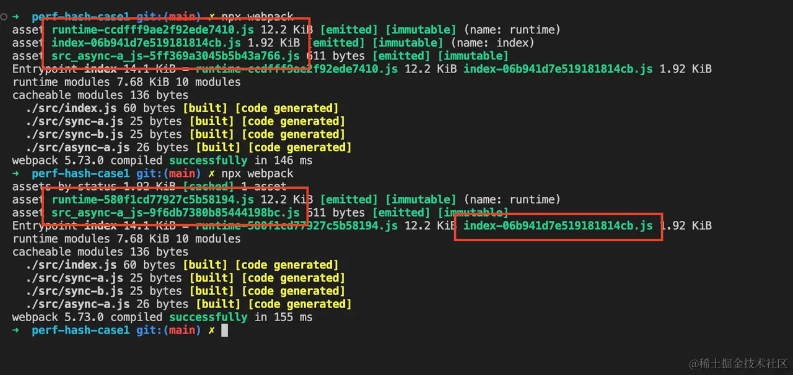
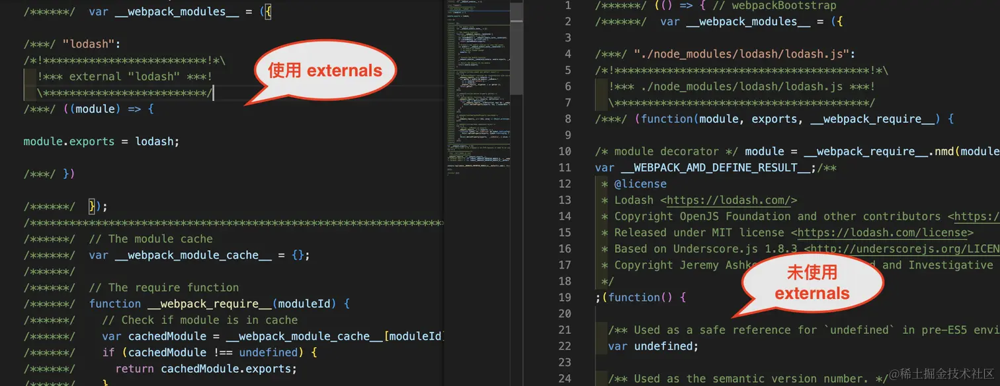
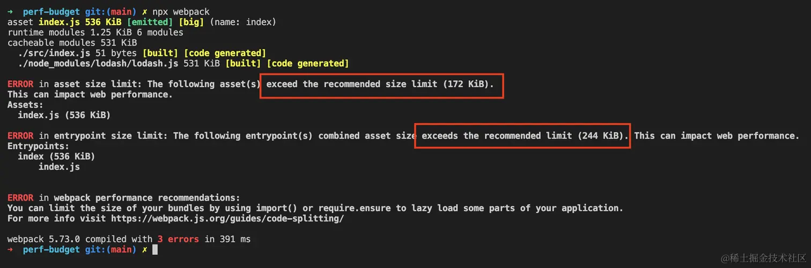

# 性能极致优化技巧

- 使用动态加载，减少首屏资源加载量；
- 使用 `externals`、`Tree-Shaking`、`Scope Hoisting` 特性，减少应用体积；
- 正确使用 [hash] 占位符，优化 HTTP 资源缓存效率

## 动态加载

Webpack 默认会将同一个 Entry 下的所有模块全部打包成一个产物文件，包括那些与页面渲染无关的模块。导致页面初始化时需要花时间加载暂时用不上的代码，影响首屏渲染性能。

```js
import someBigMethod from "./someBigMethod";

document.getElementById("someButton").addEventListener("click", () => {
  someBigMethod();
});
```

逻辑上，直到点击页面的 someButton 按钮时才会调用 someBigMethod 方法，动态导入：

```js
document.getElementById("someButton").addEventListener("click", async () => {
  // 使用 `import("module")` 动态加载模块
  const someBigMethod = await import("./someBigMethod");
  someBigMethod();
});
```

直到运行时才加载。

新的性能问题：

- 过度使用导致产物过度细碎，产物过多，运行时 HTTP 请求次数过多，影响性能
- 使用时 Webpack 需要在客户端注入一大段用于支持动态加载特性的 Runtime

Vue 页面组件加载

```js
 import { createRouter, createWebHashHistory } from "vue-router";

const Home = () => import("./Home.vue");
const Foo = () => import(/* webpackChunkName: "sub-pages" */ "./Foo.vue");
const Bar = () => import(/* webpackChunkName: "sub-pages" */ "./Bar.vue");

// 基础页面
const routes = [
  { path: "/bar", name: "Bar", component: Bar },
  { path: "/foo", name: "Foo", component: Foo },
  { path: "/", name: "Home", component: Home },
];

const router = createRouter({
  history: createWebHashHistory(),
  routes,
});

export default router;
```

## HTTP 缓存优化

调整产物文件的名称(通过 Hash)与内容(通过 [Code Splitting](../chapter16/README.md))，使其更适配 HTTP 持久化缓存策略

根据构建情况动态拼接产物文件名称`(output.filename)`

- `[fullhash]`: 整个项目的内容 `Hash` 值，项目中任意模块变化都会产生新的 `fullhash`
- `[chunkhash]`：产物对应 `Chunk` 的 `Hash`，`Chunk` 内容变化会改变 `chunkhash`
- `[contenthash]`：产物内容 `Hash`，产物内容变化会改变 `contenthash`

`output.filename` 值中插入相应占位符即可，如 "[name]-[contenthash].js"。我们来看个完整例子，假设对于下述源码结构：

```
src/
├── index.css
├── index.js
└── foo.js
```
配置

```js
module.exports = {
  // ...
  entry: { index: "./src/index.js", foo: "./src/foo.js" },
  output: {
    filename: "[name]-[contenthash].js",
    path: path.resolve(__dirname, "dist"),
  },
  plugins: [new MiniCssExtractPlugin({ filename: "[name]-[contenthash].css" })],
};
```

> 提示：也可以通过占位符传入 Hash 位数，如 [contenthash:7] ，即可限定生成的 Hash 长度。

每个产物文件名都会带上一段由产物内容计算出的唯一 Hash 值，文件内容不变，Hash 也不会变化，这就很适合用作 HTTP 持久缓存 资源

```ini
# HTTP Response header

Cache-Control: max-age=31536000
```

边际 Case 需要注意：**异步模块变化会引起主 Chunk Hash 同步发生变化**，例如对于下面这种模块关系



> 示例[代码](https://github.com/Tecvan-fe/webpack-book-samples/blob/main/perf-hash-case1/webpack.config.js)

构建后将生成入口 `index.js` 与异步模块 `async-a.js` 两个 Chunk 对应的产物



此时，若异步模块 `async-a` 或其子模块 `sync-c` 发生变化，理论上应该只会影响 `src_async-a` 的 Hash 值，但实际效果却是：



父级 Chunk(`index`) 也受到了影响，生成新的 Hash 值，这是因为在 `index` 中需要记录异步 Chunk 的真实路径



异步 Chunk 的路径变化自然也就导致了父级 Chunk 内容变化，此时可以用 `optimization.runtimeChunk` 将这部分代码抽取为单独的 `Runtime Chunk`

```js
module.exports = {
  entry: { index: "./src/index.js" },
  mode: "development",
  devtool: false,
  output: {
    filename: "[name]-[contenthash].js",
    path: path.resolve(__dirname, "dist")
  },
  // 将运行时代码抽取到 `runtime` 文件中
  optimization: { runtimeChunk: { name: "runtime" } },
};
```

之后，`async-a.js` 模块的变更只会影响 `Runtime Chunk` 内容，不再影响主 Chunk



建议至少为生成环境启动 `[contenthash]` 功能，并搭配 `optimization.runtimeChunk` 将运行时代码抽离为单独产物文件

## 使用外置依赖

`externals` 的主要作用是将部分模块排除在 Webpack 打包系统之外

```js
module.exports = {
  // ...
  externals: {
    lodash: "_",
  },
};
```

Webpack 会 预设 运行环境中已经内置 Lodash 库 —— 无论是通过 CDN 还是其它方式注入，所以不需要再将这些模块打包到产物中



注意，使用 externals 时必须确保这些外置依赖代码已经被正确注入到上下文环境中，这在 Web 应用中通常可以通过 CDN 方式实现，例如

```js
module.exports = {
  // ...
  externals: {
    react: "React",
    lodash: "_",
  },
  plugins: [
    new HtmlWebpackPlugin({
      templateContent: `
<!DOCTYPE html>
<html>
<head>
  <meta charset="utf-8">
  <title>Webpack App</title>
  <script defer crossorigin src="//unpkg.com/react@18/umd/react.development.js"></script>
  <script defer crossorigin src="//unpkg.com/lodash@4.17.21/lodash.min.js"></script>
</head>
<body>
  <div id="app" />
</body>
</html>
  `,
    }),
  ],
};
```

## Tree-Shaking 删除多余模块导出

在运行过程中静态分析模块之间的导入导出，判断哪些模块导出值没有被其它模块使用 —— 相当于模块层面的 Dead Code，并将其删除。

启动 `Tree Shaking` 功能必须同时满足两个条件

- 配置 `optimization.usedExports` 为 `true`，标记模块导入导出列表
- 启动代码优化功能，可以通过如下方式实现
    - 配置 `mode = production`
    - 配置 `optimization.minimize = true`
    - 提供 `optimization.minimizer` 数组

```js
// webpack.config.js
module.exports = {
  mode: "production",
  optimization: {
    usedExports: true,
  },
};
```

之后，Webpack 会对所有使用 ESM 方案的模块启动 Tree-Shaking

```js
// index.js
import {bar} from './bar';
console.log(bar);

// bar.js
export const bar = 'bar';
export const foo = 'foo';

```

经过处理

```js
// index.js
import {bar} from './bar';
console.log(bar);

// bar.js
export const bar = 'bar';
```

## Scope Hoisting 合并模块

默认情况下 Webpack 会将模块打包成一个个单独的函数

```js
// common.js
export default "common";

// index.js
import common from './common';
console.log(common);
```

打包后会生成

```js
"./src/common.js":
  ((__unused_webpack_module, __webpack_exports__, __webpack_require__) => {
     const __WEBPACK_DEFAULT_EXPORT__ = ("common");
     __webpack_require__.d(__webpack_exports__, {
      /* harmony export */
      "default": () => (__WEBPACK_DEFAULT_EXPORT__)
      /* harmony export */
    });
  }),
"./src/index.js":
  ((__unused_webpack_module, __webpack_exports__, __webpack_require__) => {
      var _common__WEBPACK_IMPORTED_MODULE_0__ = __webpack_require__( /*! ./common */ "./src/common.js");
      console.log(_common__WEBPACK_IMPORTED_MODULE_0__)
  })

```

这种处理方式需要将每一个模块都包裹进一段相似的函数模板代码中，Webpack 提供了 Scope Hoisting 功能，用于 将符合条件的多个模块合并到同一个函数空间 中，从而减少产物体积，优化性能。

```js
((__unused_webpack_module, __webpack_exports__, __webpack_require__) => {
    ;// CONCATENATED MODULE: ./src/common.js
    /* harmony default export */ const common = ("common");
    
    ;// CONCATENATED MODULE: ./src/index.js
    console.log(common);
})
```

提供了三种开启 Scope Hoisting 的方法

- 设置 `mode = production`
- 设置 `optimization.concatenateModules` 配置项
- 直接使用 `ModuleConcatenationPlugin` 插件

```js
const ModuleConcatenationPlugin = require('webpack/lib/optimize/ModuleConcatenationPlugin');

module.exports = {
    // 方法1： 将 `mode` 设置为 production，即可开启
    mode: "production",
    // 方法2： 将 `optimization.concatenateModules` 设置为 true
    optimization: {
        concatenateModules: true,
        usedExports: true,
        providedExports: true,
    },
    // 方法3： 直接使用 `ModuleConcatenationPlugin` 插件
    plugins: [new ModuleConcatenationPlugin()]
};
```

三种方法最终都会调用 `ModuleConcatenationPlugin` 完成模块分析与合并操作。

与 Tree-Shaking 类似，Scope Hoisting 底层**基于 ES Module 方案的静态特性**，推断模块之间的依赖关系，并进一步判断模块与模块能否合并，因此在以下场景下会失效：

1. 非 ESM 模块

遇到 AMD、CMD 一类模块时，由于导入导出内容的动态性，Webpack 无法确保模块合并后不会产生意料之外的副作用，因此会关闭 Scope Hoisting 功能。通过 `mainFileds` 属性尝试引入框架的 ESM 版本

```js
module.exports = {
  resolve: {
    // 优先使用 jsnext:main 中指向的 ES6 模块化语法的文件
    mainFields: ['jsnext:main', 'browser', 'main']
  },
};
```

2. 模块被多个 Chunk 引用

如果一个模块被多个 Chunk 同时引用，为避免重复打包，Scope Hoisting 同样会失效，例如

```js
// common.js
export default "common"

// async.js
import common from './common';

// index.js 
import common from './common';
import("./async");
```

示例中，入口 `index.js` 与异步模块 `async.js` 同时依赖 `common.js` 文件，`common.js` 无法被合并入任一 Chunk，而是作为生成为单独的作用域，最终打包结果

```js
 "./src/common.js":
  (() => {
    var __WEBPACK_DEFAULT_EXPORT__ = ("common");
  }),
 "./src/index.js":
  (() => {
    var _common__WEBPACK_IMPORTED_MODULE_0__ = __webpack_require__( /*! ./common */ "./src/common.js");
    __webpack_require__.e( /*! import() */ "src_async_js").then(__webpack_require__.bind(__webpack_require__, /*! ./async */ "./src/async.js"));
  }),  
```

## 监控产物体积

当构建生成的产物体积超过阈值时抛出异常警告

```js
module.exports = {
  // ...
  performance: {    
    // 设置所有产物体积阈值
    maxAssetSize: 172 * 1024,
    // 设置 entry 产物体积阈值
    maxEntrypointSize: 244 * 1024,
    // 报错方式，支持 `error` | `warning` | false
    hints: "error",
    // 过滤需要监控的文件类型
    assetFilter: function (assetFilename) {
      return assetFilename.endsWith(".js");
    },
  },
};
```

若此时产物体积超过 172KB



> 提示：这里的报错不会阻断构建功能， 依然能正常打包出应用产物。

建议大家参考 [Web Vitals](https://web.dev/articles/vitals?hl=zh-cn) 模型，始终关注、对比应用的线上表现，确保最佳用户体验


> 为何 Tree-Shaking 强依赖于 ESM 模块方案？ESM 与其它方案如 AMD、CMD 等，有何区别？

- 静态解析：ESM 是在代码静态解析阶段进行模块导入的，这意味着在构建过程中可以确定模块的依赖关系。这使得工具可以更轻松地分析和识别未被使用的代码，从而进行 Tree-Shaking。
- 静态导出：ESM 以静态方式导出模块成员，即在代码编译时就确定了导出的内容。相比之下，AMD（异步模块定义）和 CMD（Common Module Definition）等模块方案是动态导出的，模块的导出成员在运行时才能确定。这使得 ESM 在静态分析和优化代码时更加高效可靠。

ESM 与 AMD、CMD 等模块方案的区别主要体现在以下几个方面：

- 语法差异：
ESM 使用 import 和 export 关键字来导入和导出模块。
AMD 使用 define 和 require 函数来定义和引入模块。
CMD 也使用 define 函数定义模块，但与 AMD 不同，它推崇依赖就近的加载方式，即在执行模块时再加载其依赖。
- 加载方式：
ESM 是静态加载的，模块的依赖关系在编译时就确定了。
AMD 和 CMD 是动态加载的，模块的依赖关系在运行时才确定，因此需要在运行时进行模块的加载和解析。
- 导出方式：
ESM 以静态方式导出模块成员，即在代码编译时就确定了导出的内容。
AMD 和 CMD 是动态导出的，模块的导出成员在运行时才能确定。