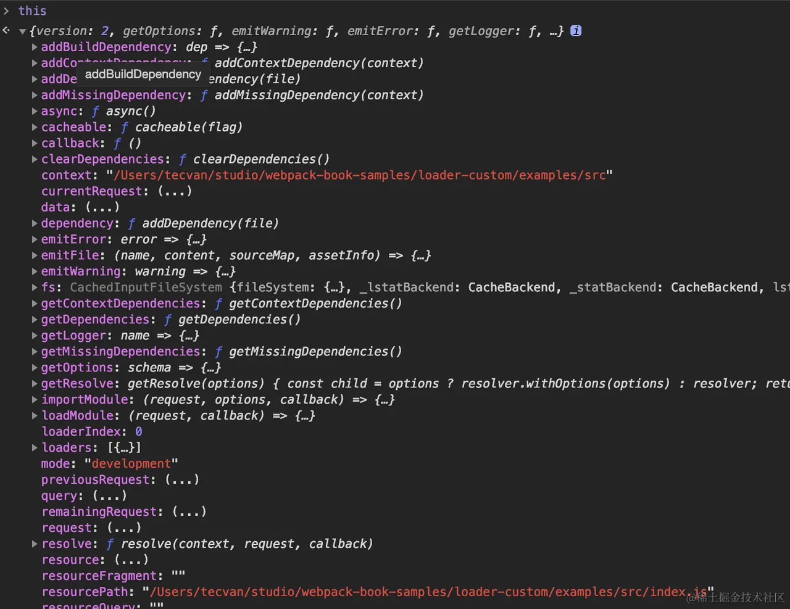

# Loader 开发

## 为什么需要 Loader

文件格式过多，Loader 将文件资源的读与处理逻辑解耦，webpack 内部只需要实现对标准 JavaScript 代码解析/处理能力。

Loader 为函数形式，接受原始代码，返回翻译结果

```js
module.exports = function(source) {
  // 执行各种代码计算
  return modifySource;
};
```

webpack 进入构建阶段，首先通过 IO 接口读取文件内容，之后调用 LoaderRunner 并将文件内容以 source 参数形式传递给 Loader 处理函数。最终以标准 JavaScript 代码提交给 webpack 主流程。

```js
module.exports = function(source, sourceMap?, data?) {
  return source;
};
```

参数：

- `source`：资源输入，对于第一个执行的 Loader 为资源文件的内容；后续执行的 Loader 则为前一个 Loader 的执行结果，可能是字符串，也可能是代码的 AST 结构
- `sourceMap`: 可选参数，代码的 [sourcemap](https://sourcemap.com/) 结构
- `data`: 可选参数，其它需要在 Loader 链中传递的信息，比如 posthtml/posthtml-loader 就会通过这个参数传递额外的 AST 对象。

大多数 Loader 要做的事情就是将 `source` 转译为另一种形式的 `output`，比如 [webpack-contrib/raw-loader](https://github.com/webpack-contrib/raw-loader) 的核心源码

```js
//... 
export default function rawLoader(source) {
  // ...
  const json = JSON.stringify(source)
    .replace(/\u2028/g, '\\u2028')
    .replace(/\u2029/g, '\\u2029');

  const esModule =
    typeof options.esModule !== 'undefined' ? options.esModule : true;

  return `${esModule ? 'export default' : 'module.exports ='} ${json};`;
}
```

这段代码的作用是将文本内容包裹成 JavaScript 模块

```js
// source
I am Mondo

// output
module.exports = "I am Mondo"

```

Loader 执行内容转译操作为 CPU 密集型任务；JavaScript 单线程架构下导致性能问题；Webpack 默认会缓存 Loader 执行结果直到资源或资源依赖发生变化，必要时可以通过 this.cachable 显示声明不作缓存

```js
module.exports = function(source) {
  this.cacheable(false);
  // ...
  return output;
};
```

## Loader 简单示例

> [代码](https://github1s.com/Tecvan-fe/webpack-book-samples/blob/main/loader-custom/package.json)

```js
loader-custom
├─ src
│  ├─ cjs.js
│  ├─ index.js
│  └─ options.json
├─ package.json
└─ babel.config.js
```

核心代码 `src/index.js`

```js
import { validate } from "schema-utils";
import schema from "./options.json";

export default function loader(source) {
  const { version, webpack } = this;
  const options = this.getOptions();

  validate(schema, options, "Loader");

  const newSource = `
  /**
   * Loader API Version: ${version}
   * Is this in "webpack mode": ${webpack}
   */
  /**
   * Original Source From Loader
   */
  ${source}`;

  return newSource;
}
```

在原来 `source` 上拼接了一些文本

1. 通过 `this.getOptions` 接口获取 Loader 配置对象；
2. 使用 [schema-utils](https://www.npmjs.com/package/schema-utils) 的 `validate` 接口校验 Loader 配置是否符合预期，配置 Schema 定义在 `src/options.json` 文件
3. 返回经过修改的内容

通过 `module.rules` 测试该 Loader

```js
const path = require("path");

module.exports = {
  // ...
  module: {
    rules: [
      {
        test: /\.js$/,
        use: [{ 
          // 传入示例 Loader 的绝对路径
          loader: path.resolve(__dirname, "../dist/index.js") 
        }],
      },
    ],
  },
};
```

也可以将 `resolveLoader.modules` 配置指向到 Loader 所在目录，Webpack 会在该目录查找加载器

```js
const path = require('path');

module.exports = {
  //...
  resolveLoader: {
    modules: ['node_modules', path.resolve(__dirname, 'loaders')],
  },
};
```

## 使用上下文接口

Loader 运行过程还可以通过一些[上下文接口](https://webpack.js.org/api/loaders/#thisaddcontextdependency)，有限制地影响 Webpack 编译过程，从而产生内容转换之外的副作用。



[Loader Context](https://webpack.js.org/api/loaders/#the-loader-context) 比较常用的接口

- `fs`：`Compilation` 对象的 `inputFileSystem` 属性，我们可以通过这个对象获取更多资源文件的内容
- `resource`：当前文件路径
- `resourceQuery`：文件请求参数，例如 `import "./a?foo=bar"` 的 `resourceQuery` 值为 `?foo=bar`
- `callback`：可用于返回多个结果
- `getOptions`：用于获取当前 Loader 的配置对象
- `async`：用于声明这是一个异步 Loader，开发者需要通过 `async` 接口返回的 callback 函数传递处理结果
- `emitWarning`：添加警告
- `emitError`：添加错误信息，注意这不会中断 Webpack 运行
- `emitFile`：用于直接写出一个产物文件，例如 `file-loader` 依赖该接口写出 `Chunk` 之外的产物
- `addDependency`：将 dep 文件添加为编译依赖，当 `dep` 文件内容发生变化时，会触发当前文件的重新构建

## 取消 Loader 缓存

```js
module.exports = function(source) {
  this.cacheable(false);
  // ...
  return output;
};
```

## 在 Loader 中返回多个结果

可以通过 `callback` 接口返回更多信息，供下游 Loader 或者 Webpack 本身使用

```js
export default function loader(content, map) {
  // ...
  linter.printOutput(linter.lint(content));
  this.callback(null, content, map);
}
```

通过 `this.callback(null, content, map)` 语句，同时返回转译后的内容与 sourcemap 内容。callback 的完整签名如下

```js
this.callback(
    // 异常信息，Loader 正常运行时传递 null 值即可
    err: Error | null,
    // 转译结果
    content: string | Buffer,
    // 源码的 sourcemap 信息
    sourceMap?: SourceMap,
    // 任意需要在 Loader 间传递的值
    // 经常用来传递 ast 对象，避免重复解析
    data?: any
);
```

## 在 Loader 返回异步结果

涉及到异步或 CPU 密集操作时，Loader 中还可以以异步形式返回处理结果，例如 webpack-contrib/less-loader 的核心逻辑

```js
import less from "less";

async function lessLoader(source) {
  // 1. 获取异步回调函数
  const callback = this.async();
  // ...

  let result;

  try {
    // 2. 调用less 将模块内容转译为 css
    result = await (options.implementation || less).render(data, lessOptions);
  } catch (error) {
    // ...
  }

  const { css, imports } = result;

  // ...

  // 3. 转译结束，返回结果
  callback(null, css, map);
}

export default lessLoader;
```

## 在 Loader 中直接写出文件

Loader Context 的 emitFile 接口可用于直接写出新的产物文件，例如在 file-loader 中：

```js
export default function loader(content) {
  const options = getOptions(this);

  validate(schema, options, {
    name: 'File Loader',
    baseDataPath: 'options',
  });
  // ...

  if (typeof options.emitFile === 'undefined' || options.emitFile) {
    // ...
    this.emitFile(outputPath, content, null, assetInfo);
  }

  const esModule =
    typeof options.esModule !== 'undefined' ? options.esModule : true;

  return `${esModule ? 'export default' : 'module.exports ='} ${publicPath};`;
}

export const raw = true;

```

## 处理二进制资源

有时候我们期望以二进制方式读入资源文件，例如在 file-loader、image-loader 等场景中，此时只需要添加 export const raw = true 语句即可，如

```js
export default function loader(source) {/* ... */}

export const raw = true;
```

之后，loader 函数中获取到的第一个参数 source 将会是 Buffer 对象形式的二进制内容

## 在 Loader 中正确处理日志

使用 Loader Context 的 [getLogger](https://v4.webpack.js.org/api/loaders/#logging) 接口

```js
export default function loader(source) {
  const logger = this.getLogger("xxx-loader");
  // 使用适当的 logging 接口
  // 支持：verbose/log/info/warn/error
  logger.info("information");

  return source;
}
```

`getLogger` 返回的 `logger` 对象支持 `verbose/log/info/warn/error` 五种级别的日志

```js
module.exports = {
  // ...
  infrastructureLogging: {
    level: 'warn',
  },
  // ...
};
```

## 在 Loader 中正确上报异常

- 使用 logger.error，仅输出错误日志，不会打断编译流程

- 使用 this.emitError 接口，同样不会打断编译流程

- 使用 this.callback 接口提交错误信息，但注意导致当前模块编译失败，效果与直接使用 throw 相同

```js
export default function loader(source) {
  this.callback(new Error("发生了一些异常"));

  return source;
}
```

参考：

- [多图详解，一次性搞懂Webpack Loader](https://juejin.cn/post/6992754161221632030?searchId=20240110170046CDEFA17BA911C91AF3EC)