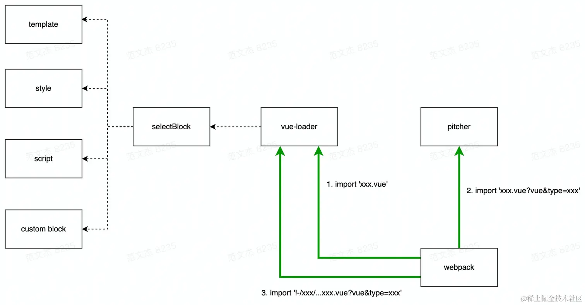

# Loader 扩展开发工具

## 使用 schema-utils

Webpack，以及 Webpack 生态下的诸多 Loader、Plugin 基本上都会提供若干“配置项”，供用户调整组件的运行逻辑，这些组件内部通常都会使用 schema-utils 工具库校验用户传入的配置是否满足要求。

```bash
yarn add -D schema-utils
```

编写配置对象的 Schema 描述

```json
// options.json
{
  "type": "object",
  "properties": {
    "name": {
      "type": "boolean"
    }
  },
  "required": ["name"],
  "additionalProperties": false
}
```

在 Loader 调用配置

```js
import { validate } from "schema-utils";
import schema from "./options.json";

// 调用 schema-utils 完成校验
export default function loader(source) {
  const options = this.getOptions();
  validate(schema, options);

  return source;
}

// Webpack5 之后还可以借助 Loader Context 的 `getOptions` 接口完成校验
export default function loader(source) {
  const options = this.getOptions(schema);

  return source;
}
```

> 示例[代码](https://github1s.com/Tecvan-fe/webpack-book-samples/blob/main/loader-validate/package.json)

`schema-utils` 的校验能力很强，底层主要依赖于 [ajv](https://ajv.js.org/guide/getting-started.html) ;基本上已经覆盖了“使用 JSON 描述对象约束”的所有场景。

`schema-utils` 内部使用 `ajv` 的 `JSON-Schema` 模式实现参数校验，而 `JSON-Schema` 是一种以 JSON 格式描述数据结构的 公共规范，使用时至少需要提供 `type` 参数

```json
{
  "type": "number"
}
```

ajv 默认支持七种基本数据类型

- number
- string
- null
- array
- object
- patternProperties
- additionalProperties

其他数据条件

- enum：枚举数组，属性值必须完全等于(Deep equal)这些值之一
- const：静态数值，属性值必须完全等于 const 定义
- not：数值必须不符合该条件
- anyof：数值必须满足 anyof 条件之一
- oneof：数值必须满足且只能满足 oneof 条件之一
- allof：数值必须满足 allof 指定的所有条件
- if/then/else：若传入的数值满足 if 条件，则必须同时满足 then 条件；若不满足 if 则必须同时满足 else，其中 else 可选

## Vue-loader

如何区分 Vue SFC 不同代码块，复用其他 Loader 处理不同区块的内容？

`vue-loader` 内部实际上包含了三个组件：

- `lib/index.js` 定义的 Normal Loader，负责将 Vue SFC 不同区块转化为 JavaScript import 语句
- `lib/loaders/pitcher.js` 定义的 Pitch Loader，负责遍历的 `rules` 数组，拼接出完整的行内引用路径；
- `lib/plugin.js` 定义的插件，负责初始化编译环境，如复制原始 `rules` 配置等

```js
const VueLoaderPlugin = require("vue-loader/lib/plugin");

module.exports = {
  module: {
    rules: [
      {
        test: /.vue$/,
        use: [{ loader: "vue-loader" }],
      }
    ],
  },
  plugins: [
    new VueLoaderPlugin()
  ],
};
```

`vue-loader` 运行过程大致上可以划分为两个阶段：

- 预处理阶段：动态修改 Webpack 配置，注入 vue-loader 专用的一系列 `module.rules`；
- 内容处理阶段：Normal Loader 配合 Pitch Loader 完成文件内容转译

## 预处理

```js
class VueLoaderPlugin {
  apply (compiler) {
    // ...

    const rules = compiler.options.module.rules
    // ...

    const clonedRules = rules
      .filter(r => r !== rawVueRules)
      .map((rawRule) => cloneRule(rawRule, refs))

    // ...

    // global pitcher (responsible for injecting template compiler loader & CSS
    // post loader)
    const pitcher = {
      loader: require.resolve('./loaders/pitcher'),
      resourceQuery: query => {
        if (!query) { return false }
        const parsed = qs.parse(query.slice(1))
        return parsed.vue != null
      }
      // ...
    }

    // replace original rules
    compiler.options.module.rules = [
      pitcher,
      ...clonedRules,
      ...rules
    ]
  }
}

function cloneRule (rawRule, refs) {
    // ...
}

module.exports = VueLoaderPlugin
```

1. 初始化并注册 Pitch Loader：动态注入的 `require.resolve('./loaders/pitcher')` ，并将 `pitcher` 注入到 `rules` 数组首位。
2. 复制 `rules` 配置

将 Webpack 配置修改为 `[pitcher, ...clonedRules, ...rules] `

```js
module.exports = {
  module: {
    rules: [
      {
        test: /.vue$/i,
        use: [{ loader: "vue-loader" }],
      },
      {
        test: /\.css$/i,
        use: [MiniCssExtractPlugin.loader, "css-loader"],
      },
      {
        test: /\.js$/i,
        exclude: /node_modules/,
        use: {
          loader: "babel-loader",
          options: {
            presets: [["@babel/preset-env", { targets: "defaults" }]],
          },
        },
      },
    ],
  },
  plugins: [
    new VueLoaderPlugin(),
    new MiniCssExtractPlugin({ filename: "[name].css" }),
  ],
};
```

这里定义了三个 rule，分别对应 vue、js、css 文件。经过 plugin 转换之后的结果大概为

```js
module.exports = {
  module: {
    rules: [
      {
        loader: "/node_modules/vue-loader/lib/loaders/pitcher.js",
        resourceQuery: () => {},
        options: {},
      },
      {
        resource: () => {},
        resourceQuery: () => {},
        use: [
          {
            loader: "/node_modules/mini-css-extract-plugin/dist/loader.js",
          },
          { loader: "css-loader" },
        ],
      },
      {
        resource: () => {},
        resourceQuery: () => {},
        exclude: /node_modules/,
        use: [
          {
            loader: "babel-loader",
            options: {
              presets: [["@babel/preset-env", { targets: "defaults" }]],
            },
            ident: "clonedRuleSet-2[0].rules[0].use",
          },
        ],
      },
      {
        test: /\.vue$/i,
        use: [
          { loader: "vue-loader", options: {}, ident: "vue-loader-options" },
        ],
      },
      {
        test: /\.css$/i,
        use: [
          {
            loader: "/node_modules/mini-css-extract-plugin/dist/loader.js",
          },
          { loader: "css-loader" },
        ],
      },
      {
        test: /\.vue$/i,
        exclude: /node_modules/,
        use: [
          {
            loader: "babel-loader",
            options: {
              presets: [["@babel/preset-env", { targets: "defaults" }]],
            },
            ident: "clonedRuleSet-2[0].rules[0].use",
          },
        ],
      },
    ],
  },
};
```

转换之后生成6个rule，按定义的顺序分别为：

1. 针对 `xx.vue&vue` 格式路径生效的规则，只用了 `vue-loader` 的 `Pitch` 作为 `Loader`；
2. 被复制的 `CSS` 处理规则，`use` 数组与开发者定义的规则相同；
3. 被复制的 `JS` 处理规则，`use` 数组也跟开发者定义的规则相同；
4. 开发者定义的 `vue-loader` 规则，内容及配置都不变；
5. 开发者定义的 `CSS` 规则，用到 `css-loader`、`mini-css-extract-plugin loader`；
6. 开发者定义的 `JS` 规则，用到 `babel-loader`。

可以看到，第2、3项是从开发者提供的配置中复制过来的，内容相似，只是 `cloneRule` 在复制过程会给这些规则重新定义 `resourceQuery` 函数

```js
function cloneRule (rawRule, refs) {
    const rules = ruleSetCompiler.compileRules(`clonedRuleSet-${++uid}`, [{
      rules: [rawRule]
    }], refs)
  
    const conditions = rules[0].rules
      .map(rule => rule.conditions)
      // shallow flat
      .reduce((prev, next) => prev.concat(next), [])

    // ...
  
    const res = Object.assign({}, rawRule, {
      resource: resources => {
        currentResource = resources
        return true
      },
      resourceQuery: query => {
        if (!query) { return false }
        const parsed = qs.parse(query.slice(1))
        if (parsed.vue == null) {
          return false
        }
        if (!conditions) {
          return false
        }
        // 用import路径的lang参数测试是否适用于当前rule
        const fakeResourcePath = `${currentResource}.${parsed.lang}`
        for (const condition of conditions) {
          // add support for resourceQuery
          const request = condition.property === 'resourceQuery' ? query : fakeResourcePath
          if (condition && !condition.fn(request)) {
            return false
          }
        }
        return true
      }
    })
    // ...
  
    return res
  }
```

## 内容处理阶段

插件处理完配置，webpack 运行起来之后，Vue SFC 文件会被多次传入不同的 Loader，经历多次中间形态变换之后才产出最终的 js 结果，大致上可以分为如下步骤

1. 路径命中 `/\.vue$/i` 规则，调用 `vue-loader` 生成中间结果 A；
2. 结果 A 命中 `xx.vue?vue` 规则，调用 `vue-loader` Pitch Loader 生成中间结果 B；
3. 结果 B 命中具体 Loader，直接调用 Loader 做处理。



```js
// 原始代码
import xx from './index.vue';
// 第一步，命中 vue-loader，转换为：
import { render, staticRenderFns } from "./index.vue?vue&type=template&id=2964abc9&scoped=true&"
import script from "./index.vue?vue&type=script&lang=js&"
export * from "./index.vue?vue&type=script&lang=js&"
import style0 from "./index.vue?vue&type=style&index=0&id=2964abc9&scoped=true&lang=css&"

// 第二步，命中 pitcher，转换为：
export * from "-!../../node_modules/vue-loader/lib/loaders/templateLoader.js??vue-loader-options!../../node_modules/vue-loader/lib/index.js??vue-loader-options!./index.vue?vue&type=template&id=2964abc9&scoped=true&"
import mod from "-!../../node_modules/babel-loader/lib/index.js??clonedRuleSet-2[0].rules[0].use!../../node_modules/vue-loader/lib/index.js??vue-loader-options!./index.vue?vue&type=script&lang=js&"; 
export default mod; export * from "-!../../node_modules/babel-loader/lib/index.js??clonedRuleSet-2[0].rules[0].use!../../node_modules/vue-loader/lib/index.js??vue-loader-options!./index.vue?vue&type=script&lang=js&"
export * from "-!../../node_modules/mini-css-extract-plugin/dist/loader.js!../../node_modules/css-loader/dist/cjs.js!../../node_modules/vue-loader/lib/loaders/stylePostLoader.js!../../node_modules/vue-loader/lib/index.js??vue-loader-options!./index.vue?vue&type=style&index=0&id=2964abc9&scoped=true&lang=css&"

// 第三步，根据行内路径规则按序调用loader

```

> 第一次执行 vue-loader

在运行阶段，根据配置规则， Webpack 首先将原始的 SFC 内容传入 vue-loader

```js
// main.js
import xx from 'index.vue';

// index.vue 代码
<template>
  <div class="root">hello world</div>
</template>

<script>
export default {
  data() {},
  mounted() {
    console.log("hello world");
  },
};
</script>

<style scoped>
.root {
  font-size: 12px;
}
</style>

```

第一次执行 vue-loader ，执行如下逻辑：

1. 调用 `@vue/component-compiler-utils` 包的 `parse` 函数，将 SFC 文本解析为 AST 对象；
2. 遍历 AST 对象属性，转换为特殊的引用路径；
3. 返回转换结果

```js
import { render, staticRenderFns } from "./index.vue?vue&type=template&id=2964abc9&scoped=true&"
import script from "./index.vue?vue&type=script&lang=js&"
export * from "./index.vue?vue&type=script&lang=js&"
import style0 from "./index.vue?vue&type=style&index=0&id=2964abc9&scoped=true&lang=css&"


/* normalize component */
import normalizer from "!../../node_modules/vue-loader/lib/runtime/componentNormalizer.js"
var component = normalizer(
  script,
  render,
  staticRenderFns,
  false,
  null,
  "2964abc9",
  null
  
)

...
export default component.exports

```

这里并没有真的处理 block 里面的内容，而是简单地针对不同类型的内容块生成 import 语句

- Script：`"./index.vue?vue&type=script&lang=js&"`
- Template: `"./index.vue?vue&type=template&id=2964abc9&scoped=true&"`
- Style: `"./index.vue?vue&type=style&index=0&id=2964abc9&scoped=true&lang=css&"`

这些路径都对应原始的 .vue 路径基础上增加了 vue 标志符及 type、lang 等参数

> 执行 pitcher

vue-loader 插件会在预处理阶段插入带 resourceQuery 函数的 Pitch Loader

```js
const pitcher = {
  loader: require.resolve('./loaders/pitcher'),
  resourceQuery: query => {
    if (!query) { return false }
    const parsed = qs.parse(query.slice(1))
    return parsed.vue != null
  }
}

```

`resourceQuery` 函数命中 `xx.vue?vue` 格式的路径，也就是说上面 `vue-loader` 转换后的 import 路径会被 Pitch Loader 命中，做进一步处理。Pitch Loader 的逻辑比较简单，做的事情也只是转换 import 路径

```js
const qs = require('querystring')
...

const dedupeESLintLoader = loaders => {...}

const shouldIgnoreCustomBlock = loaders => {...}

// 正常的loader阶段，直接返回结果
module.exports = code => code

module.exports.pitch = function (remainingRequest) {
  const options = loaderUtils.getOptions(this)
  const { cacheDirectory, cacheIdentifier } = options
  // 关注点1： 通过解析 resourceQuery 获取loader参数
  const query = qs.parse(this.resourceQuery.slice(1))

  let loaders = this.loaders

  // if this is a language block request, eslint-loader may get matched
  // multiple times
  if (query.type) {
    // if this is an inline block, since the whole file itself is being linted,
    // remove eslint-loader to avoid duplicate linting.
    if (/\.vue$/.test(this.resourcePath)) {
      loaders = loaders.filter(l => !isESLintLoader(l))
    } else {
      // This is a src import. Just make sure there's not more than 1 instance
      // of eslint present.
      loaders = dedupeESLintLoader(loaders)
    }
  }

  // remove self
  loaders = loaders.filter(isPitcher)

  // do not inject if user uses null-loader to void the type (#1239)
  if (loaders.some(isNullLoader)) {
    return
  }

  const genRequest = loaders => {
    ... 
  }

  // Inject style-post-loader before css-loader for scoped CSS and trimming
  if (query.type === `style`) {
    const cssLoaderIndex = loaders.findIndex(isCSSLoader)
    if (cssLoaderIndex > -1) {
      ...
      return query.module
        ? `export { default } from  ${request}; export * from ${request}`
        : `export * from ${request}`
    }
  }

  // for templates: inject the template compiler & optional cache
  if (query.type === `template`) {
    .​..
    // console.log(request)
    // the template compiler uses esm exports
    return `export * from ${request}`
  }

  // if a custom block has no other matching loader other than vue-loader itself
  // or cache-loader, we should ignore it
  if (query.type === `custom` && shouldIgnoreCustomBlock(loaders)) {
    return ``
  }

  const request = genRequest(loaders)
  return `import mod from ${request}; export default mod; export * from ${request}`
}

```

核心功能是遍历用户定义的rule数组，拼接出完整的行内引用路径

```js
// 开发代码：
import xx from 'index.vue'
// 第一步，通过vue-loader转换成带参数的路径
import script from "./index.vue?vue&type=script&lang=js&"
// 第二步，在 pitcher 中解读loader数组的配置，并将路径转换成完整的行内路径格式
import mod from "-!../../node_modules/babel-loader/lib/index.js??clonedRuleSet-2[0].rules[0].use!../../node_modules/vue-loader/lib/index.js??vue-loader-options!./index.vue?vue&type=script&lang=js&";

```

> 第二次执行vue-loader

通过上面 vue-loader -> Pitch Loader 处理后，会得到一个新的行内路径

```js
import mod from "-!../../node_modules/babel-loader/lib/index.js??clonedRuleSet-2[0].rules[0].use!../../node_modules/vue-loader/lib/index.js??vue-loader-options!./index.vue?vue&type=script&lang=js&";

```

之后 Webpack 会按照下述逻辑运行

- 调用 vue-loader 处理 `index.js` 文件；
- 调用 babel-loader 处理上一步返回的内容

```js
module.exports = function (source) {
  // ...

  const {
    target,
    request,
    minimize,
    sourceMap,
    rootContext,
    resourcePath,
    resourceQuery = "",
  } = loaderContext;
  // ...

  const descriptor = parse({
    source,
    compiler: options.compiler || loadTemplateCompiler(loaderContext),
    filename,
    sourceRoot,
    needMap: sourceMap,
  });

  // if the query has a type field, this is a language block request
  // e.g. foo.vue?type=template&id=xxxxx
  // and we will return early
  if (incomingQuery.type) {
    return selectBlock(
      descriptor,
      loaderContext,
      incomingQuery,
      !!options.appendExtension
    );
  }
  //...
  return code;
};

module.exports.VueLoaderPlugin = plugin;

```

第二次运行时由于路径已经带上了 `type` 参数，会命中上面第26行的判断语句，进入 `selectBlock` 函数，这个函数的逻辑很简单

```js
module.exports = function selectBlock (
  descriptor,
  loaderContext,
  query,
  appendExtension
) {
  // template
  if (query.type === `template`) {
    if (appendExtension) {
      loaderContext.resourcePath += '.' + (descriptor.template.lang || 'html')
    }
    loaderContext.callback(
      null,
      descriptor.template.content,
      descriptor.template.map
    )
    return
  }

  // script
  if (query.type === `script`) {
    if (appendExtension) {
      loaderContext.resourcePath += '.' + (descriptor.script.lang || 'js')
    }
    loaderContext.callback(
      null,
      descriptor.script.content,
      descriptor.script.map
    )
    return
  }

  // styles
  if (query.type === `style` && query.index != null) {
    const style = descriptor.styles[query.index]
    if (appendExtension) {
      loaderContext.resourcePath += '.' + (style.lang || 'css')
    }
    loaderContext.callback(
      null,
      style.content,
      style.map
    )
    return
  }

  // custom
  if (query.type === 'custom' && query.index != null) {
    const block = descriptor.customBlocks[query.index]
    loaderContext.callback(
      null,
      block.content,
      block.map
    )
    return
  }
}

```

综上，我们可以将 `vue-loader` 的核心逻辑总结为：

1. 首先给原始文件路径增加不同的参数，后续配合 `resourceQuery` 参数就可以分开处理这些内容，这样的实现相比于一次性处理，逻辑更清晰简洁，更容易理解；
2. 经过 Normal Loader、Pitch Loader 两个阶段后，SFC 内容会被转化为 `import xxx from '!-babel-loader!vue-loader?xxx'` 格式的引用路径，以此复用用户配置。
