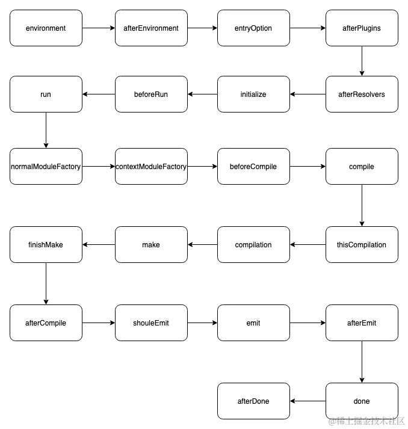
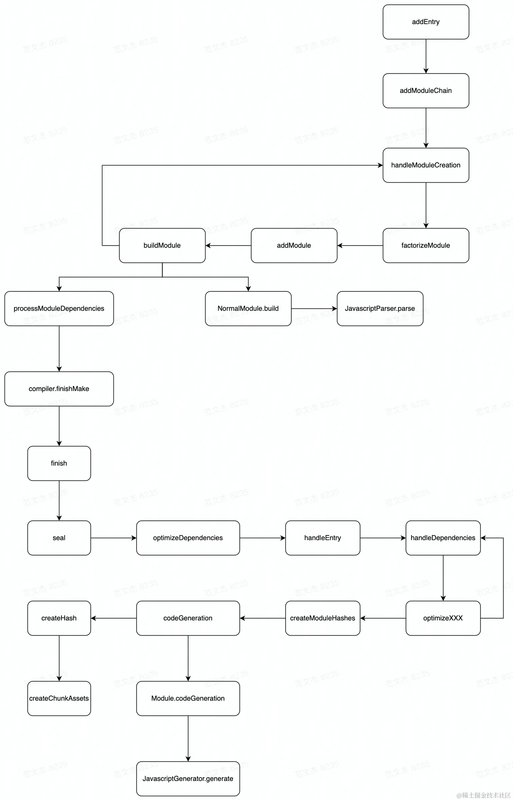
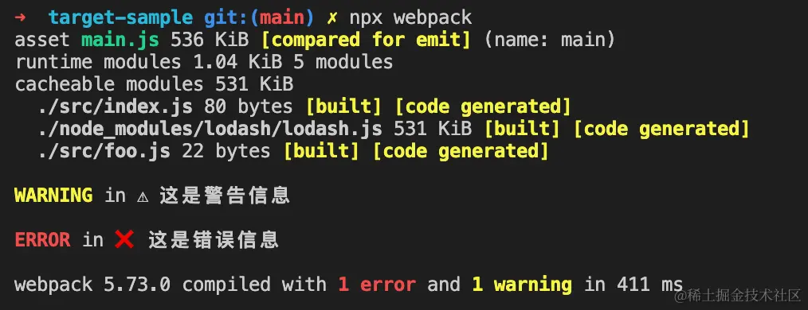
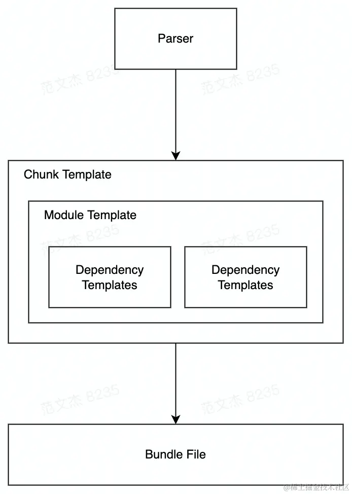

# 插件开发基础

## 插件简介

通常带有一个带有 apply 函数的类

```js
class SomePlugin {
    apply(compiler) {
    }
}

```

webpack 启动的时候会调用对象的 apply 函数，参数 compiler

```js
class SomePlugin {
  apply(compiler) {
    compiler.hooks.thisCompilation.tap("SomePlugin", (compilation) => {
      compilation.addModule(/* ... */);
    });
  }
}
```

示例中的 `compiler` 为 Hook 挂载的对象；`thisCompilation` 为 Hook 名称；后面调用的 `tap` 为调用方式，支持 `tap/tapAsync/tapPromise` 等。

在 Webpack 运行过程中，随着构建流程的推进会触发各个钩子回调，并传入上下文参数(例如上例回调函数中的 `compilation` 对象)，插件可以通过调用上下文接口、修改上下文状态等方式「篡改」构建逻辑，从而将扩展代码「勾入」到 Webpack 构建流程中。

基于 Hook 这一设计，开发插件时我们需要重点关注两个问题：

1. 针对插件需求，我们应该使用什么钩子？
2. 选定钩子后，我怎么跟上下文参数交互？

> 什么时候会触发什么钩子

Webpack 内部几个核心对象

- Compiler：全局构建管理器，Webpack 启动后会首先创建 `compiler` 对象，负责管理配置信息、Loader、Plugin 等。从启动构建到结束，`compiler` 大致上会触发如下钩子：



- Compilation：单次构建过程的管理器，负责遍历模块，执行编译操作；当 `watch = true` 时，每次文件变更触发重新编译，都会创建一个新的 `compilation` 对象；`compilation` 生命周期中主要触发如下钩子：



- 还有 Module、Resolver、Parser、Generator 等关键类型，也都相应暴露了许多 Hook

> 使用 Hook 上下文接口

- `compiler.hooks.compilation` ：
    - 时机：Webpack 刚启动完，创建出 `compilation` 对象后触发；
    - 参数：当前编译的 `compilation` 对象。
- `compiler.hooks.make`：
    - 时机：正式开始构建时触发；
    - 参数：同样是当前编译的 `compilation` 对象。
- `compilation.hooks.optimizeChunks` ：
    - 时机： `seal` 函数中，`chunk` 集合构建完毕后触发；
    - 参数：`chunks` 集合与 `chunkGroups` 集合。
- `compiler.hooks.done`：
    - 时机：编译完成后触发；
    - 参数： `stats` 对象，包含编译过程中的各类统计信息。


每个钩子传递的上下文参数不同，但主要包含如下几种类型(以 Webpack5 为例)

- `complation` 对象：构建管理器，使用率非常高，主要提供了一系列与单次构建相关的接口，包括：
    - `addModule`：用于添加模块，例如 `Module` 遍历出依赖之后，就会调用该接口将新模块添加到构建需求中；
    - `addEntry`：添加新的入口模块，效果与直接定义 `entry` 配置相似；
    - `emitAsset`：用于添加产物文件，效果与 Loader Context 的 `emitAsset` 相同；
    - `getDependencyReference`：从给定模块返回对依赖项的引用，常用于计算模块引用关系；
- `compiler` 对象：全局构建管理器，提供如下接口：
    - `createChildCompiler`：创建子 `compiler` 对象，子对象将继承原始 Compiler 对象的所有配置数据；
    - `createCompilation`：创建 `compilation` 对象，可以借此实现并行编译；
    - `close`：结束编译；
    - `getCache`：获取缓存接口，可借此复用 Webpack5 的缓存功能；
    - `getInfrastructureLogger`：获取日志对象；
- `module` 对象：资源模块，有诸如 `NormalModule/RawModule/ContextModule` 等子类型，其中 `NormalModule` 使用频率较高，提供如下接口：
    - `identifier`：读取模块的唯一标识符；
    - `getCurrentLoader`：获取当前正在执行的 Loader 对象；
    - `originalSource`：读取模块原始内容；
    - `serialize/deserialize`：模块序列化与反序列化函数，用于实现持久化缓存，一般不需要调用；
    - `issuer`：模块的引用者；
    - `isEntryModule`：用于判断该模块是否为入口文件；
- `chunk` 对象：模块封装容器，提供如下接口：
    - `addModule`：添加模块，之后该模块会与 `Chunk` 中其它模块一起打包，生成最终产物；
    - `removeModule`：删除模块；
    - `containsModule`：判断是否包含某个特定模块；
    - `size`：推断最终构建出的产物大小；
    - `hasRuntime`：判断 `Chunk` 中是否包含运行时代码；
    - `updateHash`：计算 `Hash` 值。
- `stats` 对象：构建过程收集到的统计信息，包括模块构建耗时、模块依赖关系、产物文件列表等。


- Hook 回调由 Webpack 决定何时，以何种方式执行
- Hook 回调内部可以通过调用上下文 API 、修改上下文状态等方式，对 Webpack 原定流程产生 Side Effect

## imagemin-webpack-plugin

> 学习如何遍历、修改最终产物文件

[imagemin-webpack-plugin](https://github1s.com/Klathmon/imagemin-webpack-plugin) 是一个用于实现图像压缩的插件，它会在 Webpack 完成前置的代码分析构建，提交([emit](https://webpack.js.org/api/compiler-hooks/#emit))产物时，找出所有图片资源并调用 [imagemin](https://github.com/imagemin/imagemin) 压缩图像。

```js
export default class ImageminPlugin {
  constructor(options = {}) {
    // init options
  }

  apply(compiler) {
    // ...
    const onEmit = async (compilation, callback) => {
      // ...
      await Promise.all([
        ...this.optimizeWebpackImages(throttle, compilation),
        ...this.optimizeExternalImages(throttle),
      ]);
    };
    // 在 Webpack 完成代码构建与打包操作，准备将产物发送到输出目录之前执行
    compiler.hooks.emit.tapAsync(this.constructor.name, onEmit);
  }

  optimizeWebpackImages(throttle, compilation) {}

  optimizeExternalImages(throttle) {}
}
```

```js
export default class ImageminPlugin {
  optimizeWebpackImages(throttle, compilation) {
    const {
        // 用于判断是否对特定文件做图像压缩操作
        testFunction,
        // 缓存目录
        cacheFolder
    } = this.options
  
    // 遍历 `assets` 产物数组
    return map(compilation.assets, (asset, filename) => throttle(async () => {
        // 读取产物内容
        const assetSource = asset.source()
        if (testFunction(filename, assetSource)) {
            // 尝试从缓存中读取
            let optimizedImageBuffer = await getFromCacheIfPossible(cacheFolder, assetSource, () => {
                // 调用 `imagemin` 压缩图片
                return optimizeImage(assetSource, this.options)
            })

            // 之后，使用优化版本替换原始文件
            compilation.assets[filename] = new RawSource(optimizedImageBuffer)
        }
    }))
  }
}
```

逻辑关键

1. 遍历 `compilation.assets` 产物列表，调用 `asset.source()` 方法读取产物内容；
2. 调用 `imagemin` 压缩图片；
3. 修改 `compilation.assets`，使用优化后的图片 `RawSource` 对象替换原始 `asset` 对象

## eslint-webpack-plugin

> 学习如何提交错误日志

[eslint-webpack-plugin](https://github1s.com/webpack-contrib/eslint-webpack-plugin) 是一个基于 ESLint 实现的代码风格检查插件，它的实现比较巧妙，一是使用多个 Hook，在不同时间点执行 Lint 检查；二是复用 Webpack 内置的 `error/warn` 方法提交代码风格问题。核心逻辑：

```js
class ESLintWebpackPlugin {
  constructor(options = {}) {
    // ...
  }

  apply(compiler) {
    compiler.hooks.run.tapPromise(this.key, (c) =>
      this.run(c, options, wanted, exclude)
    );
  }

  async run(compiler, options, wanted, exclude) {
    compiler.hooks.compilation.tap(this.key, (compilation) => {
      ({ lint, report, threads } = linter(this.key, options, compilation));

      const files = [];

      // 单个模块成功编译后触发
      compilation.hooks.succeedModule.tap(this.key, ({ resource }) => {
        // 判断是否需要检查该文件
        if (
          isMatch(file, wanted, { dot: true }) &&
          !isMatch(file, exclude, { dot: true })
        ) {
          lint(file);
        }
      });

      // 所有模块构建完毕后触发
      compilation.hooks.finishModules.tap(this.key, () => {
        if (files.length > 0 && threads <= 1) {
          lint(files);
        }
      });

      // 等待检查结果
      compilation.hooks.additionalAssets.tapPromise(this.key, processResults);

      async function processResults() {}
    });
  }
}
```

- `compiler.hooks.compilation`：Compiler 环境初始化完毕，创建出 `compilation` 对象，准备开始执行构建前触发；
- `compilation.hooks.succeedModule`：Webpack 完成单个「模块」的读入、运行 Loader、AST 分析、依赖分析等操作后触发
- `compilation.hooks.finishModules`：Webpack 完成「所有」模块的读入、运行 Loader、依赖分析等操作后触发；
- `compilation.hooks.additionalAssets`：构建、打包完毕后触发，通常用于为编译创建附加资产

借助 `compilation.hooks.succeedModule` 钩子，在每个模块处理完毕之后立即通过 `lint` 函数添加非阻塞代码检查任务，相比于过去的 `eslint-loader` 的阻塞式执行，这种方式能够提高 ESLint 的并发度，效率更高

借助 `compilation.hooks.additionalAssets` 钩子，在所有模块处理完毕后读取检查结果 —— 即 `processResults` 函数

```js
async function processResults() {
  const { errors, warnings } = await report();

  if (warnings && !options.failOnWarning) {
    compilation.warnings.push(warnings);
  } else if (warnings && options.failOnWarning) {
    compilation.errors.push(warnings);
  }

  if (errors && options.failOnError) {
    compilation.errors.push(errors);
  } else if (errors && !options.failOnError) {
    compilation.warnings.push(errors);
  }
}
```

代码读取 ESLint 执行结果(`report` 函数)，并使用 `compilation` 的 `errors` 与 `warnings` 数组提交错误/警告信息，这种方式只会输出错误信息，不会中断编译流程，运行效果如



## DefinePlugin

> 学习在插件中如何与 AST 结构交互

DefinePlugin 是 Webpack 官方实现的，用于构建时注入预定义常量的插件，先简单回顾一下用法，

```js
const { DefinePlugin } = require("webpack");

const baseConfig = {
  // ...
  plugins: [
    new DefinePlugin({
      PROD: true,
      VERSION: JSON.stringify("12.13.0"),
    }),
  ],
};
```

Webpack 会帮我们替换掉代码中所有 DefinePlugin 声明的属性值，例如：

```js
// 源码：
console.log(PROD, VERSION);

// 构建结果：
console.log(true, "5fa3b9");
```

DefinePlugin 的 [底层实现](https://github1s.com/webpack/webpack/blob/HEAD/lib/DefinePlugin.js) 比较复杂，需要遍历 AST 找出变量名对应的代码位置之后再做替换，插件核心结构

```js
class DefinePlugin {
  apply(compiler) {
    compiler.hooks.compilation.tap(
      "DefinePlugin",
      (compilation, { normalModuleFactory }) => {
        const handler = (parser) => {
          // 递归处理 `DefinePlugin` 参数
          const walkDefinitions = (definitions, prefix) => {
            Object.keys(definitions).forEach((key) => {
              const code = definitions[key];
              if (isObject /*...*/) {
                // 递归处理对象属性
                walkDefinitions(code, prefix + key + ".");
                applyObjectDefine(prefix + key, code);
                return;
              }
              applyDefineKey(prefix, key);
              applyDefine(prefix + key, code);
            });
          };

          // 替换基本类型的表达式值
          const applyDefine = (key, code) => {
            if (!isTypeof) {
              // 借助 expression 钩子替换内容
              parser.hooks.expression.for(key).tap("DefinePlugin", (expr) => {
                /*...*/
              });
            }
            // 处理 `'typeof window': JSON.stringify('object'),` 场景
            parser.hooks.typeof.for(key).tap("DefinePlugin", (expr) => {
              /*...*/
            });
          };

          // 替换引用类型的表达式值
          const applyObjectDefine = (key, obj) => {
            // ...
            parser.hooks.expression.for(key).tap("DefinePlugin", (expr) => {
              /*...*/
            });
          };

          walkDefinitions(definitions, "");
        };

        // 监听 `parser` 钩子
        normalModuleFactory.hooks.parser
          .for("javascript/auto")
          .tap("DefinePlugin", handler);
        normalModuleFactory.hooks.parser
          .for("javascript/dynamic")
          .tap("DefinePlugin", handler);
        normalModuleFactory.hooks.parser
          .for("javascript/esm")
          .tap("DefinePlugin", handler);
      }
    );
  }
}
module.exports = DefinePlugin;
```

核心逻辑

1. 使用 `normalModuleFactory.hooks.parser` 钩子，在 Webpack 创建出代码解析器 `Parser` 对象后执行 `handler` 函数。注意，此时还没有执行代码转 AST 操作
2. `walkDefinitions` 函数中递归遍历 `DefinePlugin` 参数对象，为每一个属性注册 `parser.hooks.expression` 钩子回调，该钩子会在 Webpack 遍历 AST 过程遇到表达式语句时触发
3. 在 `parser.hooks.expression` 回调中创建新的 `Dependency` 对象，调用 [addPresentationalDependency](https://github1s.com/webpack/webpack/blob/HEAD/lib/Module.js#L494) 添加为模块依赖

```js
const toConstantDependency = (parser, value, runtimeRequirements) => {
  return function constDependency(expr) {
    const dep = new ConstDependency(value, expr.range, runtimeRequirements);
    dep.loc = expr.loc;
    // 创建静态依赖对象，替换 loc 指定位置内容
    parser.state.module.addPresentationalDependency(dep);
    return true;
  };
};

const applyDefine = (key, code) => {
  parser.hooks.expression.for(key).tap("DefinePlugin", (expr) => {
    const strCode = toCode(/*...*/);
    if (/*...*/) {
      /*...*/
    } else {
      return toConstantDependency(parser, strCode)(expr);
    }
  });
};
```

Webpack 会借助 Template 接口将上述 Dependency 打包进 Chunk 中，替换对应位置(loc)代码



## 插件架构综述

插件架构至少需要解决三个方面的问题

- 接口：需要提供一套逻辑接入方法，让开发者能够将代码插入特定环节，变更原始逻辑
- 输入：如何将上下文信息高效传导给插件
- 输出：插件内部通过何种方式影响整套运行体系

webpack 基于 [tapable](https://github.com/webpack/tapable) 实现了:

1. 编译过程的特定节点以钩子形式，通知插件此刻正在发生什么事情
2. 通过 tapable 提供的回调机制，以参数方式传递上下文信息
3. 在上下文参数对象中附带了很多存在 Side Effect 的交互接口，插件可以通过这些接口改变

```js
class Compiler {
  // 在构造函数中，先初始化钩子对象
  constructor() {
    this.hooks = {
      thisCompilation: new SyncHook(["compilation", "params"]),
    };
  }

  compile() {
    // 特定时机触发特定钩子
    const compilation = new Compilation();
    this.hooks.thisCompilation.call(compilation);
  }
}
```

`Compiler` 类型内部定义了 `thisCompilation` 钩子，并在 `compilation` 创建完毕后发布事件消息，插件开发者就可以基于这个钩子获取到最新创建出的 `compilation` 对象

```js
class SomePlugin {
  apply(compiler) {
    compiler.hooks.thisCompilation.tap("SomePlugin", (compilation, params) => {
        // 上下文信息： compilation、params
    });
  }
}
```

钩子回调传递的 `compilation/params` 参数，就是 Webpack 希望传递给插件的上下文信息，也是插件能拿到的输入。不同钩子会传递不同的上下文对象，这一点在钩子被创建的时候就定下来了，比如

```js
class Compiler {
    constructor() {
        this.hooks = {
            /** @type {SyncBailHook<Compilation>} */
            shouldEmit: new SyncBailHook(["compilation"]),
            /** @type {AsyncSeriesHook<Stats>} */
            done: new AsyncSeriesHook(["stats"]),
            /** @type {AsyncSeriesHook<>} */
            additionalPass: new AsyncSeriesHook([]),
            /** @type {AsyncSeriesHook<Compiler>} */
            beforeRun: new AsyncSeriesHook(["compiler"]),
            /** @type {AsyncSeriesHook<Compiler>} */
            run: new AsyncSeriesHook(["compiler"]),
            /** @type {AsyncSeriesHook<Compilation>} */
            emit: new AsyncSeriesHook(["compilation"]),
            /** @type {AsyncSeriesHook<string, Buffer>} */
            assetEmitted: new AsyncSeriesHook(["file", "content"]),
            /** @type {AsyncSeriesHook<Compilation>} */
            afterEmit: new AsyncSeriesHook(["compilation"]),
        };
    }
}
```

插件架构的灵魂就在于，框架自身只负责实现最关键的核心流程，其它具体功能都尽量交给具体插件实现

## 总结

Webpack 插件是一个带 `apply` 方法的对象，可以在 `apply` 函数中注册各式各样的 Hook 回调，监听对应事件，在回调中修改上下文状态，达到干预 Webpack 构建逻辑的效果。需要理解构建过程中的不同环节会触发什么 Hook、对应传递什么上下文参数、如何与上下文参数对象交互。