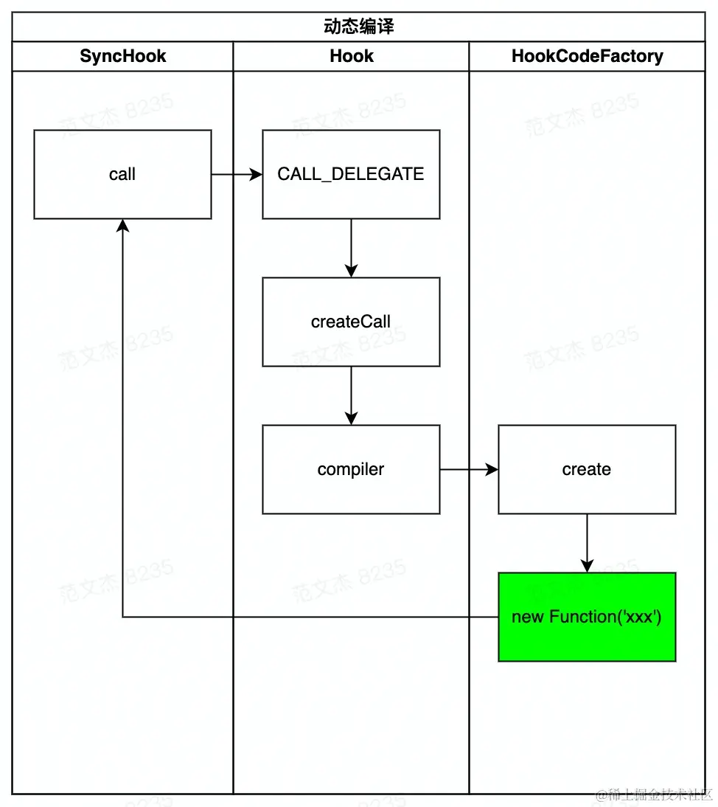

# 插件架构

## Tapable 全解析

[Tapable](https://github.com/webpack/tapable) 是 Webpack 插件架构的核心支架，处理器之间交互需求。

- 支持将前一个处理器的结果传入下一个回调处理器
- 支持异步并行调用这些回调处理器

```js
const { SyncHook } = require("tapable");

// 1. 创建钩子实例
const sleep = new SyncHook();

// 2. 调用订阅接口注册回调
sleep.tap("test", () => {
  console.log("callback A");
});

// 3. 调用发布接口触发回调
sleep.call();

// 运行结果：
// callback A
```

## Hook 类型汇总

|  名称   | 简介  | 统计  |
|  ----  | ----  | ----  |
|`SyncHook` |同步钩子 |Webpack 共出现 71 次，如 Compiler.hooks.compilation|
|`SyncBailHook`| 同步熔断钩子 |Webpack 共出现 66 次，如 Compiler.hooks.shouldEmit|
|`SyncWaterfallHook`|同步瀑布流钩子|Webpack 共出现 37 次，如 Compilation.hooks.assetPath|
|`SyncLoopHook`|同步循环钩子|Webpack 中未使用|
|`AsyncParallelHook`|异步并行钩子|Webpack 仅出现 1 次：Compiler.hooks.make|
|`AsyncParallelBailHook`|异步并行熔断钩子|Webpack 中未使用|
|`AsyncSeriesHook`|异步串行钩子|Webpack 共出现 16 次，如 Compiler.hooks.done|
|`AsyncSeriesBailHook`|异步串行熔断钩子|Webpack 中未使用|
|`AsyncSeriesLoopHook`|异步串行循环钩子|Webpack 中未使用|
|`AsyncSeriesWaterfallHook`|异步串行瀑布流钩子|Webpack 共出现 5 次，如 NormalModuleFactory.hooks.beforeResolve|

- 按回调逻辑，分为：
    - 基本类型，名称不带 `Waterfall/Bail/Loop` 关键字：与通常 订阅/回调 模式相似，按钩子注册顺序，逐次调用回调；
    - `waterfall` 类型：前一个回调的返回值会被带入下一个回调；
    - `bail` 类型：逐次调用回调，若有任何一个回调返回非 `undefined` 值，则终止后续调用；
    - `loop` 类型：逐次、循环调用，直到所有回调函数都返回 `undefined` 。

- 按执行回调的并行方式，分为：
    - `sync` ：同步执行，启动后会按次序逐个执行回调，支持 `call/tap` 调用语句；
    - `async` ：异步执行，支持传入 `callback` 或 `promise` 风格的异步回调函数，支持 `callAsync/tapAsync` 、`promise/tapPromise` 两种调用语句

## SyncHook 钩子

SyncHook 算的上是简单的钩子了，触发后会按照注册的顺序逐个调用回调，且不关心这些回调的返回值，底层逻辑大致如下述代码

```js
function syncCall() {
  const callbacks = [fn1, fn2, fn3];
  for (let i = 0; i < callbacks.length; i++) {
    const cb = callbacks[i];
    cb();
  }
}
```

```js
const { SyncHook } = require("tapable");

class Somebody {
  constructor() {
    this.hooks = {
      sleep: new SyncHook(),
    };
  }
  sleep() {
    //   触发回调
    this.hooks.sleep.call();
  }
}

const person = new Somebody();

// 注册回调
person.hooks.sleep.tap("test", () => {
  console.log("callback A");
});
person.hooks.sleep.tap("test", () => {
  console.log("callback B");
});
person.hooks.sleep.tap("test", () => {
  console.log("callback C");
});

person.sleep();
// 输出结果：
// callback A
// callback B
// callback C
```

选择异步风格的 `callAsync` ，选用 `call` 或 `callAsync` 并不会影响回调的执行逻辑，两者唯一的区别是 `callAsync` 需要传入 `callback` 函数，用于处理回调队列可能抛出的异常：

```js
// call 风格
try {
  this.hooks.sleep.call();
} catch (e) {
    // 错误处理逻辑
}
// callAsync 风格
this.hooks.sleep.callAsync((err) => {
  if (err) {
    // 错误处理逻辑
  }
});
```

由于调用方式不会 Hook 本身的规则，所以对使用者来说，无需关心底层到底用的是 `call` 还是 `callAsync`

```js
const { SyncHook } = require("tapable");

class Somebody {
  constructor() {
    this.hooks = {
      sleep: new SyncHook(),
    };
  }
  sleep() {
    //   触发回调
    this.hooks.sleep.callAsync((err) => {
      if (err) {
        console.log(`interrupt with "${err.message}"`);
      }
    });
  }
}

const person = new Somebody();

// 注册回调
person.hooks.sleep.tap("test", (cb) => {
  console.log("callback A");
  throw new Error("我就是要报错");
});
// 第一个回调出错后，后续回调不会执行
person.hooks.sleep.tap("test", () => {
  console.log("callback B");
});

person.sleep();

// 输出结果：
// callback A
// interrupt with "我就是要报错"
```

## SyncBailHook 钩子

`bail` 单词有熔断的意思，而 `bail` 类型钩子的特点是在回调队列中，若任一回调返回了非 `undefined` 的值，则中断后续处理，直接返回该值，用一段伪代码来表示：

```js
function bailCall() {
  const callbacks = [fn1, fn2, fn3];
  for (let i in callbacks) {
    const cb = callbacks[i];
    const result = cb(lastResult);
    // 如果有任意一个回调返回结果，则停止调用剩下的回调
    if (result !== undefined) {
      // 熔断
      return result;
    }
  }
  return undefined;
}
```

`SyncBailHook` 的调用顺序与规则都跟 `SyncHook` 相似，主要区别一是 `SyncBailHook` 增加了熔断逻辑

```js
const { SyncBailHook } = require("tapable");

class Somebody {
  constructor() {
    this.hooks = {
      sleep: new SyncBailHook(),
    };
  }
  sleep() {
    return this.hooks.sleep.call();
  }
}

const person = new Somebody();

// 注册回调
person.hooks.sleep.tap("test", () => {
  console.log("callback A");
  // 熔断点
  // 返回非 undefined 的任意值都会中断回调队列
  return '返回值：tecvan'
});
person.hooks.sleep.tap("test", () => {
  console.log("callback B");
});

console.log(person.sleep());

// 运行结果：
// callback A
// 返回值：tecvan
```

相比于 `SyncHook` ，`SyncBailHook` 运行结束后，会将熔断值返回给call函数，`callback A` 返回的 返回值：`tecvan` 会成为 `this.hooks.sleep.call` 的调用结果

> 在 Webpack 中被如何使用

`SyncBailHook` 通常用在发布者需要关心订阅回调运行结果的场景

```js
class Compiler {
  run(callback) {
    //   ...

    const onCompiled = (err, compilation) => {
      if (this.hooks.shouldEmit.call(compilation) === false) {
        // ...
      }
    };
  }
}
```

Webpack 会根据 `shouldEmit` 钩子的运行结果确定是否执行后续的操作，其它场景也有相似逻辑

- `NormalModuleFactory.hooks.createModule` ：预期返回新建的 `Module` 对象；
- `Compilation.hooks.needAdditionalSeal` ：预期返回 `bool` 值，判定是否进入 `unseal` 状态
- `Compilation.hooks.optimizeModules` ：预期返回 `bool` 值，用于判定是否继续执行优化操作

## SyncWaterfallHook 钩子

`waterfall` 钩子的执行逻辑跟 `lodash` 的 `flow` 函数有点像，大致上就是将前一个函数的返回值作为参数传入下一个函数

```js
function waterfallCall(arg) {
  const callbacks = [fn1, fn2, fn3];
  let lastResult = arg;
  for (let i in callbacks) {
    const cb = callbacks[i];
    // 上次执行结果作为参数传入下一个函数
    lastResult = cb(lastResult);
  }
  return lastResult;
}
```

1. 上一个函数的结果会被带入下一个函数；
2. 最后一个回调的结果会作为 call 调用的结果返回。

```js
const { SyncWaterfallHook } = require("tapable");

class Somebody {
  constructor() {
    this.hooks = {
      sleep: new SyncWaterfallHook(["msg"]),
    };
  }
  sleep() {
    return this.hooks.sleep.call("hello");
  }
}

const person = new Somebody();

// 注册回调
person.hooks.sleep.tap("test", (arg) => {
  console.log(`call 调用传入： ${arg}`);
  return "tecvan";
});

person.hooks.sleep.tap("test", (arg) => {
  console.log(`A 回调返回： ${arg}`);
  return "world";
});

console.log("最终结果：" + person.sleep());
// 运行结果：
// call 调用传入： hello
// A 回调返回： tecvan
// 最终结果：world

```

`SyncWaterfallHook` 钩子有一些注意事项

- 初始化时必须提供参数，例如上例 `new SyncWaterfallHook(["msg"])` 构造函数中，必须传入参数 `["msg"]` ，用于动态编译 `call` 的参数依赖，后面我们会讲到 动态编译 的细节

- 发布调用 `call` 时，需要传入初始参数

> 在 Webpack 中被如何使用

```js
class NormalModuleFactory {
  constructor() {
    this.hooks = {
      factory: new SyncWaterfallHook(["filename", "data"]),
    };

    this.hooks.factory.tap("NormalModuleFactory", () => (result, callback) => {
      let resolver = this.hooks.resolver.call(null);

      if (!resolver) return callback();

      resolver(result, (err, data) => {
        if (err) return callback(err);

        // direct module
        if (typeof data.source === "function") return callback(null, data);

        // ...
      });
    });
  }

  create(data, callback) {
    //   ...
    const factory = this.hooks.factory.call(null);
    // ...
  }
}
```

大致上就是在创建模块，通过 `factory` 钩子将 `module` 的创建过程外包出去，在钩子回调队列中依据 `waterfall` 的特性逐步推断出最终的 `module` 对象

## SyncLoopHook 钩子

`loop` 型钩子的特点是循环执行，直到所有回调都返回 `undefined` ，不过这里循环的维度是单个回调函数，例如有回调队列 `[fn1, fn2, fn3]` ，`loop` 钩子先执行 `fn1` ，如果此时 `fn1` 返回了非 `undefined` 值，则继续执行 `fn1` 直到返回 `undefined` 后，才向前推进执行 `fn2` 。

```js
function loopCall() {
  const callbacks = [fn1, fn2, fn3];
  for (let i in callbacks) {
    const cb = callbacks[i];
    // 重复执行
    while (cb() !== undefined) {}
  }
}
```

由于 `loop` 钩子循环执行的特性，使用时务必十分注意，避免陷入死循环

```js
const { SyncLoopHook } = require("tapable");

class Somebody {
  constructor() {
    this.hooks = {
      sleep: new SyncLoopHook(),
    };
  }
  sleep() {
    return this.hooks.sleep.call();
  }
}

const person = new Somebody();
let times = 0;

// 注册回调
person.hooks.sleep.tap("test", (arg) => {
  ++times;
  console.log(`第 ${times} 次执行回调A`);
  if (times < 4) {
    return times;
  }
});

person.hooks.sleep.tap("test", (arg) => {
  console.log(`执行回调B`);
});

person.sleep();
// 运行结果
// 第 1 次执行回调A
// 第 2 次执行回调A
// 第 3 次执行回调A
// 第 4 次执行回调A
// 执行回调B
```

## AsyncSeriesHook 钩子

- 支持异步回调，可以在回调函数中写 `callback` 或 `promise` 风格的异步操作
- 回调队列依次执行，前一个执行结束后，才会开始执行下一个
- 与 `SyncHook` 一样，不关心回调的执行结果

```js
function asyncSeriesCall(callback) {
  const callbacks = [fn1, fn2, fn3];
  //   执行回调 1
  fn1((err1) => {
    if (err1) {
      callback(err1);
    } else {
      //   执行回调 2
      fn2((err2) => {
        if (err2) {
          callback(err2);
        } else {
          //   执行回调 3
          fn3((err3) => {
            if (err3) {
              callback(err2);
            }
          });
        }
      });
    }
  });
}
```

```js
const { AsyncSeriesHook } = require("tapable");

const hook = new AsyncSeriesHook();

// 注册回调
hook.tapAsync("test", (cb) => {
  console.log("callback A");
  setTimeout(() => {
    console.log("callback A 异步操作结束");
    // 回调结束时，调用 cb 通知 tapable 当前回调已结束
    cb();
  }, 100);
});

hook.tapAsync("test", () => {
  console.log("callback B");
});

hook.callAsync();
// 运行结果：
// callback A
// callback A 异步操作结束
// callback B
```

A 回调内部的 `setTimeout` 执行完毕调用 `cb` 函数，`tapable` 才认为当前回调执行完毕，开始执行 B 回调；也可以使用 promise 风格调用 tap/call 函数

```js
const { AsyncSeriesHook } = require("tapable");

const hook = new AsyncSeriesHook();

// 注册回调
hook.tapPromise("test", () => {
  console.log("callback A");
  return new Promise((resolve) => {
    setTimeout(() => {
      console.log("callback A 异步操作结束");
      resolve();
    }, 100);
  });
});

hook.tapPromise("test", () => {
  console.log("callback B");
  return Promise.resolve();
});

hook.promise();
// 运行结果：
// callback A
// callback A 异步操作结束
// callback B
```

- 将 `tapAsync` 更改为 `tapPromise`
- `Tap` 回调需要返回 `promise` 对象
- `callAsync` 调用更改为 `promise`

> 在 Webpack 中被如何使用

```js
class Compiler {
  run(callback) {
    if (err) return finalCallback(err);

    this.emitAssets(compilation, (err) => {
      if (err) return finalCallback(err);

      if (compilation.hooks.needAdditionalPass.call()) {
        // ...
        this.hooks.done.callAsync(stats, (err) => {
          if (err) return finalCallback(err);

          this.hooks.additionalPass.callAsync((err) => {
            if (err) return finalCallback(err);
            this.compile(onCompiled);
          });
        });
        return;
      }

      this.emitRecords((err) => {
        if (err) return finalCallback(err);

        // ...
        this.hooks.done.callAsync(stats, (err) => {
          if (err) return finalCallback(err);
          return finalCallback(null, stats);
        });
      });
    });
  }
}
```

## AsyncParallelHook 钩子

`AsyncParallelHook` 也支持异步风格的回调，不过 `AsyncParallelHook` 是以并行方式，同时执行回调队列里面的所有回调

```js
function asyncParallelCall(callback) {
  const callbacks = [fn1, fn2];
  // 内部维护了一个计数器
  var _counter = 2;

  var _done = function() {
    _callback();
  };
  if (_counter <= 0) return;
  // 按序执行回调
  var _fn0 = callbacks[0];
  _fn0(function(_err0) {
    if (_err0) {
      if (_counter > 0) {
        // 出错时，忽略后续回调，直接退出
        _callback(_err0);
        _counter = 0;
      }
    } else {
      if (--_counter === 0) _done();
    }
  });
  if (_counter <= 0) return;
  // 不需要等待前面回调结束，直接开始执行下一个回调
  var _fn1 = callbacks[1];
  _fn1(function(_err1) {
    if (_err1) {
      if (_counter > 0) {
        _callback(_err1);
        _counter = 0;
      }
    } else {
      if (--_counter === 0) _done();
    }
  });
}
```

特点

- 支持异步风格；
- 并行执行回调队列，不需要做任何等待；
- 与 `SyncHook` 一样，不关心回调的执行结果

## 实践应用

对于 [compiler.hooks.done](https://webpack.js.org/api/compiler-hooks/#done) 钩子

`AsyncSeriesHook` 钩子

- 支持异步语法，我们可以用 `tap/tapAsync/tapPromise` 方式注册回调；
- Webpack 会按照注册顺序串行执行回调；
- Webpack 不关心回调的返回值，但可以通过 callback 函数传递 Error 信息

对于 [compilation.hooks.optimizeChunkModules](https://webpack.js.org/api/compilation-hooks/#optimizemodules) 钩子

`SyncBailHook` 钩子

- 不支持异步语法，我们只能用 `tap` 注册回调；
- 若任意回调有返回值，则中断 `Hook` 流程，后面回调不再执行，所以使用时需要谨慎

## Hook 动态编译

动态编译是一个非常大胆的设计，不同 Hook 所谓的同步、异步、bail、waterfall、loop 等回调规则都是 Tapable 根据 Hook 类型、参数、回调队列等参数，调用 `new Function` 语句动态拼装出一段控制执行流程的 JavaScript 代码实现控制

```js
const { SyncHook } = require("tapable");

const sleep = new SyncHook();

sleep.tap("test", () => {
  console.log("callback A");
});
sleep.call();
```

调用 sleep.call 时



编译过程主要涉及三个实体

- `tapable/lib/SyncHook.js` ：定义 `SyncHook` 的入口文件
- `tapable/lib/Hook.js` ：`SyncHook` 只是一个代理接口，内部实际上调用了 `Hook` 类，由 `Hook` 负责实现钩子的逻辑（其它钩子也是一样的套路）
- `tapable/lib/HookCodeFactory.js` ：动态编译出 `call、callAsync、promise` 函数内容的工厂类，注意，其他钩子也都会用到 `HookCodeFactory` 工厂函数

`SyncHook` （其他钩子类似）调用 `call` 后，Hook 基类收集上下文信息并调用 `createCall` 及子类传入的 `compiler` 函数；`compiler` 调用 `HookCodeFactory` 进而使用 `new Function` 方法动态拼接出回调执行函数。

```js
(function anonymous(
) {
"use strict";
var _context;
var _x = this._x;
var _fn0 = _x[0];
_fn0();

})
```

那么问题来了，通过 new Function、eval 等方式实现的动态编译，存在诸如性能、安全性等方面的问题，所以社区很少见到类似的设计，真的有必要用这种方式实现 Hook 吗？

```js
const { AsyncSeriesWaterfallHook } = require("tapable");

const sleep = new AsyncSeriesWaterfallHook(["name"]);

sleep.tapAsync("test1", (name, cb) => {
  console.log(`执行 A 回调： 参数 name=${name}`);
  setTimeout(() => {
    cb(undefined, "tecvan2");
  }, 100);
});

sleep.tapAsync("test", (name, cb) => {
  console.log(`执行 B 回调： 参数 name=${name}`);
  setTimeout(() => {
    cb(undefined, "tecvan3");
  }, 100);
});

sleep.tapAsync("test", (name, cb) => {
  console.log(`执行 C 回调： 参数 name=${name}`);
  setTimeout(() => {
    cb(undefined, "tecvan4");
  }, 100);
});

sleep.callAsync("tecvan", (err, name) => {
  console.log(`回调结束， name=${name}`);
});

// 运行结果：
// 执行 A 回调： 参数 name=tecvan
// 执行 B 回调： 参数 name=tecvan2
// 执行 C 回调： 参数 name=tecvan3
// 回调结束， name=tecvan4
```

AsyncSeriesWaterfallHook 的特点是异步 + 串行 + 前一个回调的返回值会传入下一个回调，对应生成函数

```js
(function anonymous(name, _callback) {
  "use strict";
  var _context;
  var _x = this._x;
  function _next1() {
    var _fn2 = _x[2];
    _fn2(name, function(_err2, _result2) {
      if (_err2) {
        _callback(_err2);
      } else {
        if (_result2 !== undefined) {
          name = _result2;
        }
        _callback(null, name);
      }
    });
  }
  function _next0() {
    var _fn1 = _x[1];
    _fn1(name, function(_err1, _result1) {
      if (_err1) {
        _callback(_err1);
      } else {
        if (_result1 !== undefined) {
          name = _result1;
        }
        _next1();
      }
    });
  }
  var _fn0 = _x[0];
  _fn0(name, function(_err0, _result0) {
    if (_err0) {
      _callback(_err0);
    } else {
      if (_result0 !== undefined) {
        name = _result0;
      }
      _next0();
    }
  });
});
```

核心逻辑：

-  生成函数将回调队列各个项封装为 `_next0/_next1` 函数，这些 `next` 函数内在逻辑高度相似；
-  按回调定义的顺序，逐次执行，上一个回调结束后，才调用下一个回调

Tapable 提供的大多数特性都是基于 `Hook + HookCodeFactory` 实现的，如果大家对此有兴趣，可以在 [tapable/lib/Hook.js](https://github1s.com/webpack/tapable/blob/master/lib/Hook.js#L12) 的

## 高级特性：Intercept

除了通常的 `tap/call` 之外，tapable 还提供了简易的中间件机制 —— `intercept` 接口

```js
const sleep = new SyncHook();

sleep.intercept({
  name: "test",
  context: true,
  call() {
    console.log("before call");
  },
  loop(){
    console.log("before loop");
  },
  tap() {
    console.log("before each callback");
  },
  register() {
    console.log("every time call tap");
  },
});
```

其中 `register` 在每次调用 `tap` 时被调用；其他三种中间件的触发时机大致如下

```js
  var _context;
  const callbacks = [fn1, fn2];
  var _interceptors = this.interceptors;
  // 调用 call 函数，立即触发
  _interceptors.forEach((intercept) => intercept.call(_context));
  var _loop;
  var cursor = 0;
  do {
    _loop = false;
    // 每次循环开始时触发 `loop`
    _interceptors.forEach((intercept) => intercept.loop(_context));
    // 触发 `tap`
    var _fn0 = callbacks[0];
    _interceptors.forEach((intercept) => intercept.tap(_context, _fn0));
    var _result0 = _fn0();
    if (_result0 !== undefined) {
      _loop = true;
    } else {
      var _fn1 = callbacks[1];
      // 再次触发 `tap`
      _interceptors.forEach((intercept) => intercept.tap(_context, _fn1));
      var _result1 = _fn1();
      if (_result1 !== undefined) {
        _loop = true;
      }
    }
  } while (_loop);

```

`intercept` 特性在 Webpack 内主要被用作进度提示，如 `Webpack/lib/ProgressPlugin.js` 插件中，分别对 `compiler.hooks.emit` 、`compiler.hooks.afterEmit` 钩子应用了记录进度的中间件函数

## 高级特性：HookMap

提供了一种集合操作能力，能够降低创建与使用的复杂度

```js
const { SyncHook, HookMap } = require("tapable");

const sleep = new HookMap(() => new SyncHook());

// 通过 for 函数过滤集合中的特定钩子
sleep.for("statement").tap("test", () => {
  console.log("callback for statement");
});

// 触发 statement 类型的钩子
sleep.get("statement").call();
```

`HookMap` 能够用于实现的动态获取钩子功能，例如在 Webpack 的 `lib/parser.js` 文件中，`parser` 文件主要完成将资源内容解析为 AST 集合，之后遍历 AST 并以 `HookMap` 方式对外通知遍历到的内容

遇到表达式的时候触发 `Parser.hooks.expression` 钩子，问题是 AST 结构和内容都很复杂，如果所有情景都以独立的钩子实现，那代码量会急剧膨胀。这种场景就很适合用 `HookMap` 解决，以 `expression` 为例

```js
class Parser {
  constructor() {
    this.hooks = {
      // 定义钩子
      // 这里用到 HookMap ，所以不需要提前遍历枚举所有 expression 场景
      expression: new HookMap(() => new SyncBailHook(["expression"])),
    };
  }

  //   不同场景下触发钩子
  walkMemberExpression(expression) {
    const exprName = this.getNameForExpression(expression);
    if (exprName && exprName.free) {
      // 触发特定类型的钩子
      const expressionHook = this.hooks.expression.get(exprName.name);
      if (expressionHook !== undefined) {
        const result = expressionHook.call(expression);
        if (result === true) return;
      }
    }
    // ...
  }

  walkThisExpression(expression) {
    const expressionHook = this.hooks.expression.get("this");
    if (expressionHook !== undefined) {
      expressionHook.call(expression);
    }
  }
}
```

通过 `this.hooks.expression.get(xxx)` 语句动态获取对应钩子实例，之后再调用 `call` 触发。`HookMap` 的消费逻辑与普通 `Hook` 类似，只需要增加 `for` 函数过滤出你实际监听的 Hook 实例即可

```js
// 钩子消费逻辑
// 选取 CommonJsStuffPlugin 仅起示例作用
class CommonJsStuffPlugin {
  apply(compiler) {
    compiler.hooks.compilation.tap(
      "CommonJsStuffPlugin",
      (compilation, { normalModuleFactory }) => {
        const handler = (parser, parserOptions) => {
          // 通过 for 精确消费钩子
          parser.hooks.expression
            .for("require.main.require")
            .tap(
              "CommonJsStuffPlugin",
              ParserHelpers.expressionIsUnsupported(
                parser,
                "require.main.require is not supported by Webpack."
              )
            );
          parser.hooks.expression
            .for("module.parent.require")
            .tap(
              "CommonJsStuffPlugin",
              ParserHelpers.expressionIsUnsupported(
                parser,
                "module.parent.require is not supported by Webpack."
              )
            );
          parser.hooks.expression
            .for("require.main")
            .tap(
              "CommonJsStuffPlugin",
              ParserHelpers.toConstantDependencyWithWebpackRequire(
                parser,
                "__Webpack_require__.c[__Webpack_require__.s]"
              )
            );
          // ...
        };
      }
    );
  }
}
```