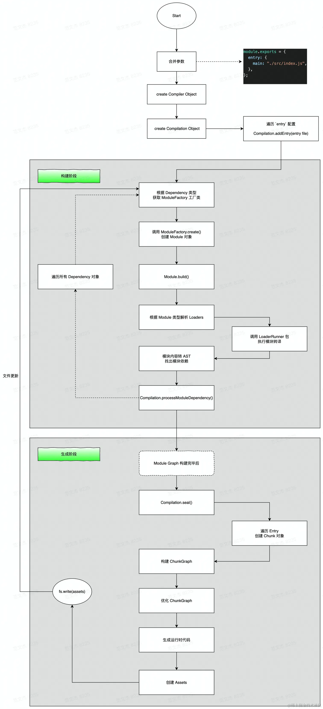
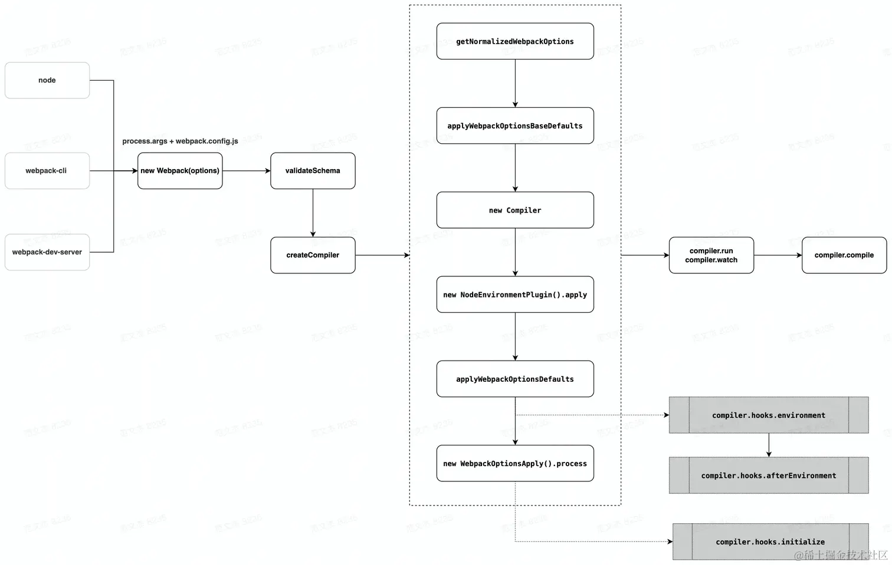
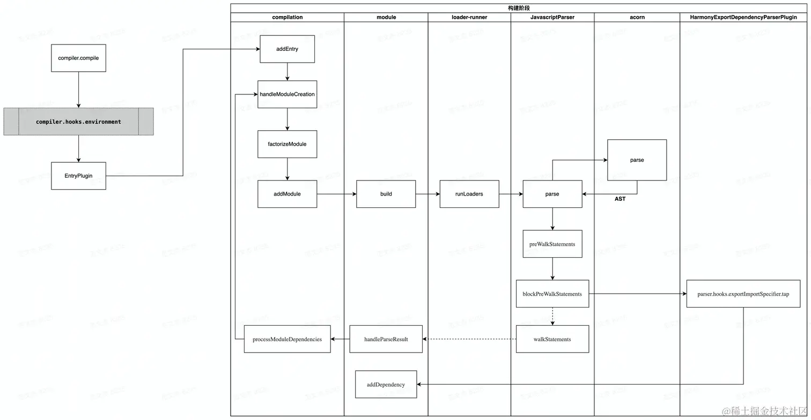
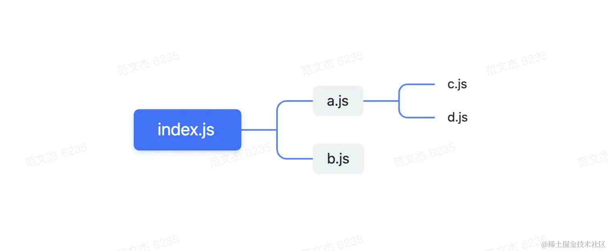
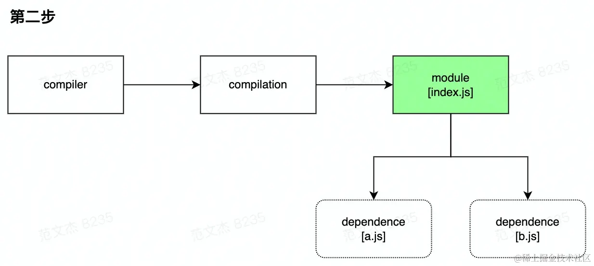
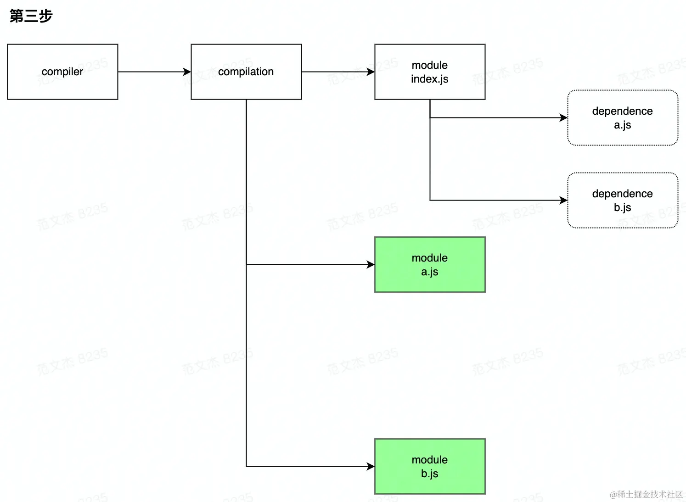
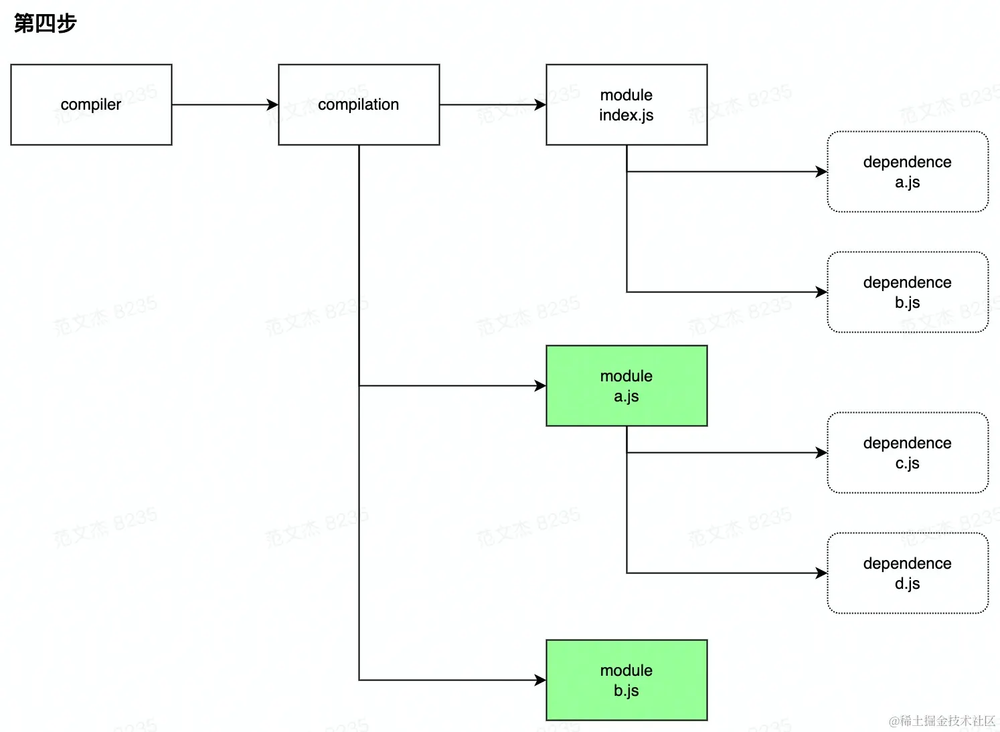
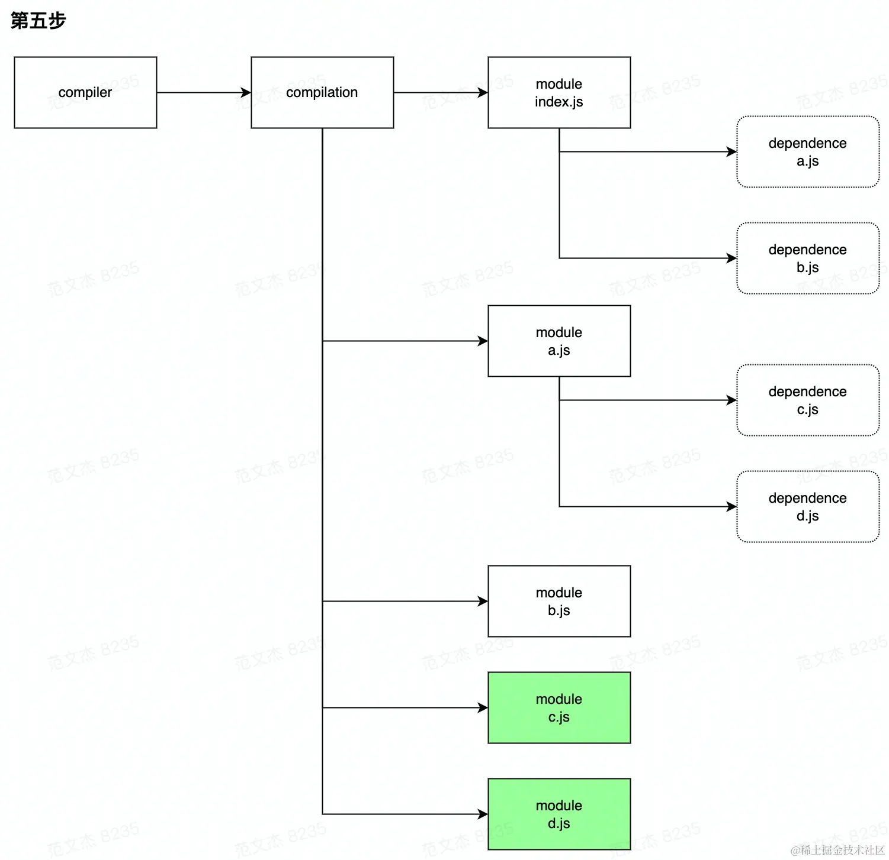
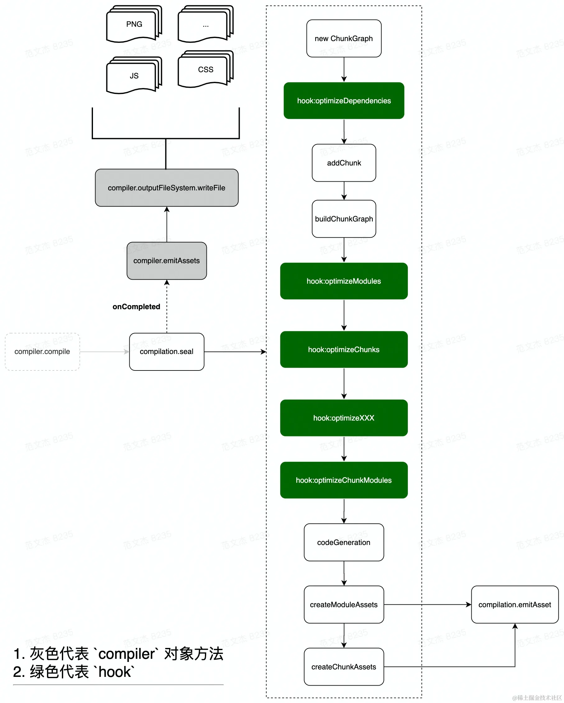
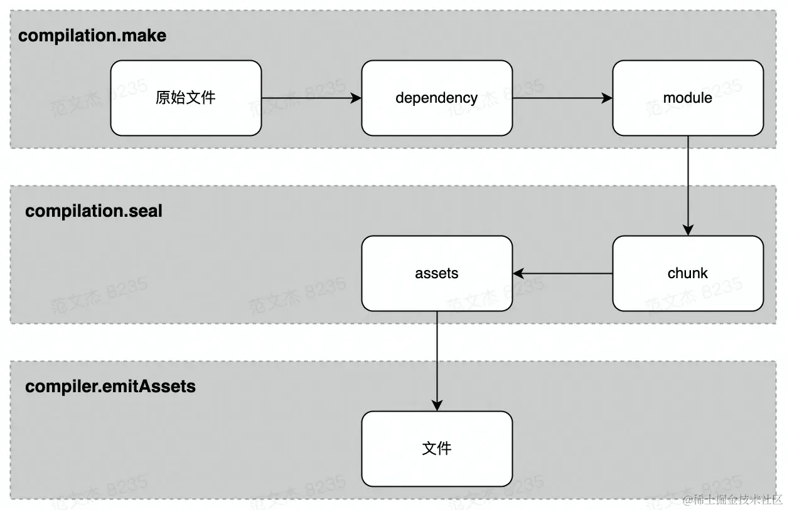

# Init、Make、Seal 真正读懂 Webpack 核心流程

Webpack 能够将各种类型的资源 —— 包括图片、音视频、CSS、JavaScript 代码等，通通转译、组合、拼接、生成标准的、能够在不同版本浏览器兼容执行的 JavaScript 代码文件，这一特性能够轻易抹平开发 Web 应用时处理不同资源的逻辑差异，使得开发者以一致的心智模型开发、消费这些不同的资源文件。

打包功能的底层实现逻辑很复杂，抛去大多数分支逻辑后，大致包含如下步骤



为了方便理解，上述过程划分为三个阶段


1. 初始化阶段：修整配置参数，创建 Compiler、Compilation 等基础对象，并初始化插件及若干内置工厂、工具类，并最终根据 `entry` 配置，找到所有入口模块
2. 构建阶段：从 `entry` 文件开始，调用 loader 将模块转译为 JavaScript 代码，调用 Acorn 将代码转换为 AST 结构，遍历 AST 从中找出该模块依赖的模块；之后 递归 遍历所有依赖模块，找出依赖的依赖，直至遍历所有项目资源后，构建出完整的 模块依赖关系图
3. 生成阶段：根据 `entry` 配置，将模块组装为一个个 Chunk 对象，之后调用一系列 Template 工厂类翻译 Chunk 代码并封装为 Asset，最后写出到文件系统

> 单次构建过程自上而下按顺序执行，如果启动了 watch ，则构建完成后不会退出 Webpack 进程，而是持续监听文件内容，发生变化时回到「构建」阶段重新执行构建流程

三个阶段环环相扣，「初始化」的重点是根据用户配置设置好构建环境；「构建阶段」则重在解读文件输入与文件依赖关系；最后在「生成阶段」按规则组织、包装模块，并翻译为适合能够直接运行的产物包。三者结合，实现 Webpack 最核心的打包能力，其它功能特性也几乎都是在此基础上，通过 Hook 介入、修改不同阶段的对象状态、流程逻辑等方式实现。

## 初始化阶段

修整 & 校验配置对象、运行插件、调用 `compiler.compile` 方法开始执行构建操作，代码比较简单



校验用户参数，并合并默认配置对象

1. 启动时，首先将 `process.args` 参数与 `webpack.config.js` 文件合并成用户配置
2. 调用 [validateSchema](https://github1s.com/webpack/webpack/blob/HEAD/lib/validateSchema.js#L77-L78) 校验配置对象（`validateSchema` 底层依赖于 [schema-utils](https://www.npmjs.com/package/schema-utils) 库）
3. 调用 [getNormalizedWebpackOptions](https://github1s.com/webpack/webpack/blob/HEAD/lib/config/normalization.js#L116-L117) + [applyWebpackOptionsBaseDefaults](https://github1s.com/webpack/webpack/blob/HEAD/lib/config/defaults.js#L120-L121) 合并出最终配置

创建 Compiler 对象并开始启动插件

1. 调用 [createCompiler](https://github1s.com/webpack/webpack/blob/HEAD/lib/webpack.js#L61-L62) 函数创建 `compiler` 对象
2. [遍历](https://github1s.com/webpack/webpack/blob/HEAD/lib/webpack.js#L68-L69) 配置中的 `plugins` 集合，执行插件的 `apply` 方法
3. [调用](https://github1s.com/webpack/webpack/blob/HEAD/lib/webpack.js#L80-L81) `new WebpackOptionsApply().process` 方法，根据配置内容动态注入相应插件，包括
    - 调用 [EntryOptionPlugin](https://github1s.com/webpack/webpack/blob/HEAD/lib/EntryOptionPlugin.js) 插件，该插件根据 `entry` 值注入 `DynamicEntryPlugin` 或 `EntryPlugin` 插件
    - 根据 `devtool` 值注入 `Sourcemap` 插件，包括：`SourceMapDevToolPlugin`、`EvalSourceMapDevToolPlugin` `、EvalDevToolModulePlugin`
    - 注入 `RuntimePlugin` ，用于根据代码内容动态注入 webpack 运行时

最后，调用 `compiler.compile` 方法开始执行构建

```js
// webpack/lib/compiler.js 
compile(callback) {
    const params = this.newCompilationParams();
    this.hooks.beforeCompile.callAsync(params, err => {
      // ...
      const compilation = this.newCompilation(params);
      this.hooks.make.callAsync(compilation, err => {
        // ...
        this.hooks.finishMake.callAsync(compilation, err => {
          // ...
          process.nextTick(() => {
            compilation.finish(err => {
              // ...
              compilation.seal(err => {
                // ...
                this.hooks.afterCompile.callAsync(compilation, err => {
                    if (err) return callback(err);
                    return callback(null, compilation);
                });
              });
            });
          });
        });
      });
    });
  }
```

[compile](https://github1s.com/webpack/webpack/blob/HEAD/lib/Compiler.js#L1159-L1160) 方法搭建起了后续构建流程框架

1. 调用 `newCompilation` 方法创建 `compilation` 对象；
2. 触发 `make` 钩子，紧接着 [EntryPlugin](https://github1s.com/webpack/webpack/blob/HEAD/lib/EntryPlugin.js#L47-L49) 在这个钩子中调用 `compilation` 对象的 `addEntry` 方法创建入口模块，主流程开始进入「构建阶段」
3. `make` 执行完毕后，触发 `finishMake` 钩子
4. 执行 `compilation.seal` 函数，进入「生成阶段」，开始封装 Chunk，生成产物；
5. `seal` 函数结束后，触发 `afterCompile` 钩子，开始执行收尾逻辑

调用 [compile](https://github1s.com/webpack/webpack/blob/HEAD/lib/Compiler.js#L1159-L1160) 函数触发 make 钩子后，初始化阶段就算是结束了，流程逻辑开始进入「构建阶段」

## 构建阶段

「构建阶段」从 `entry` 模块开始递归解析模块内容、找出模块依赖，按图索骥逐步构建出项目整体 `module` 集合以及 `module` 之间的 依赖关系图，这个阶段的主要作用就是读入并理解所有原始代码

在上述「初始化阶段」的最后，`compiler.compile` 函数会触发 `compiler.hook.make` 钩子，`EntryPlugin` 监听该钩子并开始调用 `compilation.addEntry` 添加入口

```js
class EntryPlugin {
    apply(compiler) {
        const { entry, options, context } = this;
        // 创建入口 Dependency 对象
        const dep = EntryPlugin.createDependency(entry, options);

        compiler.hooks.make.tapAsync("EntryPlugin", (compilation, callback) => {
            compilation.addEntry(context, dep, options, err => {
                callback(err);
            });
        });
    }
}
```

`addEntry` 之后的执行逻辑


1. 调用 [handleModuleCreation](https://github1s.com/webpack/webpack/blob/HEAD/lib/Compilation.js#L1476-L1477)，根据文件类型构建 `module` 子类 —— 一般是 `NormalModule`
2. 调用 [loader-runner](https://www.npmjs.com/package/loader-runner) 转译 `module` 内容，将各类资源类型转译为 Webpack 能够理解的标准 JavaScript 文本
3. 调用 [acorn](https://www.npmjs.com/package/acorn) 将 JavaScript 代码解析为 AST 结构
4. 在 [JavaScriptParser](https://github1s.com/webpack/webpack/blob/HEAD/lib/javascript/JavascriptParser.js) 类中遍历 AST，触发各种钩子，其中最关键的
  - 遇到 import 语句时，触发 [exportImportSpecifier](https://github1s.com/webpack/webpack/blob/HEAD/lib/javascript/JavascriptParser.js#L1983-L1984) 钩子
  - [HarmonyExportDependencyParserPlugin](https://github1s.com/webpack/webpack/blob/HEAD/lib/dependencies/HarmonyExportDependencyParserPlugin.js#L153-L154) 监听该钩子，将依赖资源添加为 Dependency 对象
  - 调用 `module` 对象的 `addDependency`， 将 `Dependency` 对象转换为 Module 对象并添加到依赖数组中


5. AST 遍历完毕后，调用 `module.handleParseResult` 处理模块依赖数组
6. 对于 `module` 新增的依赖，调用 `handleModuleCreate`，控制流回到第一步
7. 所有依赖都解析完毕后，构建阶段结束

过程中模块源码经历了 `module => ast => dependences => module` 的流转，先将源码解析为 AST 结构，再在 AST 中遍历 `import` 等模块导入语句，收集模块依赖数组 —— `dependences`，最后遍历 `dependences` 数组将 Dependency 转换为 Module 对象，之后递归处理这些新的 Module，直到所有项目文件处理完毕。

> 这个过程会调用 acorn 将模块内容 —— 包括 JS、CSS，甚至多媒体文件，解析为 AST 结构，所以需要使用 loaders 将不同类型的资源转译为标准 JavaScript 代码

递归处理流程



其中 `index.js` 为 `entry` 文件，依赖于 a/b 文件；a 依赖于 c/d 文件。初始化编译环境之后，`EntryPlugin` 根据 `entry` 配置找到 `index.js` 文件，并调用 `compilation.addEntr`y 函数将之添加为 `Module` 对象，触发构建流程，构建完毕后内部会生成这样的数据结构


调用 Acorn 将 index.js 代码解析为 AST，并遍历 AST 找到 index.js 文件的依赖



得到两个新的依赖对象：`dependence[a.js]` 与 `dependence[b.js]` ，这是下一步操作的关键线索，紧接着调用 `module[index.js]` 的 `handleParseResult` 函数处理这两个依赖对象，得到 a、b 两个新的 Module 对象



又触发 `module[a/b]` 的 `handleModuleCreation` 方法，从 a.js 模块中又解析到 c.js/d.js 两个新依赖，于是再继续调用 `module[a]` 的 `handleParseResult`，递归上述流程



最终得到 a/b/c/d 四个 Module 与对应的 Dependency 对象



## 生成阶段

「构建阶段」负责读入与分析源代码文件，将之一一转化为 [Module](https://github1s.com/webpack/webpack/blob/HEAD/lib/Module.js)、[Dependency](https://github1s.com/webpack/webpack/blob/HEAD/lib/Dependency.js) 对象，解决的是资源“输入”问题；而「生成阶段」则负责根据一系列内置规则，将上一步构建出的所有 Module 对象拆分编排进若干 Chunk 对象中，之后以 Chunk 粒度将源码转译为适合在目标环境运行的产物形态，并写出为产物文件，解决的是资源“输出”问题。

「生成阶段」发生在 make 阶段执行完毕，`compiler.compile` 调用 [compilation.seal](https://github1s.com/webpack/webpack/blob/HEAD/lib/Compilation.js#L2780-L2781) 函数时

```js
// webpack/lib/compiler.js 
compile(callback) {
    // ...
    const compilation = this.newCompilation(params);
    this.hooks.make.callAsync(compilation, err => {
        // ...
        compilation.seal(err => {/* */});
    });
  }
```

`compilation.seal` 函数是「生成阶段」的入口函数，`seal` 原意密封、上锁，我个人理解在 Webpack 语境下接近于“将模块装进 Chunk”，核心流程



1. 创建本次构建的 [ChunkGraph](https://github1s.com/webpack/webpack/blob/HEAD/lib/ChunkGraph.js) 对象
2. [遍历](https://github1s.com/webpack/webpack/blob/HEAD/lib/Compilation.js#L2815-L2816) 入口集合 compilation.entries
  1. 调用 addChunk 方法为每一个入口 [创建](https://github1s.com/webpack/webpack/blob/HEAD/lib/Compilation.js#L2817-L2818) 对应的 Chunk 对象（EntryPoint Chunk）
  2. [遍历](https://github1s.com/webpack/webpack/blob/HEAD/lib/Compilation.js#L2832-L2833) 该入口对应的 Dependency 集合，[找到](https://github1s.com/webpack/webpack/blob/HEAD/lib/Compilation.js#L2835-L2836) 相应 Module 对象并 [关联](https://github1s.com/webpack/webpack/blob/HEAD/lib/Compilation.js#L2837-L2838) 到该 Chunk
3. 到这里可以得到若干 Chunk，之后调用 [buildChunkGraph](https://github1s.com/webpack/webpack/blob/HEAD/lib/buildChunkGraph.js#L1347-L1348) 方法将这些 Chunk 处理成 Graph 结构，方便后续处理
4. 之后，触发 `optimizeModules/optimizeChunks` 等钩子，由插件（如 [SplitChunksPlugin](https://webpack.js.org/plugins/split-chunks-plugin/)）进一步修剪、优化 Chunk 结构
5. 一直到最后一个 Optimize 钩子 `optimizeChunkModules` 执行完毕后，开始调用 [compilation.codeGeneration](https://github1s.com/webpack/webpack/blob/HEAD/lib/Compilation.js#L3160-L3161) 方法生成 Chunk 代码，在 `codeGeneration` 方法内部
  1. 遍历每一个 Chunk 的 Module 对象，调用 [_codeGenerationModule](https://github1s.com/webpack/webpack/blob/HEAD/lib/Compilation.js#L3297-L3298)
  2. `_codeGenerationModule` 又会继续往下调用 [module.codeGeneration](https://github1s.com/webpack/webpack/blob/HEAD/lib/Module.js#L876-L877) 生成单个 Module 的代码，这里注意不同 Module 子类有不同 `codeGeneration` 实现，对应不同产物代码效果

6. 所有 Module 都执行完 `codeGeneration`，生成模块资产代码后，开始调用 [createChunkAssets](https://github1s.com/webpack/webpack/blob/HEAD/lib/Compilation.js#L4520-L4521) 函数，为每一个 Chunk 生成资产文件
7. 调用 [compilation.emitAssets](https://github1s.com/webpack/webpack/blob/HEAD/lib/Compilation.js#L4638-L4639) 函数“提交”资产文件，注意这里还只是记录资产文件信息，还未写出磁盘文件
8. 上述所有操作正常完成后，触发 `callback` 回调，控制流回到 `compiler` 函数
9. 最后，[调用](https://github1s.com/webpack/webpack/blob/HEAD/lib/Compiler.js#L466-L467) `compiler` 对象的 [emitAssets](https://github1s.com/webpack/webpack/blob/HEAD/lib/Compiler.js#L592-L593) 方法，输出资产文件

`seal` 很复杂，重点在于将 Module 按入口组织成多个 Chunk 对象，之后暴露 optimizeXXX 钩子，交由插件根据不同需求对 Chunk 做进一步修剪、整形、优化，最后按 Chunk 为单位做好代码合并与转换，输出为资产文件

Entry 与 Chunk 一一对应，而 Chunk 与最终输出的资源一一对应，假如有这样的配置

```js
// webpack.config.js
module.exports = {
  entry: {
    a: "./src/a.js",
    b: "./src/b.js",
  },
  // ...
};
```


a 依赖于 c/e；b 依赖于 c/d；a/b 同时依赖于 c。最终生成的 Chunk 结构为


根据依赖关系，chunk[a] 包含了 a/c/e 三个模块，chunk[b] 包含了 b/c/d 三个模块

`seal` 过程中会不断调用 `compilation.emitAssets` 提交资产记录，而直到 `seal` 结束后则调用 `compiler.emitAssets` 函数，函数内部调用 `compiler.outputFileSystem.writeFile` 方法将 `assets` 集合写入文件系统，Webpack 完成从源码到资产文件的转换，构建工作至此结束。

## 资源形态流转

上面我们已经把逻辑层面的构造主流程梳理完了，最后我们再结合资源形态流转的角度重新考察整个过程，加深理解



- `compiler.make` 阶段
  - `entry` 文件以 `dependence` 对象形式加入 `compilation` 的依赖列表，`dependence` 对象记录了 `entry` 的类型、路径等信息
  - 根据 `dependence` 调用对应的工厂函数创建 `module` 对象，之后读入 `module` 对应的文件内容，调用 `loader-runner` 对内容做转化，转化结果若有其它依赖则继续读入依赖资源，重复此过程直到所有依赖均被转化为 `module`

- `compilation.seal` 阶段
  - 遍历 `module` 集合，根据 `entry` 配置及引入资源的方式，将 `module` 分配到不同的 `Chunk`
  - `Chunk` 之间最终形成 `ChunkGraph` 结构
  - 遍历 `ChunkGraph`，调用 `compilation.emitAsset` 方法标记 `chunk` 的输出规则，即转化为 `assets` 集合

- `compiler.emitAssets` 阶段
  - 将 `assets` 写入文件系统

这个过程用到很多 Webpack 基础对象，包括

- `Entry`：编译入口
- `Compiler`：编译管理器，Webpack 启动后会创建 `compiler` 对象，该对象一直存活直到构建结束进程退出
- `Compilation`：单次构建过程的管理器，比如 `watch = true` 时，运行过程中只有一个 `compiler`，但每次文件变更触发重新编译时，都会创建一个新的 `compilation` 对象
- `Dependence`：依赖对象，记录模块间依赖关系
- `Module`：Webpack 内部所有资源都会以 Module 对象形式存在，所有关于资源的操作、转译、合并都是以 Module 为单位进行的
- `Chunk`：编译完成准备输出时，将 Module 按特定的规则组织成一个一个的 `Chunk`

## 总结

构建主流程可以简单划分为三个阶段：

1. **初始化阶段**：负责设置构建环境，初始化若干工厂类、注入内置插件等
2. **构建阶段**：读入并分析 `Entry` 模块，找到模块依赖，之后递归处理这些依赖、依赖的依赖，直到所有模块都处理完毕，这个过程解决资源“输入”问题
3. **生成阶段**：根据 `Entry` 配置将模块封装进不同 `Chunk` 对象，经过一系列优化后，再将模块代码翻译成产物形态，按 `Chunk` 合并成最终产物文件，这个过程解决资源“输出”问题