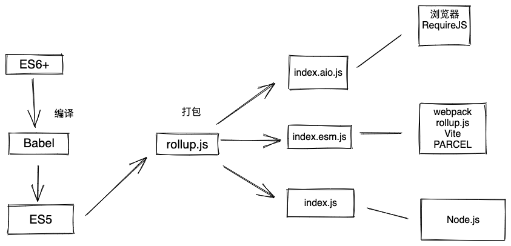

# 构建

## 模块

- 独立性

- 完整性

- 可依赖

- 被依赖

模块就是一个独立的空间，能引用其他模块，也能被其他模块引用。

### 原始模块

函数及模块

```js
(function(w, $) {

    function clone() {
        // ...
    }

    w.clone = clone

})((window.clone = window.clone || {}), jQuery)
```

### AMD

异步模块加载规范。浏览器并不支持，需要借助 RequireJS 才能加载 AMD 模块。规范定义模块的方式：

```js
define(id?, dependencies?, factory);
```

给 clone 添加 AMD 模块支持

```js
define(function() {
    function clone () {
        // ...
    }
})
```

引入模块

```js
define(['clone'], function(clone) {
    const a = { x: 1 }
    const b = clone(a)
})
```

### ComomonJS

同步模块加载规范。主要用于 Node.js 环境中。定义模块的方式：

```js
define(function(require, exports, module) {
    // ...
})
```

其中 define 包裹函数系统自动生成，并不需要自己书写。

```js
function clone() {
    // ...
}
module.exports = clone;
```

引入模块

```js
const clone = require('./clone.js')
const a = { x: 1 }
const b = clone(a)
```

### UMD

通用模块加载规范。并不是一种新的规范，是对前面三种模块（原始模块，AMD，CommonJS）方式的整合。

```js
(function(root, factory){
    var clone = factory(root)

    if (typeof define === 'function' && define.amd) {
        define('clone', function() {
            return clone
        })
    } else if (typeof exports === 'object') {
        module.exports = clone
    } else {
        var _clone = root.clone
        clone.noConflict = function() {
            if (root.clone === clone) {
                root.clone = _clone
            }
            return clone
        }
        root.clone = clone
    }

})(this, function(root) {
    function clone(source) {
        // ...
    }
    return clone
})
```

UMD 规范只是对不同模块规范的简单整合。

### ES Module

原生的模块系统。部分浏览器直接支持，而不兼容的浏览器则可以通过构建工具使用。

```js
export function clone(source) {
    // 
}
```

引用模块

```js
import { clone } from './clone.js'
const a = { a: 1 }
const b = clone(a)
```

开源库为满足各种模块使用者的需求，需要对每种模块提供支持，可以提供两个入口文件

|  入口文件   | 支持的模块  |
|  ----  | ----  |
| index.js  | 原始模块，AMD，CommonJS，UMD |
| index.esm.js  | ES Module |


## 技术体系

不同技术体系对繁杂的依赖关系解决方案。

### 传统体系

传统的依赖关系完全靠人工手动处理，如果 `clone` 函数依赖 `type` 方法，必须在其前引入相关函数文件。

```html
<script src="lib/type.js"></script>
<script src="lib/clone.js"></script>
```

### Node.js 体系

Node.js 模块系统遵守 Common JS 规范，其内置了依赖系统。

```js
const clone = require('./clone.js')
```

`package.json` 文件中 `main` 字段，定义当前模块对应的入口文件，当该模块被其他模块引用时，会找到该字段对应文件。

### 工具化体系

`webpack` 安装

```bash
npm init -y
npm i webpack webpack-cli -S
```

配置文件 `webpack.config.js`

```js
const path = require('path')

module.exports = {
    entry: './index.js',
    output: {
        filenane: 'index.js',
        path: path.resolve(__dirname, 'dist')
    }
}
```

打包命令

```bash
npx webpack
```

输出 `dist/index.js` 文件。

打包工具在加载库时，需要知道这个库是支持 `CommonJS` 还是 `ES Module`，通过设置 `package.json` 字段确认

```json
{
    "main": "index.js",
    "module": "index.esm.js"
}
```

在 `webpack` 中，配置 `mainFields` 支持优先使用 `module` 字段。

```js
// webpack.config.js
module.exports = {
    //...
    resolve: {
        mainFields: ["module", "main"]
    }
}
```

打包工具会优先查看依赖库是否支持 `ES Module`，不支持则遵循 `CommonJS`；开源库需要对每种技术体系都提供支持

|  技术体系   | 模块规范  | 依赖库处理  |
|  ----  | ----  | ----  |
| 传统体系 | 原始模块 | 依赖打包 |
| Node.js 体系 | CommonJS | 无须处理 |
| 工具化体系 | CommonJS + ES Module | 无须处理 |

## 打包方案

不同模块规范，所需提供的入口文件不同

|     | 浏览器（script、AMD、CMD）  | 打包工具（webpack、rollup.js）  | Node.js  |
|  ----  | ----  | ----  | ----  |
| 入口文件 | index.aio.js | index.esm.js | index.js |
| 模块规范 | UMD | ES Module | CommonJS |
| 自身依赖 | 打包 | 打包 | 打包 |
| 第三方依赖 | 打包 | 不打包 | 不打包 |

### 打包工具

选用 `rollup.js`。

`webpack` 打包后，存在多余的冗余代码，而 `rollup.js` 巧妙的通过被依赖的模块放在依赖模块的前面的方法来解决模块依赖问题。

### 打包步骤

安装

```bash
npm i rollup@0.57.1 -S
```
相关配置文件

|  打包输出问价   | 配置文件呢  | 技术体系  | 模块规范  |
|  ----  | ----  | ----  | ----  |
| dist/index.js | config/rollup.config.js | Node.js | CommonJS |
| dist/index.esm.js | config/rollup.config.esm.js | webpack | ES Module |
| dist/index.aio.js | config/rollup.config.aio.js | 浏览器 | UMD |

各配置文件编辑，合并打包命令

```json
"main": "dist/index.js", // cjs 入口
"module": "dist/index.esm.js", // esm 模块入口
"scripts": {
    "build:cjs": "npx rollup -c config/rollup.config.js",
    "build:esm": "npx rollup -c config/rollup.config.esm.js",
    "build:aio": "npx rollup -c config/rollup.config.aio.js",
    "build": "npm run build:cjs && npm run build:esm && npm run build:aio"
},
```

### 添加 banner

添加库说明。如：协议信息。

统一添加 banner 信息

```js
// rollup.js
const pkg = require('../package.json')

const version = pkg.version

const banner = `/*!
* ${pkg.name} ${version}
* Licensed under MIT
*/
`

exports.banner = banner
```

在配置文件内添加 banner 字段

```js
// rollup.config.js
const common = require('./rollup')

module.exports = {
    input: 'src/index.js',
    output: {
        file: 'dist/index.js',
        format: 'cjs',
        banner: common.banner
    }
}
```

### 按需加载

- 提供 `tree shaking` 功能，自动屏蔽未被使用的功能

- 让使用库的项目能按需加载

在 `package.json` 中配置 `sideEffects`

```json
{
    "sideEffects": false,
}
```

## 兼容方案

确定兼容环境。

[ECMAScript](./ECMAScript.md) 的演进

`ES5` 之前版本特性是安全的，之后存在兼容性问题，一般引入 `polyfill` 插件即可，不过 `ES6` 兼容性不容乐观，需要利用 `Babel` 进行转换。

```bash
npm i rollup-plugin-babel@4.0.3 @babel/core@7.1.2 @babel/preset-env@7.1.0 -D
```

`preset-env` 插件，只需要简单配置需要兼容的环境，它会自动帮助开发者选择相应的插件。

```js
// rollup.js
const babel = require('rollup-plugin-babel')
function getCompiler(opt) {
    return babel({
        babelrc: false,
        presets: [
            [
                '@babel/preset-env',
                {
                    targets: {
                        browsers: 'last 2 versions, > 1%, ie >= 8, chrome >= 45, safari >= 10',
                        node: '0.12'
                    },
                    modules: false,
                    loose: true // 松散模式，更好的兼容 IE8
                }
            ]
        ],
        exclude: 'node_modules/**'
    })
}

exports.getCompiler = getCompiler
```

修改配置

```js
const common = require('./rollup')

module.exports = {
    // ...
    plugins: [
        common.getCompiler()
    ]
}
```

编译后，可以看到代码已被转换成 `ECMAScript5`

```js
// 源码
const t = type(source)

// 编译后
var t = type(source);
```

这个只能解决 ES6 新语法的兼容性，但是对于一些 API 还是会出现兼容性问题，平时在项目中可以引入**全局的 polyfill** 解决这个问题，但对库来说并不友好，会污染全局环境。

使用 core-js 解决

```bash
npm i @babel/plugin-transform-runtime -D
npm i @babel/runtime-corejs2 -S
```

修改 Babel 配置

```js
// rollup.js
{
    plugins: [
        [
            '@babel/plugin-transfrom-runtime',
            {
                corejs: 2
            }
        ]
    ],
    runtimeHelpers: true,
}
```

对于打包 aio 模式需要引入 `rollup-plugin-commonjs` 插件

```bash
npm i rollup-plugin-commonjs@8.3.0 -D
```

修改 aio 配置

```js
// rollup.config.aio.js
const commonjs = require('rollup-plugin-commonjs');

module.exports = {
    plugins: [
        commonjs({
            include: 'node_modules/**',
        }),
        common.getCompiler()
    ]
}
```
执行打包命令，`Array.from` 函数被替换

```js
// 源码
const b = Array.from('abc')
console.log(b)

// 编译后
var _Array$from = _interopDefault(require('@babel/runtime-corejs2/core-js/array/from'));
var b = _Array$from('abc');
```

## 完整方案

库的开发者与库的使用者之间的矛盾

- 库开发者编写 ES6 新特性

- 库使用者能够在各种浏览器（IE6 ～ IE11）和 Node.js 中运行

- 库使用者能使用 AMD，CommonJS，ES Module 模块规范

- 库使用者能使用 webpack，rollup.js 等打包工具

完整编译与打包流程和入口文件环境总结


