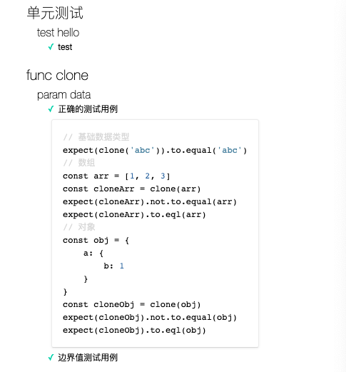
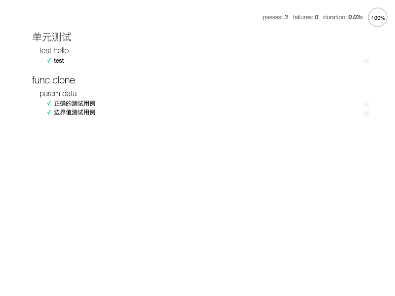

# 测试

多维度

- 单元测试

- 兼容性测试

- 黑盒测试

## 单元测试

测试能够降低重构的风险，测试驱动可以帮助库的开发者找到漏洞的逻辑。单元测试适合库的开发场景，其提倡边写测试边写代码，通过测试来保证和提升代码质量。

单元测试用例：

- 测试驱动开发（TDD）

- 行为驱动开发（BDD）

测试框架：Mocha

断言库：expect.js 兼容性可以支持 IE6

```bash
npm i mocha@3.5.3 expect.js@0.3.1 -D

mkdir test
tocuh test/test.js
```

编写测试文件

```js
const expect = require('expect.js')

describe('单元测试', () => {
    describe('test hello', () => {
        it('test', () => {
            expect(1).to.equal(1)
        })
    })
})
```
在 `package.json` 添加命令

```json
{
    "scripts": {
        "test": "mocha"
    }
}
```

执行命令 `npm test` 输出测试结果。

## 设计测试用例

测试覆盖率和效率

测试用例要尽可能全面覆盖各种情况，覆盖全面的时候，数量要尽可能少，这样才能提高测试效率。

### 设计思路

函数测试：**按照参数分组**，每个参数一组，在对一个参数进行测试时，保证其他参数无影响。

```js
function clone(data) {
    // ...
}
```
只有一个参数，因此只有一个分组

|  分组   | 正确的测试用例  | 错误的测试用例  | 边界值测试用例  |
|  ----  | ----  | ----  | ----  |
| data | 基本数据类型，对象，数组 | 无 | 空参数，undefined, null |

### 编写代码

断言接口

在断言中添加 `not` 即对结果进行取非转换

```js
expect(1).to.equal(1);
expect(1).not.to.equal(1);
```

`equal`：相当于全等

`eql`：值相等

```js
var arr = [1, 2, 3]
var ary = [...arr]

expect(arr).to.equal(ary) // false
expect(arr).to.eql(ary) // true
```

对 `clone` 函数进行测试

```js
describe('func clone', () => {
    describe('param data', () => {
        it('正确的测试用例', () => {
            // 基础数据类型
            expect(clone('abc')).to.equal('abc')

            // 数组
            const arr = [1, 2, 3]
            const cloneArr = clone(arr)
            expect(cloneArr).not.to.equal(arr)
            expect(cloneArr).to.eql(arr)

            // 对象
            const obj = {
                a: {
                    b: 1
                }
            }
            const cloneObj = clone(obj)
            expect(cloneObj).not.to.equal(obj)
            expect(cloneObj).to.eql(obj)
        })

        it('边界值测试用例', () => {
            expect(clone()).to.equal(undefined)
            expect(clone(undefined)).to.equal(undefined)
            expect(clone(null)).to.equal(null)
        })
    })
})
```

## 验证测试覆盖率

设计测试用例的方法基本可以保证主流程的测试，但依然存在人为疏忽和一些边界情况可能漏测问题。**代码覆盖率是衡量测试是否严谨的指标**，检查代码覆盖率可以帮助单元测试查漏补缺。

### 代码覆盖率

检查工具 `Istanbul`

```bash
npm i nyc@13.1.0 -D
```

修改命令，通过 `nyc` 来执行 mocha 命令即可获得代码覆盖率

```json
{
    "scripts": {
        "test:nyc": "nyc mocha",
        "test": "mocha"
  },
}
```

执行命令：`npm run test:nyc`

```bash
 func clone
    param data
      ✓ 正确的测试用例
      ✓ 边界值测试用例


  3 passing (14ms)

----------|----------|----------|----------|----------|-------------------|
File      |  % Stmts | % Branch |  % Funcs |  % Lines | Uncovered Line #s |
----------|----------|----------|----------|----------|-------------------|
All files |      100 |    76.92 |      100 |      100 |                   |
 index.js |      100 |    76.92 |      100 |      100 |             10,29 |
----------|----------|----------|----------|----------|-------------------|
```

`Istanbul` 支持从 4 个维度来衡量代码覆盖率

- 语句覆盖率(Stmts)

- 分支覆盖率(Brannnch)

- 函数覆盖率(Funcs)

- 行覆盖率(Lines)

可以提供可查看的报告，根目录新建 `.nycrc` 文件

```json
{
    "reporter": ["html", "text"]
}
```
再次执行测试命令，可以看到自动生成了 `coverage` 目录，打开 `index.js.html` 可以看到生成的报告。

### 源代码覆盖率

上面测试的**构建后的代码**，它由于环境的不同，会生成很多兼容代码，所以导致某些环境无法覆盖，进而代码覆盖率低。

源码覆盖，`Istanbul` 支持引入 `Babel` 工具，其原理是先向源码中插入测试代码覆盖率的代码，再调用 `Babel` 进行构建，将构建好的代码传给 `Mocha` 进行测试

安装插件：

```bash
npm i @babel/register@7.0.0 babel-plugin-istanbul@5.1.0 cross-env@5.2.0 -D
```

修改 `.nycrc` 文件

```json
{
    "reporter": ["html", "text"],
    "require": ["@babel/register"], // 设置后，通过 require 引用的文件都会通过 Babel 实时编译
    "sourceMap": false, // 编译后，不需要 nyc 的 sourceMap
    "instrument": false // 关闭 nyc 插值检测
}
```

需要给 `nyc` 单独添加 `Babel` 配置

```json
{
    "presets": [
        [
            "@babel/preset-env",
            {
                "targets": {
                    "browsers": "last 2 versions, > 1%, ie >= 8, chrome >= 45, safari >= 10",
                    "node": "0.12"
                },
                "modules": "commonjs",
                "loose": false
            }
        ]
    ],
    "env": {
        "test": {
            "plugins": ["istanbul"] // babel-plugin-istanbul 只有在环境变量 test 才会被加载
        }
    }
}
```

修改 package.json 命令

```json
{
    "scripts": {
        "test:nyc:cro": "cross-env NODE_ENV=test nyc mocha",
    }
}
```

最后修改测试文件 `test.js` 中的源代码引入

```js
// const clone = require('../dist/index.js').clone
const clone = require('../src/index').clone
```

执行测试命令 `npm run test:nyc:cro` 后，可以看到对源码的测试覆盖率

### 校验覆盖率

设置当代码覆盖率低于某个百分比时报错。设置 `check-coverage` 为 true，对每个维度设置阀值

```json
{
    "check-coverage": true,
    "lines": 100,
    "statements": 100,
    "functions": 100,
    "branches": 100
}
```
由于 Branch 覆盖率不满足要求，测试失败了

```bash
ERROR: Coverage for branches (87.5%) does not meet global threshold (100%)
----------|----------|----------|----------|----------|-------------------|
File      |  % Stmts | % Branch |  % Funcs |  % Lines | Uncovered Line #s |
----------|----------|----------|----------|----------|-------------------|
All files |      100 |     87.5 |      100 |      100 |                   |
 index.js |      100 |     87.5 |      100 |      100 |                17 |
 type.js  |      100 |      100 |      100 |      100 |                   |
----------|----------|----------|----------|----------|-------------------|
```

一般不要求 100% 覆盖率，可以将阀值调至 75% ，这时测试就不会报错了

```bash
  func clone
    param data
      ✓ 正确的测试用例
      ✓ 边界值测试用例


  3 passing (13ms)

----------|----------|----------|----------|----------|-------------------|
File      |  % Stmts | % Branch |  % Funcs |  % Lines | Uncovered Line #s |
----------|----------|----------|----------|----------|-------------------|
All files |      100 |     87.5 |      100 |      100 |                   |
 index.js |      100 |     87.5 |      100 |      100 |                17 |
 type.js  |      100 |      100 |      100 |      100 |                   |
----------|----------|----------|----------|----------|-------------------|
```

## 浏览器环境测试

### 模拟浏览器环境

jsdom：提供对 DOM 和 BOM 模拟

```bash
npm i mocha-jsdom -D
```

对 getUrlParam 函数的测试

```js
const JSDOM = require('mocha-jsdom')

function getUrlParam(key) {
    const query = location.search[0] === '?' ? location.search.slice(1) : location.search

    const map = query.split('&').reduce((data, k) => {
        const arr = k.split('=')
        data[arr[0]] = arr[1]
        return data;
    }, {})
    return map[key];
}

describe('获取当前URL中参数', () => {
    JSDOM({ url: 'https://imondo.cn?a=1' })
    it('参数(id)的值', () => {
        expect(getUrlParam('a')).to.be.equal('1')
    })
}) 
```

### 真实的浏览器测试

`Mocha` 支持在浏览器环境中运行。

- `test` 目录添加 `browser/index.html`

- 添加代码

```html
<!DOCTYPE html>
<html lang="en">
<head>
    <meta charset="UTF-8">
    <meta http-equiv="X-UA-Compatible" content="IE=edge">
    <meta name="viewport" content="width=device-width, initial-scale=1.0">
    <title>Mocha</title>
    <link rel="stylesheet" href="../../node_modules/mocha/mocha.css">
</head>
<body>
    <div id="mocha"></div>
    <script src="../../node_modules/mocha/mocha.js"></script>
    <script src="../../node_modules/expect.js/index.js"></script>
    <script src="../../dist/index.aio.js"></script>
    <script>
        var libs = {
            'expect.js': expect,
            '../src/index.js': window['clone']
        }
        var require = function(path) {
            return libs[path]
        }
    </script>
    <script>
        mocha.setup('bdd')
    </script>
    <script src="../test.js"></script>
    <script>
        mocha.run()
    </script>
</body>
</html>
```

打开页面可以看到测试结果



### 自动化测试

`PhantomJS` 失去维护

流行使用 `Chrome` 的 `Headless` 特性，支持通过命令启动一个没有界面的进程来执行，除了没有界面，和真实浏览器没有差异。

使用 `Puppeteer` 工具

```bash
npm i puppeteer@5.5.0 -D
```

- 添加 `test/browser/puppeteer.js`

- 添加代码

```js
const puppeteer = require('puppeteer')

;(async () => {
    const testPath = `file://${__dirname}/index.html`

    const browser = await puppeteer.launch()

    const page = await browser.newPage()

    await page.goto(testPath)

    // 截图保存
    const pngPath = `${__dirname}/browser.png`

    await page.screenshot({
        path: pngPath,
        fullPage: true
    })

    await browser.close()
})()
```

运行 `node test/browser/puppeteer.js` 可以看到生成截图 `browser.png`



- 运行成功的用例 `class` 存在 `pass`

- 运行失败的用例 `class` 存在 `fail`

获取通过和失败的 `class` 数量，可以验证结果。修改 `puppeteer.js` 文件

```js
    // ...
    await page.screenshot({
        path: pngPath,
        fullPage: true
    })

    // 获取数量
    await page.waitFor('.suite')
    // 通过
    const passNode = await page.$$('.pass')
    // 失败
    const errNode = await page.$$('.fail')

    if (passNode && passNode.length) {
        console.log(`通过 ${passNode.length} 项`)
    }

    if (errNode && errNode.length) {
        console.log(`失败 ${errNode.length} 项`)
        await browser.close()
        process.exit(1)
    }

    await browser.close()
```

修改 package.json 命令

```json
{
    "scripts": {
        "test:puppeteer": "node test/browser/puppeteer.js",
    }
}
```

运行查看结果